Now that you have a ROKS cluster, you need to install manually the Cloud Pak for Multicloud Management 2.0. Let's do it!

To use the installation script provided below you need a ROKS cluster with 2 or more worker nodes (full install requires 4 nodes 16 core + 32 GB RAM) and workstation (Linux or Mac) with following tools installed: (git, make, jq, cloudctl, oc, kubectl)

1. Open a terminal window and create some working directory. Clone git repo with the installation scripts. You may be asked for w3 authentication. If you haven't done so before look at the [Authentication to github.ibm.com](#authentication-to-githubibmcom) at the bottom.

   ```bash
   mkdir installmcm20
   cd installmcm20
   git clone https://github.ibm.com/john-webb/CP4MCM_20.git
   ```

2. Login to [https://cloud.ibm.com](https://cloud.ibm.com) if you have not done that already. Open the details of OCP cluster in IBM Cloud - if you requested it via ibm.com/demos go to the **My reservations**, open **Details** and use **Cluster URL**.

   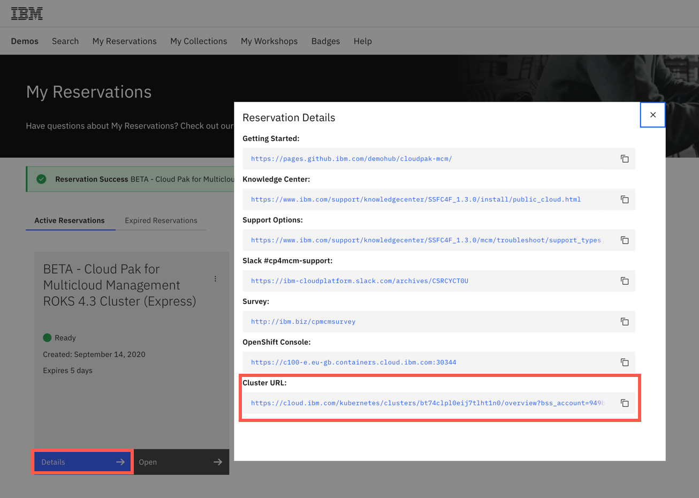

3. Click the **Openshift web console** to open Openshift console and get the CLI login credentials

   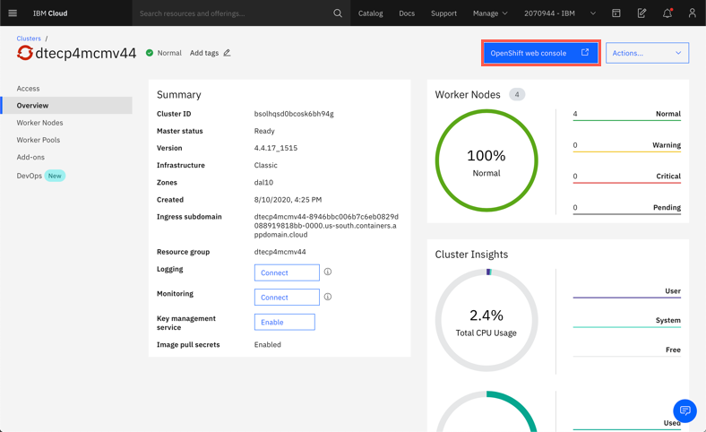

   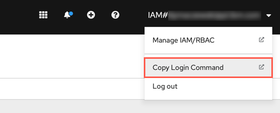

   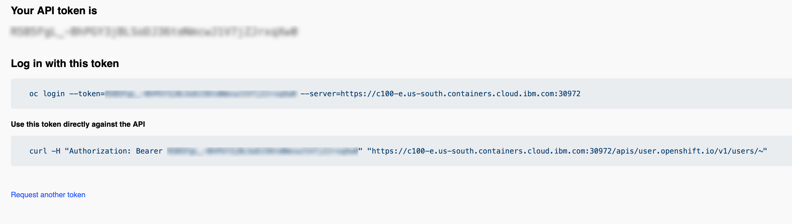

   Copy and paste the `oc login` command to the Terminal window on your workstation.

   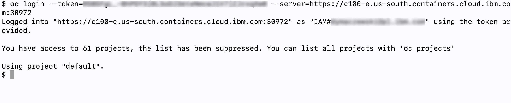

4. Log in to [MyIBM Container Software Library](https://myibm.ibm.com/products-services/containerlibrary) by using the IBMid and password that are associated with the entitled software.

5. In the Entitlement keys section, select Copy key to copy the entitlement key to the clipboard.

   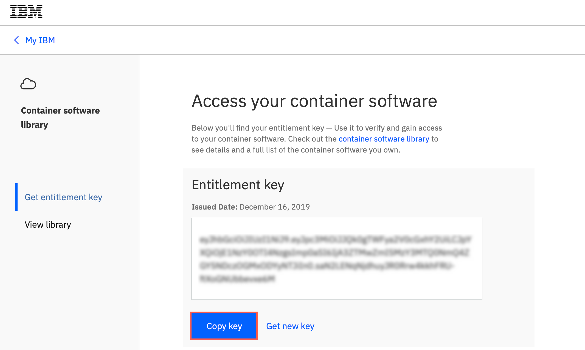

6. In the terminal window on your workstation create an environment variable holding the value of the entitlement key

   ```bash
   cd CP4MCM_20
   export ENTITLED_REGISTRY_KEY=<entitlement_key>
   ```

7. With your favourite editor edit the file `0-setup_env.sh` on your workstation and adjust the following variables (your ROKS cluster may be deployed in other region or zone)

   ```bash
   ROKSREGION="us-south"
   ROKSZONE="dal10"
   ```

   The values can be found in IBM Cloud console
   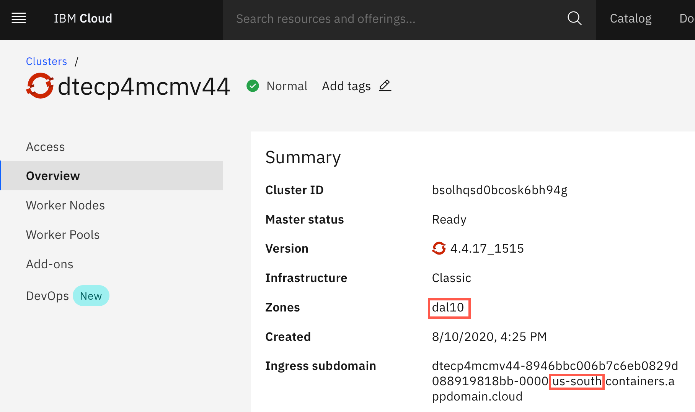

8. Run the installation first scipt which registers the operators in the catalog

   ```bash
   ./1-common-services.sh
   ```

   Output should look like below:

   ```bash
   ./1-common-services.sh
   catalogsource.operators.coreos.com/opencloud-operators created
   Waiting for CatalogSource (60 seconds)
   Done.
   ```

9. To install Cloud Pak for MCM Core Services run the following command

   ```bash
   ./cp4m/2-cp4mcm-core.sh
   ```

   Output should look like below:

   ```bash
   ./cp4m/2-cp4mcm-core.sh
   Now using project "cp4m" on server "https://c100-e.us-south.containers.cloud.ibm.com:30972".

   You can add applications to this project with the 'new-app' command. For example, try:

       oc new-app django-psql-example

   to build a new example application in Python. Or use kubectl to deploy a simple Kubernetes application:

       kubectl create deployment hello-node --image=gcr.io/hello-minikube-zero-install/hello-node

   secret/ibm-management-pull-secret created
   catalogsource.operators.coreos.com/management-installer-index created
   Waiting for CP4MCM CatalogSource (60 seconds)
   subscription.operators.coreos.com/ibm-management-orchestrator created
   Waiting for CP4MCM Subscription (60 seconds)
   Applying the CP4MCM 2.0 - Core Installation
   installation.orchestrator.management.ibm.com/ibm-management created
   Installation has started. Check status by running 'oc get opreq -A'
   NAMESPACE   NAME                        AGE   PHASE        CREATED AT
   cp4m        ibm-management-cs           12s   Installing   2020-09-09T12:45:56Z
   cp4m        ibm-management-foundation   5s    Pending      2020-09-09T12:46:03Z
   ```

   Install can take several minutes. Wait until the output of `oc get opreq -A` command looks like below:

   ```bash
   $ oc get opreq -A
   NAMESPACE             NAME                                         AGE     PHASE     CREATED AT
   cp4m                  ibm-management-cs                            8m22s   Running   2020-09-09T12:45:56Z
   cp4m                  ibm-management-foundation                    8m15s   Running   2020-09-09T12:46:03Z
   ibm-common-services   catalog-ui-request                           6m6s    Running   2020-09-09T12:48:12Z
   ibm-common-services   helm-api-request                             3m27s   Running   2020-09-09T12:50:51Z
   ibm-common-services   helm-repo-request                            3m26s   Running   2020-09-09T12:50:52Z
   ibm-common-services   ibm-auditlogging-request                     6m8s    Running   2020-09-09T12:48:10Z
   ibm-common-services   ibm-commonui-request                         6m9s    Running   2020-09-09T12:48:09Z
   ibm-common-services   ibm-iam-request                              7m41s   Running   2020-09-09T12:46:37Z
   ibm-common-services   ibm-licensing-request                        6m11s   Running   2020-09-09T12:48:07Z
   ibm-common-services   ibm-metering-request                         6m10s   Running   2020-09-09T12:48:08Z
   ibm-common-services   ibm-mongodb-request                          5m33s   Running   2020-09-09T12:48:45Z
   ibm-common-services   management-ingress                           6m12s   Running   2020-09-09T12:48:06Z
   ibm-common-services   monitoring-exporters-operator-request        7m40s   Running   2020-09-09T12:46:38Z
   ibm-common-services   monitoring-grafana-operator-request          6m13s   Running   2020-09-09T12:48:05Z
   ibm-common-services   monitoring-prometheus-ext-operator-request   6m13s   Running   2020-09-09T12:48:05Z
   ibm-common-services   platform-api-request                         6m7s    Running   2020-09-09T12:48:11Z
   kube-system           ibm-license-advisor-sender-instance          6m5s    Running   2020-09-09T12:48:13Z
   ```

10. To access the Cloud Pak console run the following commands to find out the URL and admin password

    ```bash
    YOUR_CP4MCM_ROUTE=`oc -n ibm-common-services get route cp-console --template '{{.spec.host}}'`
    CP_PASSWORD=`oc -n ibm-common-services get secret platform-auth-idp-credentials -o jsonpath='{.data.admin_password}' | base64 -d`
    echo " You can access your cluster with the URL and credentials below:"
    echo " URL = https://$YOUR_CP4MCM_ROUTE"
    echo " User = admin"
    echo " Password = $CP_PASSWORD"
    ```

11. Use the output from the above command in your browser. 

    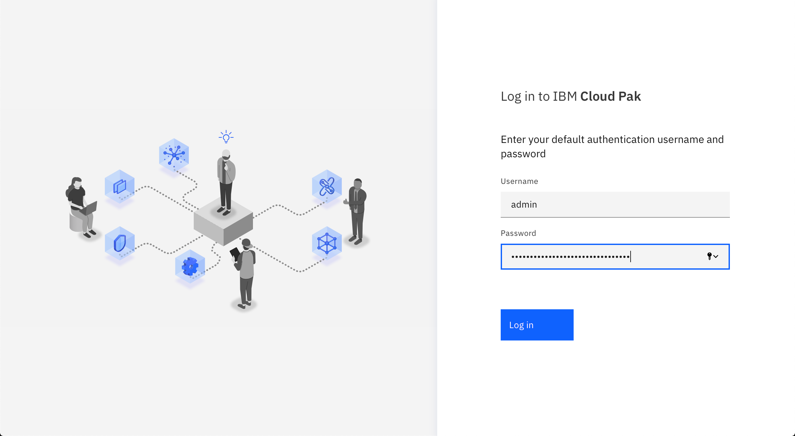

12. Upon successful login you should see the welcome screen shown below. If you see error *504 Gateway Time-out*, it means the environment was not yet fully initialized. Wait additional 1-2 minutes and refresh the browser.

    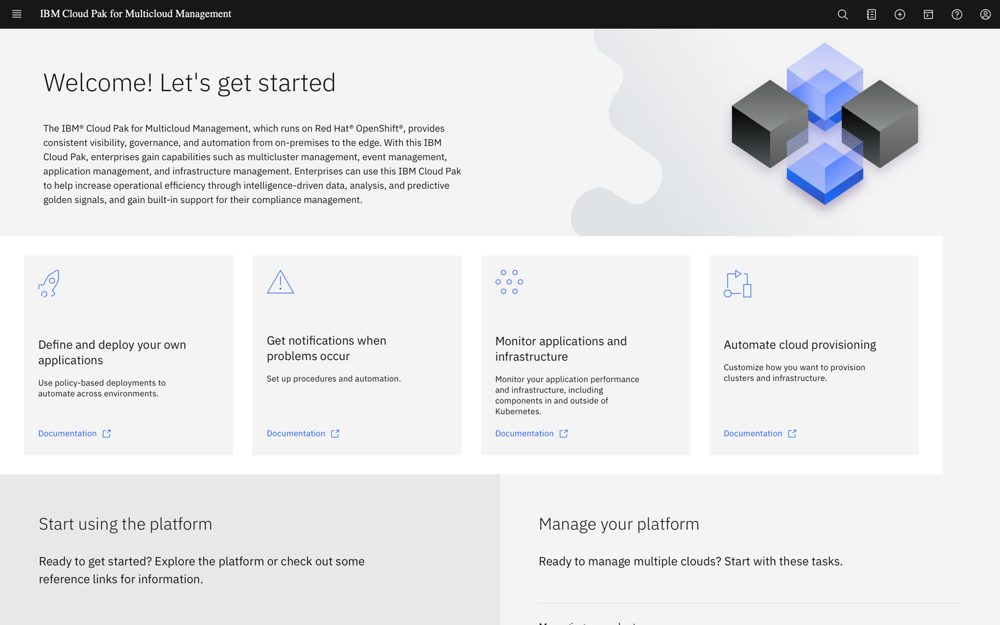

13. Continue the installation running in the terminal window LDAP creation script `./cp4m/3-ldap.sh`. To complete this part you need `cloudctl` utility installed on your workstation
    You can check if it is installed running the following command:

    ```bash
    cloudctl version
    ```

    For procedure how to install `cloudctl` look here: [Installing cloudctl](https://www.ibm.com/support/knowledgecenter/pl/SSFC4F_2.0.0/cloudctl/3.x.x/install_cli.html)

    ```bash
    ./cp4m/3-ldap.sh
    ```

    Sample output looks like below:

    ```bash
    Authenticating...
    OK

    Targeted account mycluster Account

    Targeted namespace default

    Configuring kubectl ...
    Property "clusters.mycluster" unset.
    Property "users.mycluster-user" unset.
    Property "contexts.mycluster-context" unset.
    Cluster "mycluster" set.
    User "mycluster-user" set.
    Context "mycluster-context" created.
    Switched to context "mycluster-context".
    OK

    Configuring helm: /Users/dymaczew/.helm
    OK
    securitycontextconstraints.security.openshift.io/anyuid added to: ["system:serviceaccount:ldap:default"]
    deployment.apps/ldap created
    service/ldap-service created
    Sleeping while LDAP is starting.. (60 seconds)
    LDAP connection my_ldap 'bcded990-f29d-11ea-878f-e59d81bf9fa1' successfully created
    OK
    Group operations imported
    OK
    ```

   At this point the LDAP authentication is enabled. You can notice the changed Login screen, now showing:

   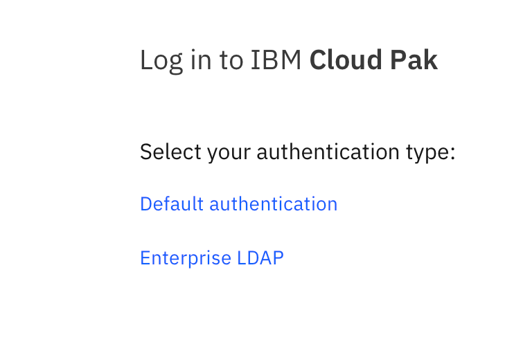

   If you select **Enterprise LDAP** you can use one of the predefined users to login - for example **bob** with password **Passw0rd**.

14. To install Infrastructure Management module run the following script:

    ```bash
    ./cp4m/4-CAMandIM.sh
    ```

    Output will look like below:

    ```bash
    Create management-infrastructure-management namespace.
    Now using project "management-infrastructure-management" on server "https://c100-e.us-south.containers.cloud.ibm.com:30972".

    You can add applications to this project with the 'new-app' command. For example, try:

        oc new-app django-psql-example

    to build a new example application in Python. Or use kubectl to deploy a simple Kubernetes application:

        kubectl create deployment hello-node --image=gcr.io/hello-minikube-zero-install/hello-node

    Adding CAM Config to Installaton (CAM_API_KEY = )(ROKS = true)
    installation.orchestrator.management.ibm.com/ibm-management patched
    Enabling the IM Module in the  Installation
    installation.orchestrator.management.ibm.com/ibm-management patched
    Installation has started. Check status by running 'oc get opreq -A'
    ```

15. To install CloudForms you can run the following script:

    ```bash
    ./cp4m/5-CloudFormsandOIDC.sh`
    ```

    Output should be similar to the one shown below:

    ```bash
    YOUR_CLIENT_ID = VGhlcmUgaXMgYSBodWdlIHdoaXRlIGVsZXBoYW50IGluIExBIHpvbwo=
    YOUR_CLIENT_SECRET = MTIzNDU2Nzg5MDEyMzQ1Njc4OTAxMjM0NTY3ODkwMTIzNDUK
    YOUR_CP4MCM_ROUTE = cp-console.dtecp4mcmv44-8946bbc006b7c6eb0829d088919818bb-0000.us-south.containers.appdomain.cloud
    YOUR_IM_HTTPD_ROUTE = inframgmtinstall.dtecp4mcmv44-8946bbc006b7c6eb0829d088919818bb-0000.us-south.containers.appdomain.cloud
    CP_PASSWORD = XXXXXXXXXXXXXXXXXXXXXXX
    ENTITLED_REGISTRY_SECRET = ibm-management-pull-secret
    Authenticating...
    OK

    Targeted account mycluster Account

    Targeted namespace ibm-common-services

    Configuring kubectl ...
    Property "clusters.mycluster" unset.
    Property "users.mycluster-user" unset.
    Property "contexts.mycluster-context" unset.
    Cluster "mycluster" set.
    User "mycluster-user" set.
    Context "mycluster-context" created.
    Switched to context "mycluster-context".
    OK

    Configuring helm: /Users/dymaczew/.helm
    OK
    Registering IAM OAUTH client.
    OK
    client_name:		VGhlcmUgaXMgYSBodWdlIHdoaXRlIGVsZXBoYW50IGluIExBIHpvbwo=
    client_id:		VGhlcmUgaXMgYSBodWdlIHdoaXRlIGVsZXBoYW50IGluIExBIHpvbwo=
    client_secret:		MTIzNDU2Nzg5MDEyMzQ1Njc4OTAxMjM0NTY3ODkwMTIzNDUK
    Creating imconnectionsecret.
    secret/imconnectionsecret created
    Creating CloudForms IMInstall
    iminstall.infra.management.ibm.com/im-iminstall created
    Sleeping for 30 seconds.
    Creating IM Connection Resource
    connection.infra.management.ibm.com/imconnection created
    Applying navigation UI updates.
    Checking if kubectl is installed...
    kubectl is installed
    Running kubectl command to retrieve navigation items...
    *** A backup cr file is stored in ./navconfigurations.original

    Finished importing into navconfigurations.yaml
    Verifying...
    Navconfigurations.yaml file is valid
    ------------
    Find the Infrastructure Management and CP4MCM console URL.
    https://cp-console.dtecp4mcmv44-8946bbc006b7c6eb0829d088919818bb-0000.us-south.containers.appdomain.cloud
    CP4MCM URL: https://cp-console.dtecp4mcmv44-8946bbc006b7c6eb0829d088919818bb-0000.us-south.containers.appdomain.cloud
    IM URL: https://inframgmtinstall.dtecp4mcmv44-8946bbc006b7c6eb0829d088919818bb-0000.us-south.containers.appdomain.cloud
    Navigation items added to file
    Updating MCM with new items...
    Finished updating MCM
    Success!
    ```

    You can verify if all the pods started correctly running the following command

    ```bash
    oc get pods -n management-infrastructure-management
    ```

    HINT: You can proceed with installing monitoring without waiting for Infrastructure management install to complete.

16. To install monitoring module, run the following command:

    ```bash
    ./cp4m/6-MonitoringModule.sh
    ```

    Installation takes about 15 minutes and the sample output looks like below:

    ```bash
    $ ./cp4m/6-MonitoringModule.sh
    Adding Monitoring Storage Config to Installaton
    installation.orchestrator.management.ibm.com/ibm-management patched
    Enabling Monitoring Module
    installation.orchestrator.management.ibm.com/ibm-management patched
    Sleeping until install starts.
    Authenticating...
    OK

    Targeted account mycluster Account

    Targeted namespace default

    Configuring kubectl ...
    Property "clusters.mycluster" unset.
    Property "users.mycluster-user" unset.
    Property "contexts.mycluster-context" unset.
    Cluster "mycluster" set.
    User "mycluster-user" set.
    Context "mycluster-context" created.
    Switched to context "mycluster-context".
    OK

    Configuring helm: /Users/xxxxxxx/.helm
    OK
    User bob imported
    User tom imported
    OK
    OK
    Docker config for SECRET=ibm-management-pull-secret in NAMESPACE=cp4m
    ENTITLED_REGISTRY_DOCKERCONFIG=XXXXXXXXHIDDENXXXXXXXXX
    deployable.app.ibm.com/cnmon-pullsecret-deployable patched
    NAME                                                     TEMPLATE-KIND   TEMPLATE-APIVERSION    AGE   STATUS
    cnmon-chl-ibm-ace-dashboard-icp4i-prod-3.1.4             HelmRelease     app.ibm.com/v1alpha1   10m
    cnmon-chl-ibm-ace-server-icp4i-prod-3.1.4                HelmRelease     app.ibm.com/v1alpha1   10m
    cnmon-chl-ibm-apiconnect-icp4i-prod-1.0.5                HelmRelease     app.ibm.com/v1alpha1   10m
    cnmon-chl-ibm-apm-ema-prod-1.1.1                         HelmRelease     app.ibm.com/v1alpha1   10m
    cnmon-chl-ibm-app-connect-designer-icp4i-3.1.4           HelmRelease     app.ibm.com/v1alpha1   10m
    cnmon-chl-ibm-aspera-hsts-icp4i-1.3.0                    HelmRelease     app.ibm.com/v1alpha1   10m
    cnmon-chl-ibm-aspera-hsts-prod-1.2.3                     HelmRelease     app.ibm.com/v1alpha1   10m
    cnmon-chl-ibm-cloud-appmgmt-prod-1.7.1                   HelmRelease     app.ibm.com/v1alpha1   10m
    cnmon-chl-ibm-cp4mcm-cloud-native-monitoring-1.3.0       HelmRelease     app.ibm.com/v1alpha1   10m
    cnmon-chl-ibm-cpq-prod-1.0.0                             HelmRelease     app.ibm.com/v1alpha1   10m
    cnmon-chl-ibm-datapower-icp4i-1.0.6                      HelmRelease     app.ibm.com/v1alpha1   10m
    cnmon-chl-ibm-eam-prod-4.1.0                             HelmRelease     app.ibm.com/v1alpha1   10m
    cnmon-chl-ibm-eventstreams-icp4i-prod-1.4.2              HelmRelease     app.ibm.com/v1alpha1   10m
    cnmon-chl-ibm-eventstreams-rhel-icp4i-prod-1.3.3         HelmRelease     app.ibm.com/v1alpha1   10m
    cnmon-chl-ibm-icp4i-asset-repo-prod-4.0.1                HelmRelease     app.ibm.com/v1alpha1   10m
    cnmon-chl-ibm-icp4i-prod-3.1.1                           HelmRelease     app.ibm.com/v1alpha1   10m
    cnmon-chl-ibm-icp4i-tracing-prod-1.0.2                   HelmRelease     app.ibm.com/v1alpha1   10m
    cnmon-chl-ibm-mobilefoundation-prod-3.0.5                HelmRelease     app.ibm.com/v1alpha1   10m
    cnmon-chl-ibm-mqadvanced-server-integration-prod-6.0.0   HelmRelease     app.ibm.com/v1alpha1   10m
    cnmon-chl-ibm-mqadvanced-server-prod-6.0.0               HelmRelease     app.ibm.com/v1alpha1   10m
    cnmon-chl-ibm-mss-prod-1.0.0                             HelmRelease     app.ibm.com/v1alpha1   10m
    cnmon-chl-ibm-netcool-prod-2.1.4                         HelmRelease     app.ibm.com/v1alpha1   10m
    cnmon-chl-ibm-security-foundations-prod-1.0.7            HelmRelease     app.ibm.com/v1alpha1   10m
    cnmon-chl-ibm-security-solutions-prod-1.0.7              HelmRelease     app.ibm.com/v1alpha1   10m
    cnmon-chl-ibm-spectrum-protect-plus-prod-1.0.0           HelmRelease     app.ibm.com/v1alpha1   10m
    cnmon-chl-ibm-ucd-prod-6.0.8                             HelmRelease     app.ibm.com/v1alpha1   10m
    cnmon-chl-ibm-ucda-prod-2.1.9                            HelmRelease     app.ibm.com/v1alpha1   10m
    cnmon-chl-ibm-ucdr-prod-2.0.9                            HelmRelease     app.ibm.com/v1alpha1   10m
    cnmon-chl-ibm-ucv-prod-1.5.5                             HelmRelease     app.ibm.com/v1alpha1   10m
    cnmon-chl-ibm-wml-accelerator-prod-1.0.0                 HelmRelease     app.ibm.com/v1alpha1   10m
    cnmon-pullsecret-deployable                              Secret          v1                     10m   Propagated
    cnmon-sub-deployable                                     Subscription    app.ibm.com/v1alpha1   10m   Propagated
    NAME        TYPE       PATHNAME                                                             AGE
    cnmon-chl   HelmRepo   https://raw.githubusercontent.com/IBM/charts/master/repo/entitled/   10m
    NAME        STATUS       AGE
    cnmon-sub   Propagated   10m
    NAME       AGE
    cnmon-pr   10m
    ```

17. Congratulations!

    You should have a Cloud Pak for Multicloud Management 2.0 installed with the following modules enabled:
    - Core Services
    - Infrastructure Management (CAM + CloudForms)
    - Monitoring (ICAM)
    - with OpenLDAP authentication


## Authentication to github.ibm.com

In order to clone the repositories from GitHub Enterprise (github.ibm.com) you need to authenticate with w3 credentials. It is possible with user & password in the browser, but for authentication with git CLI you need to generate personal access token (PAT).

You need to have git installed on your workstation. If you are using Mac, to configure git cli to use Keychain Access for storing the credentials run

```bash
git credential-osxkeychain
git config --global credential.helper osxkeychain
```

For other platforms check [Github Docs](https://docs.github.com/en/github/using-git/caching-your-github-credentials-in-git).

1. Open the page [https://github.ibm.com/settings/tokens](https://github.ibm.com/settings/tokens) and login with your w3 credentials

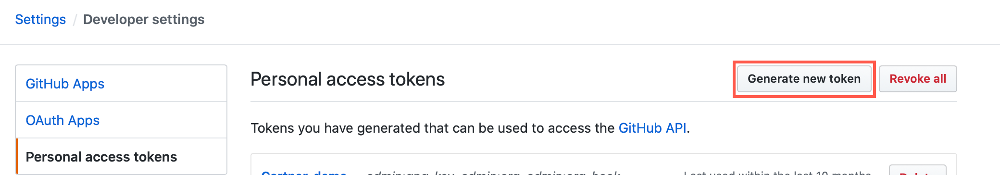

2. Click **Generate new token**. Then provide a **Name** and select **repo** and **admin:org** checkboxes. Finanlly, click **Generate token** at the bottom.

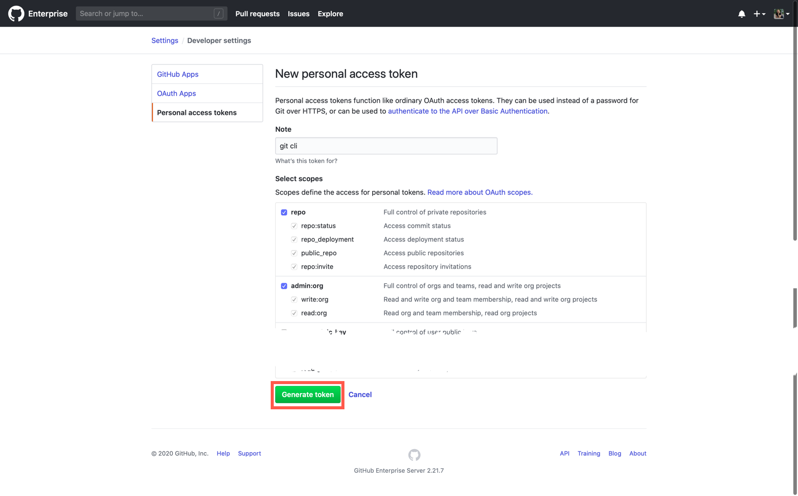

3. Copy the generated token and use as password when asked by the git cli when you run the `git clone` command

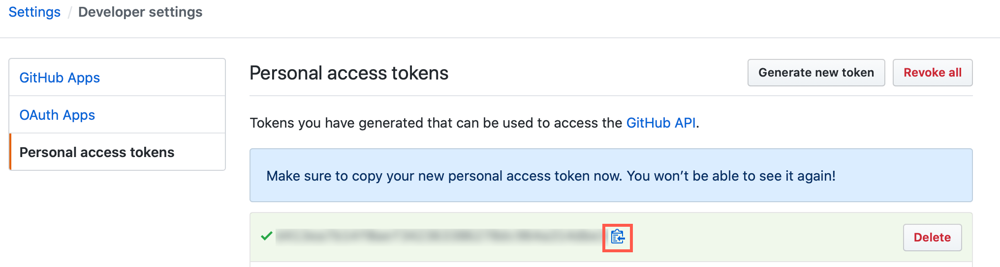


