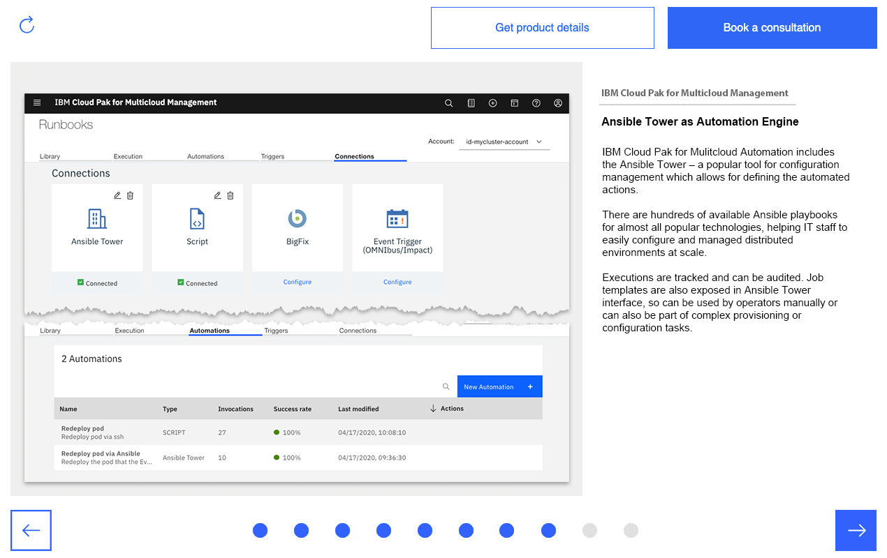
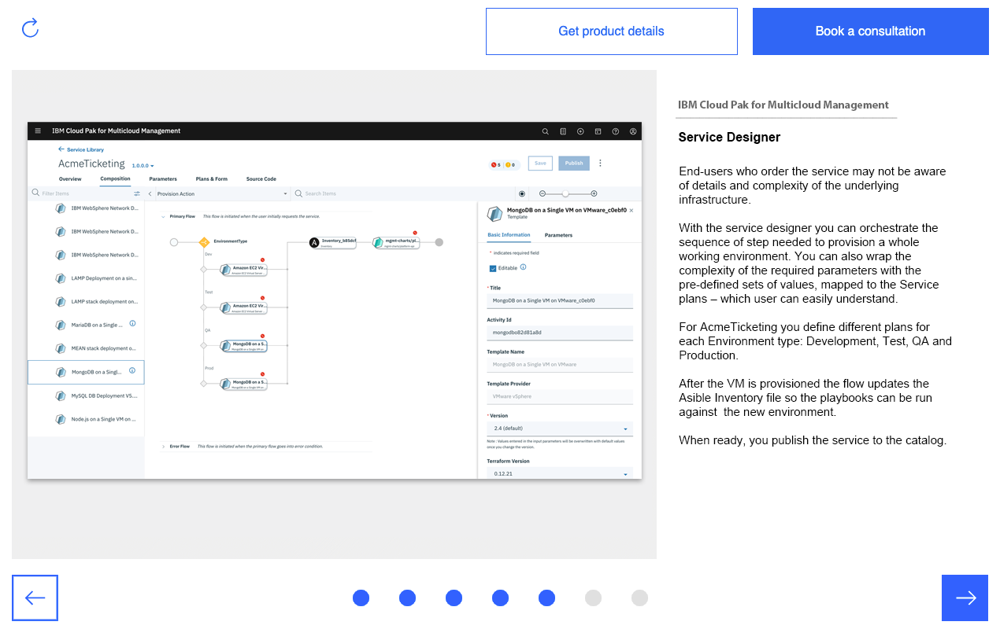

<Row>

<Column colLg={4} colMd={4} noGutterMdLeft>
<ArticleCard
    color="dark"
    title="Migrating application across clusters"
    href="https://cloudsalesdemos4.mybluemix.net/ci/uc5%20-%20migrate%20apps/index.html"
    author="Seamlessly migrate applications among clouds to adapt to changing needs"
    actionIcon="arrowRight"
    >

</ArticleCard>
</Column>

<Column colLg={4} colMd={4} noGutterMdLeft>
<ArticleCard
    color="dark"
    title="Support efficient problem resolution"
    href="https://ibm.invisionapp.com/share/96O04DVZPJW"
    author="Support efficient problem resolution across distributed teams with auto-remediation tools"
    actionIcon="arrowRight"
    >

</ArticleCard>
</Column>

<Column colLg={4} colMd={4} noGutterMdLeft>
<ArticleCard
    color="dark"
    title="Simplify provisioning and scaling across multiple clouds"
    href="https://ibm.invisionapp.com/share/NUO04ZTE82Q"
    author="Simplify provisioning and scaling across multiple clouds with templated provisioning and dynamic scaling"
    actionIcon="arrowRight"
    >

</ArticleCard>
</Column>

</Row>
