<FeatureCard
  title="Event Management and Runbook Automation with IBM Cloud Pak for Multicloud Management"
  color="dark"
  >


</FeatureCard>


<AnchorLinks>
  <AnchorLink>Lab Overview</AnchorLink>
  <AnchorLink>Prerequisite</AnchorLink>
  <AnchorLink>Business Context</AnchorLink>
  <AnchorLink>Create Online Banking support group</AnchorLink>
  <AnchorLink>Configure Slack integration</AnchorLink>
  <AnchorLink>Define Incident Policy</AnchorLink>
  <AnchorLink>Configure Ansible Tower</AnchorLink>
  <AnchorLink>Configure Runbook automation</AnchorLink>
  <AnchorLink>Test runbook automation</AnchorLink>
</AnchorLinks>

***

## Lab Overview

IBM Cloud Pak for Multicloud Management is the enterprise-grade multicloud management solution. This cloud-agnostic solution leverages open-source technology and your existing tools to provide an integrated dashboard to manage your environments and your applications where they need to reside - public, private, or edge - with choice of vendor cloud platform and consistent visibility, governance and automation.

Event Management installed along with Monitoring module of the Cloud Pak gives you the capability to automate management of incidents and events that are associated with resources and applications. You can visualize and manage multiple clusters, and consolidate the information from your monitoring systems to address problems. Events can indicate something that happened on an application, service, or another monitored object. All events that are related to a single application, or to a particular cluster, are correlated with an incident. Event Management can receive events from various monitoring sources, either on-premises or in the cloud.

In this lab, you are the leader of the Operations team, responsible for problem resolution. You define how your team is notified in the event of a failure and define a "runbook" guide of possible remediation steps.

In this tutorial, you will explore the following key capabilities:
- `Create a policy that automatically assigns incidents to alert over Slack`
- `Generate sample events to verify that your new policy works as expected`
- `Use the runbook suggested to the incident to resolve it`

***

## Prerequisite

- You need to provision your own copy of the CP4MCM 2.0 environment, start it and verify for correct startup (check [here](../../gettingstarted/)).

***

## Business Context

In a real-world environment, an operator isn't going to continually watch the overview screen, waiting for new events or failures. This is where the event management capability comes in, which not only notifies operators when failure conditions occur but can also provide automated and guided remediation of error events.

In this tutorial, you will log in to the Hub cluster to configure and use event management capabilities.

You will complete the following tasks:

-	Create Online Banking support group
- Configure Slack integration
- Define Event Policy
- Define Incident Policy
- Configure Ansible Tower
- Configure Runbook automation
- Test runbook automation

***

## Create Online Banking support group

In this exercise, your task is to configure event management for handling events related to the Online Banking application.

1. To start the lab, you should be in your Cloud Pak for Multicloud Management Web Console. If you are not, check [here](../gettingstarted/) how to open your console page.

  

2. Now, let's open the Monitoring module user inteface. Click the hamburger **Menu** and select **Monitor health -> Incidents**.

   

3. To effectively handle incidents at scale, they must be automatically dispatched to the right users for handling. The first step is to create a group for users who will be responsible for handling Online Banking related events and incidents.Click the **Administration** tab (1) and then **Users and groups** (2)

   
    
4. Notice that some users have already been defined. There are the users with ClusterAdministrator role that were automatically assigend **Operations lead** role in the Monitoring module. Before we create support group, let's start with adding a user to the system. The demo environment has an LDAP configured, so you will import user from the LDAP.
   
5. Open the humburger **Menu** and select **Administer -> Identity and Access**

   
   
6. Select **Teams** tab and then click on the **operations** team

   

   

7. Select the **Users** tab (1) , and then click **Add users** (2)

   

8. In the **Select domain** dropdown pick **my_ldap**. This dropdown shows all identity sources registered in the Cloud Pak. In this environment, there are two sources available: a default Openshift authentication (Cloud Identity Directory) and LDAP connection my_ldap.

   

9. In the search box, enter **carlos** and hit Enter (1). Then, select the user **carlos** (2), change the role to **Editor** (3), and finally click **Add** button (4).

   

10. Now, go back to the Monitoring UI (Menu-> Monitor health-> Incidents-> Administration -> Users and Groups). You should see user `carlos` in the list with the role `Operations engineer`. This is default mapping of Cloud Pak role `Editor` to the Monitoring module roles. Click **Groups** tab

    
 
11.	There are no groups defines so you need to create one. Click **New group**.

12. Provide the name **Online Banking Support** (1), then click Users icon (2), select user **carlos** (3) and click **Assign**

    
  
13.	Finally, click **Save**

    

    Now, when you have the right support group defined, let's configure which incidents should be assigned to this group and how the users should be notified.

***

## Configure Slack integration

Operation teams use different notification methods. Some prefer emails, but many uses collaboration tools like PagerDuty, Slack or Microsoft Teams. In this exercise you will configure integration with Slack.

1. Go back to the **Administration** view.

    

2. Select **Integrations** tile

   

3. On the Integrations view, select **Outgoing** tab (1) and then click **New integration** (2)

   

4. You can see multiple default integartions provided by Cloud Pak for Multicloud Management. If your company is not using any of the pre-defined ones, you can use the Generic webhook. In this exercise you will configure Slack so select **Slack** tile.

   

5. Provide the integration name (e.g. **slack**) (1) and then the webhook created in the Slack channel (2). For convenience, we have created a slack channel for you so you can reuse the following webhook URL:

   ```sh
   
   ```

   Finally click **Save** (3) to create the integration.

   

6. Now, go back to the Incoming integrations tab. You can see that along with the configured integrations, there is an additional tile for generating **Sample events**.
 
   Sample events are artificial events that are injected into the system to demonstrate some capabilities but are also very helpful for testing policies and runbook automation. Click **Generate**. 
   If you wait for about a minute you should see the following notification.

   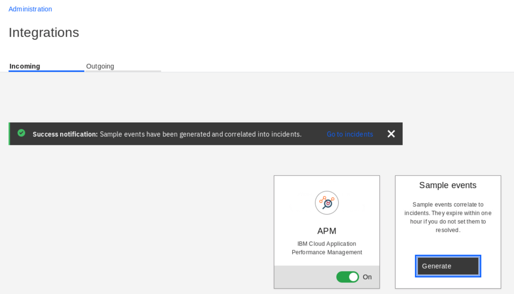

   If you cannot see the notification or see an error, follow the tutorial as the events were probably generated anyway.

7. Go back to the Administration tab clicking the link in the upper-left corner.

***

## Define Incident Policy

   In this step, you create a policy that automatically assigns incidents related to the Online Banking application to the newly created support group.

1. You should view the Administration tab. Click the **Policies** tile.

   

2. There are two types of policies:
   - **Event policies** define how to handle events received by the system. Events are generated by data collectors, monitoring agents, or can come from numerous external sources defined in the Integrations section. Based on the attributes, some events are correlated into Incidents. 
   - **Incident policies** define how to prioritize the incidents, to whom they should be assigned for handling and how the owners should be notified 
  
   Click **Incident policies** tab.

   

3. There are several default policies already defined in the system. However, to handle Online Banking related incidents you need to create a new one. Click **New incident policy**.

4. Enter the policy name and description. In the Incidents section below, select **Specify conditions** radio button. Then, in the conditions section, select **Priority is higher than Priority 3** to filter out less important incidents. Finally, click the **Add condition to describe incident events** to specify that you are interested in incidents related to Online Banking.

   

5. In the section that opens, specify the condition that the events correlated into the incidents must match to activate the policy. For Condition 1 select **Application contains Online Banking**. To verify if the policy matches any events in the system, you can click **Test**.

   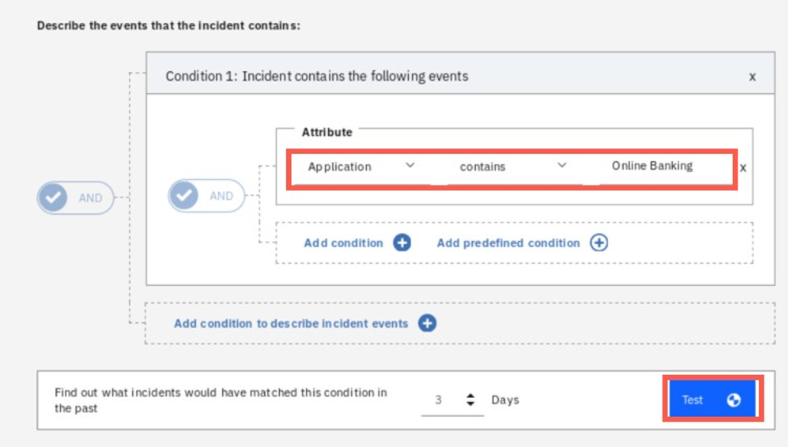

6. If you successfully generated sample events before, you should see at least one incident matching the defined conditions.

   

7. Scroll down to the **Action** section. Here select the **Assign and notify**, and then click **Add assignment/notification**.

   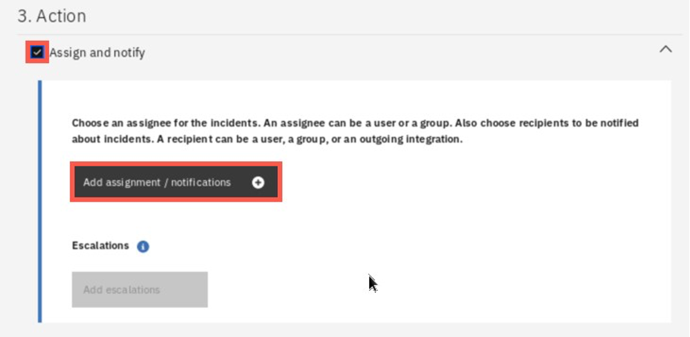

8. In the dialog that opens, select Online Banking Support group and check the Notify checkbox. Then click the Integrations tab to define the notification details.

   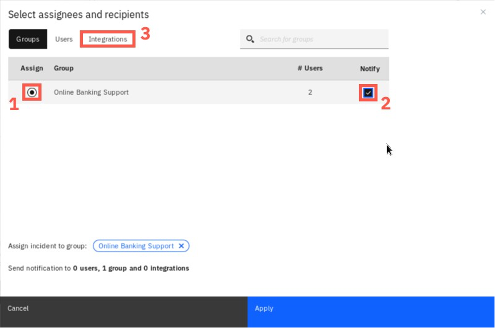

9. Select the **Notify** checkbox in the Slack row and click **Apply** at the bottom.

   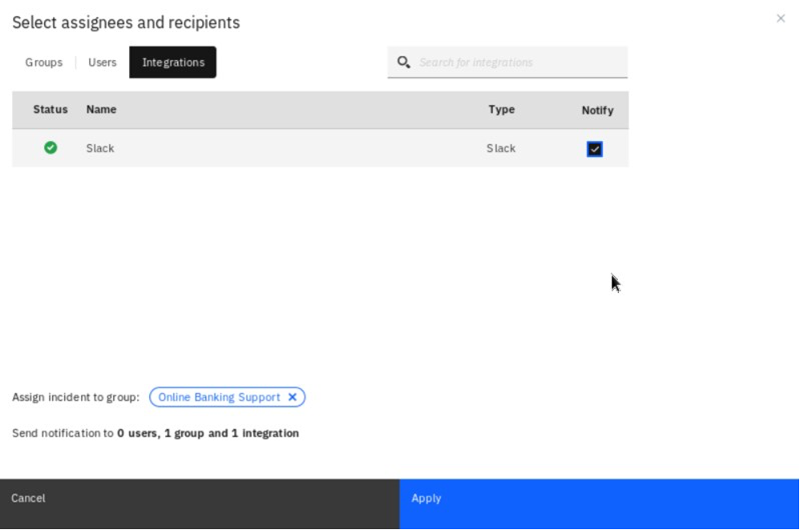

10. Finally, **Enable** the policy and click **Save**.

    

11. You have just defined a new incident policy. The policies are processed in a order visible on the screen. If you would like to change the order you can select a policy and use a context menu (vertical three dots on the right) and select **Move up** or **Move down**. This is sometimes important - for example if one of the previous policies will change the priority of your incidents, your policy may never be activated. However in this lab there is no need to change the sequence. 

    

12. Go back to the main Administration view clicking the link in the upper-left corner.

***

## Configure Ansible Tower

   In this section you will configure Ansible Tower. With Red Hat® Ansible® Tower you can centralize and control your IT infrastructure with a visual dashboard, role-based access control, job scheduling, integrated notifications and graphical inventory management. Ansible Tower is embeded into Cloud Pak for Multicloud Management to drive automation of event response with runbooks and is also used for configuration and compliance automation within infrastructure module.

1. Open a new browser tab and use the Ansible bookmark to open Ansible Tower interface.

   

2. Provide `admin` as username and paste the password using Skytap stored credentials.

   

3. First, you need to define a credentails to be used with the target environments. Select **Credentials** from the menu and then click '+' sign to add new credentials.

   

   You will add 2 different type of credentials. First let's add a credentials to the vcenter that allows Asnible Tower to collect data from the Vmware vSphere environment. Later, you will add credentials to specific virtual machines, to allow running Ansible playbooks on these VMs using ssh.

4. Provide a name (e.g. `vcenter`) (1), select the Organization `Default` (2), then select the **Credential type** lookup (3) to pick the **Vmware vCenter** option (5) available on the last tab of the list (4). Then click **Select**.

   Then, provide `10.0.0.100` as **Vcenter Host**, `administrator@vsphere.local` as **Username** and `P@ssw0rd` as **Password**. Finally, click **Save**.

   

5. To add the second credentials, click the '+' sign again, and provide name (e.g. `ubuntu`). This time select type `Machine` and provide `ibmuser` as **Username** and `passw0rd` as **Password**. You can notice it is also possible to provide the SSH key as a credentials, but you won't use this method in this tutorial. Scroll down and click **Save**.

   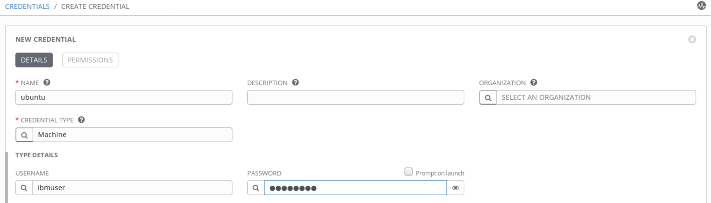

6. Now, let's add new Inventory. In the menu select **Inventories**.

   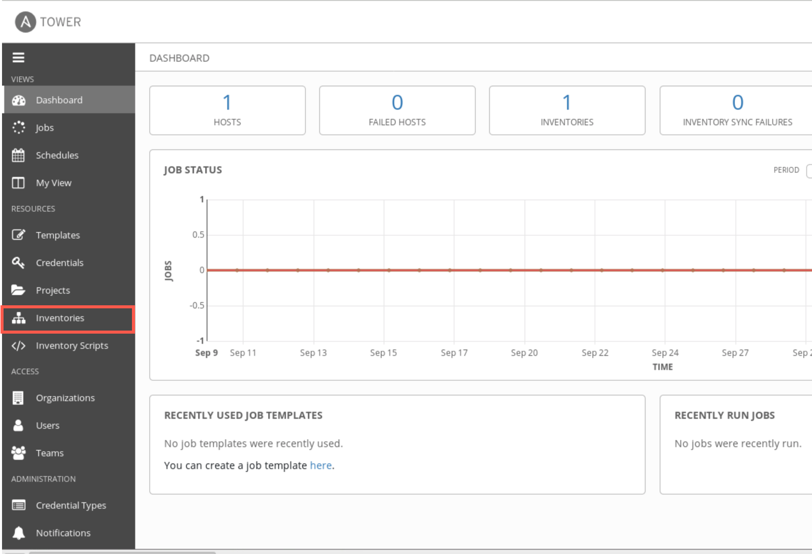

7. An Inventory is a collection of hosts against which jobs may be launched. To create automation you must first define a set of target hosts as Inventory and assign the credentials that Ansible will use to connect to the target system. You can define a static inventory for a well known hosts in your infrastructure, as well as dynamic inventory that will be automatically populated with the virtual machines provisioned in a public or private cloud. Let's start with dynamic one. Click '+' sign on the right and select **Inventory** to create a new inventory.

   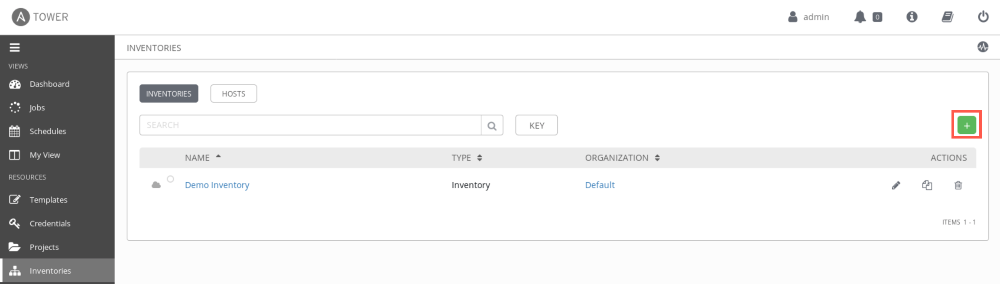

   Provide the name `vmware` and click **Save**

   

   Now, select **Sources** tab (1) and click '+' sign (2) to add new source.

   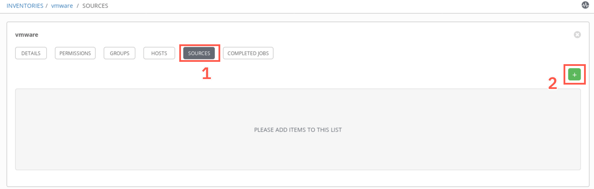

   Provide a name (e.g. `vcenter`) and select **Source** `VMware vCenter`.

   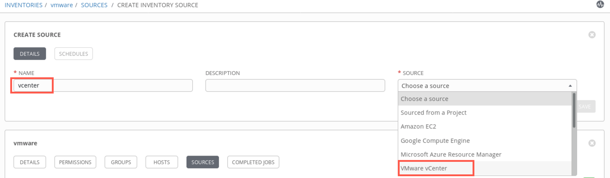

   Credentials `vcenter` should be populated automatically, as there is only one entry of this type defined. If you have defined more, select the credenitals defined in step 4 above. Then, click **Save**

   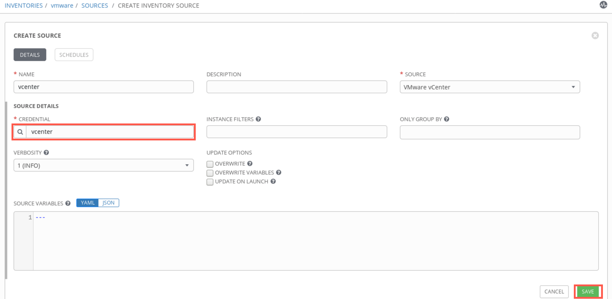 

8. On the Sources view, select the **Sync** icon (1) to pull inventory details from Vmware environment. When the sync job completes, you should see a green cloud icon next to the source name (2).

   

9. Now, add the static inventory for other hosts. Add new inventory but this time provide the name `static` and instead of sources tab, select `hosts`.


   
***

## Configure Runbook automation

   Runbooks are automated, semi-automated, or manual procedures capturing the organizational knowledge of how to diagnose and resolve different types of incidents. IBM Cloud Pak for Multicloud Management allows you to define and use runbooks, leverage automation through scripts but also integrate with multiple automation tools, like Ansible Tower or BigFix. In this section, you explore these capabilities.

1. You should be in the Administration view. Click **Runbooks** tile

   

2. Click **Connections** tab. Connections let you define automation tools that you want to use in your runbooks. Here you will define a connection to Ansible Tower

   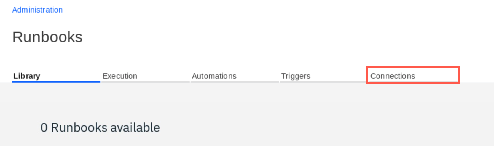

3. Click **Configure** under the Ansible Tower tile.

   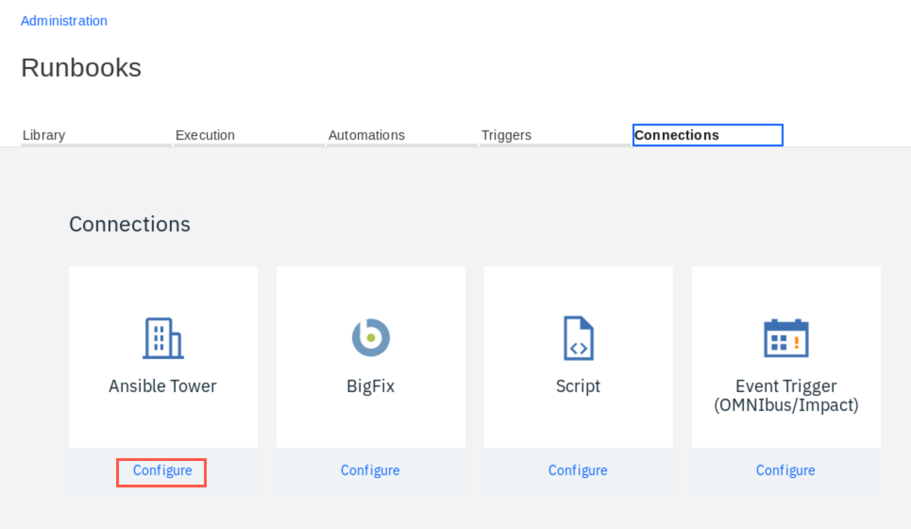

4. Enter Asible Tower URL: `https://ansible-tower-web-svc-ansible-tower.apps.demo.ibmdte.net`, provide `admin` as user and insert the password using the stored credentials from the Skytap menu. Finally click **Save**.

   

5. If you entered the credentials and URL correctly, you should see the green checkmark next to the **Connected** shown under Ansible Tower tile.

   

6. Now select the **Automations** tab and click **New automation**.

   Automations are predefined tasks that can be invoked by the operator manually during the incident or executed automatically in response to the incoming events. 


***

## Test runbook automation

***

## Summary

You completed the Cloud Pak for Multicloud Management tutorial: Multi-cluster Management. Throughout the tutorial, you explored the key takeaways:
- `Understand Cloud Pak for Multicloud Management`;
- `Add a managed cluster`;
- `Deploy an application`;
-	`Manage and monitor application resources of local and remote clusters`;

If you would like to learn more about Cloud Pak for Multicloud Management, please refer to:
-	<a href="https://www.ibm.com/cloud/cloud-pak-for-management" target="blank">Cloud Pak for Multicloud Management home page</a>
- <a href="https://www.ibm.com/demos/collection/Cloud-Pak-for-Multicloud-Management" target="blank">Cloud Pak for Multicloud Management Demos </a>
