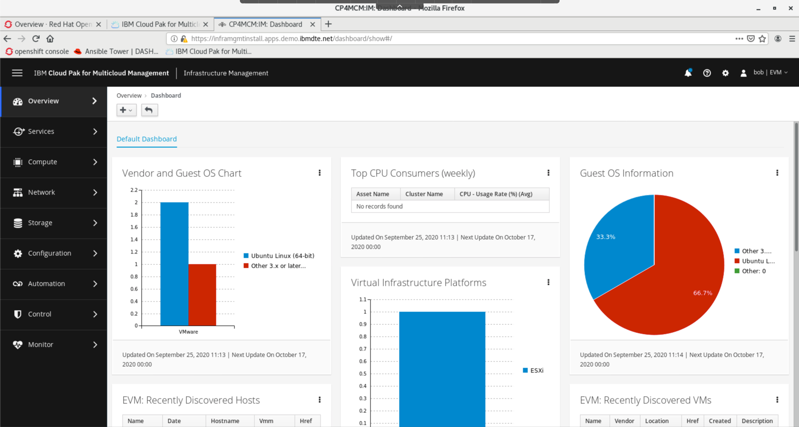
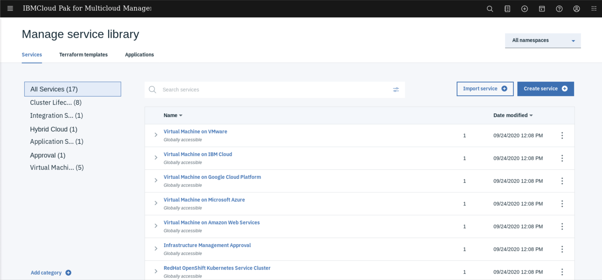
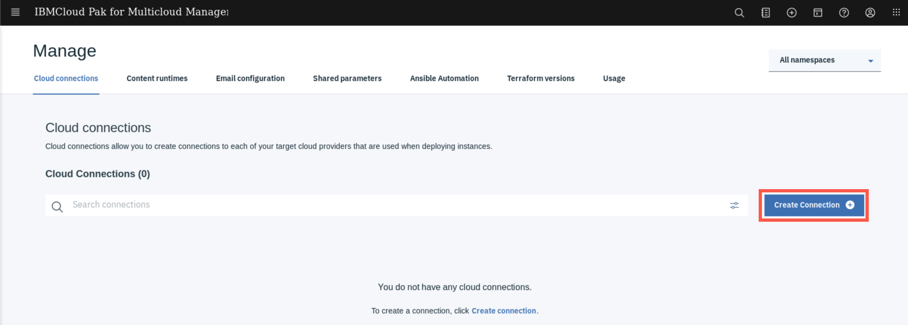
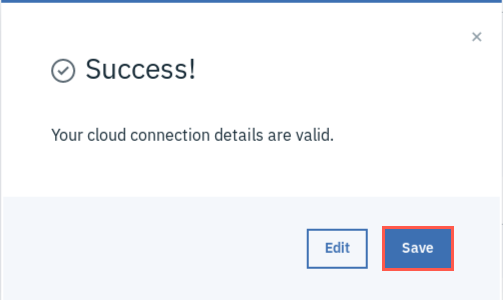
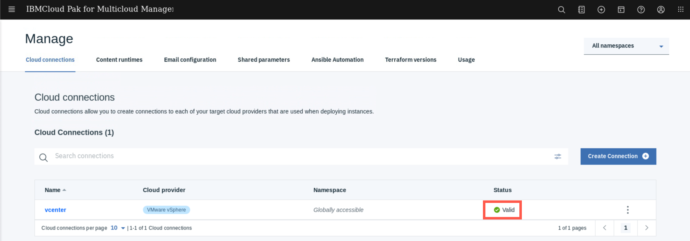
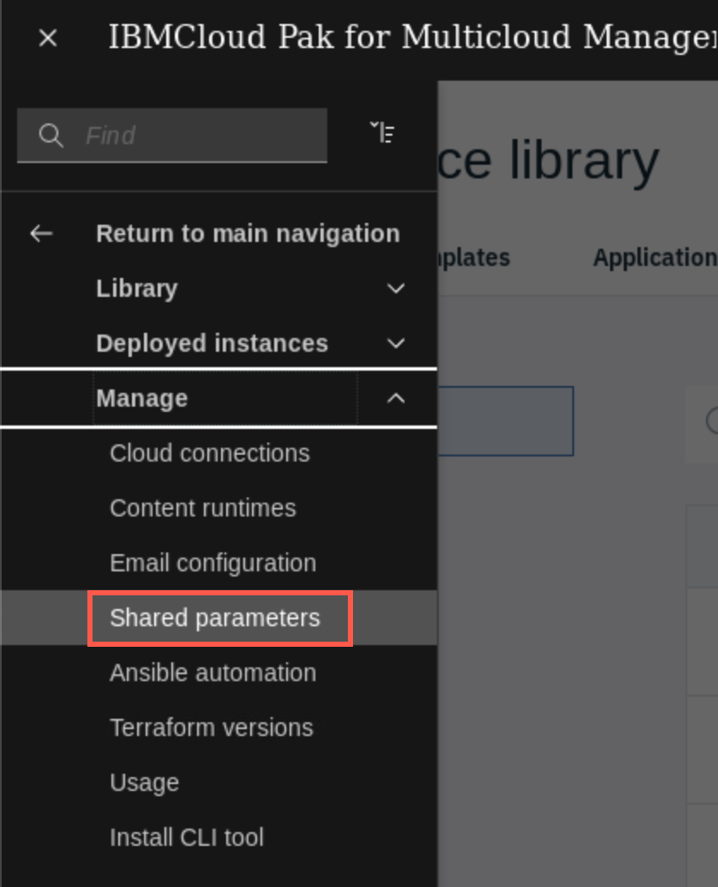
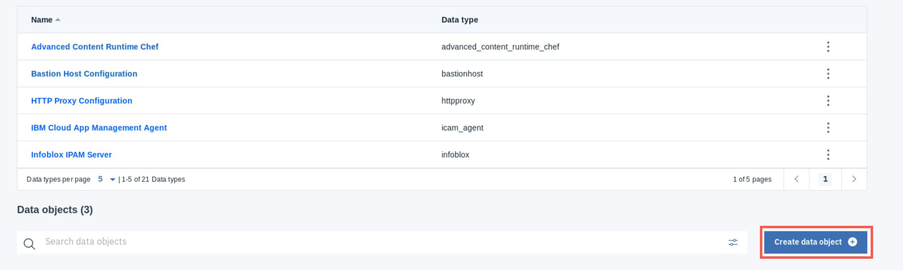

<FeatureCard
  title="Infrastructure Management with IBM Cloud Pak for Multicloud Management"
  color="dark"
  >

</FeatureCard>

<AnchorLinks>
  <AnchorLink>Lab Overview</AnchorLink>
  <AnchorLink>Prerequisite</AnchorLink>
  <AnchorLink>Business Context</AnchorLink>
  <AnchorLink>Define a connection to Vmware vSphere environment</AnchorLink>
  <AnchorLink>Define a shared parameter instance</AnchorLink>
  <AnchorLink>Summary</AnchorLink>
</AnchorLinks>

***

## Lab Overview

  IBM Cloud Pak® for Multicloud Management – Infrastructure Management delivers the insight, control, and automation enterprises need to address the challenges of managing virtual environments, which are far more complex than physical ones. This technology enables enterprises with existing virtual infrastructures to improve visibility and control, and those just starting virtualization deployments to build and operate a well-managed virtual infrastructure.

  IBM Cloud Pak® for Multicloud Management – Infrastructure Management was previously called IBM Red Hat CloudForms. For more information, see the previous versions of CloudForms® Red Hat CloudForms product documentation Opens in a new tab.

  IBM Cloud Pak® for Multicloud Management – Infrastructure Management includes the following feature sets:
  - Insight: discovery, monitoring, utilization, performance, reporting, analytics, chargeback, and trending.
  - Control: security, compliance, alerting, policy-based resource and configuration management.
  - Automate: IT process, task and event, provisioning, workload management and orchestration.
  - Integrate: systems management, tools and processes, event consoles, CMDB, RBA, and web services.

In this tutorial, you will explore the following key capabilities:
-	`Understand Cloud Pak for Multicloud Management Infrastructure Management capabilities`
-	`Learn how to define a new service for VM provisioning`
- `Learn how to provision new VM service`
-	`Learn how to apply configuration and control policies to the managed VMs`

***

## Prerequisite

- You need to provision your own copy of the CP4MCM 2.x environment, start it and verify for correct startup (check [here](../../gettingstarted/)).

***

## Business Context

In the hybrid environments there is often need to provision services that are a mix of systems and services running in multiple target environments. While new cloud-native applications may be fully containerized and run on the Kubernetes clusters, in case of modernized legacy applications usually some parts are still running on a Virtual Machines. IBM Cloud Pak for Multicloud Management allows you to automate provisioning of virtual machines as a part of hybrid applications. It also provides you the means to manage virtual machine lifecycle and compliance, as well as report the usage of shared resources in a form of chargback reports.

Cloud Pak for Multicloud Management provide 2 main ways to provision new infrastructure. First, leverages the provioning capabilities of ManagedIQ project and built-in providers. Second, uses the Terraform infrastructure-as-Code approach. You can any of these 2 methods or both - depending on the use case.

For the Terraform provisionig part you will complete the following tasks:
-	Define a connection to Vmware vSphere environment
-	Define a shared parameter data object
-	Define a new service for VM provisioning
- Test new service provisioning
- Define a new service plan
- Publish a service to the catalog

For the ManagedIQ/CloudForm provisionig part you will complete the following tasks:
- Define a new dialog
- Define a Self-service catalog and new catalog item
- Request a new service
-	Defina and apply compliance policy for a new VM service
-	Define a chargeback report for VMs

***

## Define a connection to Vmware vSphere environment

In this section, you will define a connection to the Vmware vSphere environment. The demo environment contains a single node vSphere cluster managed by the Vmware vCenter which you will leverage in that excercise.

1. To start the lab, you should be in your Cloud Pak for Multicloud Management Web Console. If you are not, check [here](../gettingstarted/) how to open your console page.

  

2. Now, let's explore the Infrastructure Management view. Click the hamburger **Menu** (1) and select **Automate Infrastructure -> Infrastructure Management** (2).

  

3. The new browser tab opens, and because there is a Single-Sign-On configured between the Cloud Pak Core and Infrastructure management module, you should get automatically logged in.

  

   The dashboard shows summary of the information regarding the connected providers. In this environment, there is only 1 provider used - Vmware vSphere, but you could connect many other target environments - including Openstack, Microsoft SC VMM or public clouds, like AWS, Azure, GKE, etc. This user interface was inherited from the former Red Hat CloudForms and is a commercial, supported version of the open source project ManagedIQ. This modules uses Ansible to discover the VMs in the managed providers and apply configuration and control policies. It also collects the usage data needed for chargeback reports, allowing you to divide costs of shared infrastructure among different consumers - application owners, business units or departaments.

4. To leverage Infrastructure-as-Code for service provisionig Cloud Pak for Multicloud Management uses the Terraform. To open the Terraform management UI (former Cloud Automation Manager) go back to the browser tab with the main Cloud Pak UI, click the hamburger **Menu** (1) and select **Automate Infrastructure -> Manage Services** (2).

  

  This opens a service management UI - where you can define and manage Terraform templates and services. Service comprise of one or more templates connected into a provisioning workflow with pre-defined parameters and service plans.

  

5. Before you will be able to exercise any of the templates that are pre-loaded in the service library, you have to define a connection to the target environment. In this demo scenario it is Vmware vCenter. Click hamburger menu in the top-left corner (1) and select **Manage -> Cloud connections**

   

6. Click **Create connection** button to add a new connection.

   

   Provide the following details:

   - cloud provider: `VMware vSphere`
   - Connection name: `vcenter`
   - vCenter user: `administrator@vsphere.local`
   - vCenter password: `P@ssw0rd`
   - vCenter host: `10.0.0.100`

   When ready click **Create** at the bottom.

   

   If the details are entered correctly, you should see the **Success** message shown below. Click **Save**.

   

   Great, you connected Infrastructure management to your target environment. Let's move to the next section.

   

***

## Define a shared parameter instance

   To provision new VMs using a terraform usually user has to provide multiple parameters that are required by VMware vSphere environment. Cloud Pak for Multicloud Management let you pre-define those parameters so users won't be required to specify them every time they request a service. This is done by defining a shared parameter data object.

1. Open the hamburger menu and select **Manage -> Shared parameters**.

   

2. On the top of the screen you will see a definition of shared parameters data types. These type defines what attributes the shared parameter object contains - usually they are defined to match the parameters required by terraform providers. Scroll down to the **Data objects** section which holds the defined instances of shared parameters, and click the **Create data object button**.

   

3. On the naxt page, provide the following details:

   - Data Type: `vsphere_managed_inventory_definition`
   - Data Object Name: `ubuntu`
   - Datacenter Name: `Datacenter`
   - Resource Pool Name: `dte-demo`
   - Virtual Machine Folder Name: `DTE`
   - Virtual Machine Image Template Name: `ubuntu`
   - Virtual Machine Domain Name: `demo.ibmdte.net`
   - Virtual Machine Template User Name: `ibmuser`
   - Virtual Machine Template User Password: `passw0rd`
   - Datastore Name: `datastore2`
   - Network Name: `VM Network`
   - DNS Servers: `10.0.0.201`
   - DNS Suffixes: `demo.ibmdte.net`
   - IPv4 Gateway: `10.0.0.254`
   - IPv4 Netmask (CIDR): `24`

   When finished click **Create** at the bottom.

   *to be continued...*

  Congratulations! You have successfully completed the lab “Infrastructure Management with IBM Cloud Pak for Multicloud Management”.

***

## Summary

You completed the Cloud Pak for Multicloud Management tutorial: Multi-cluster Management. Throughout the tutorial, you explored the key takeaways:
-	`Understand Cloud Pak for Multicloud Management Infrastructure Management capabilities`;
-	`Learn how to define a new service for VM provisioning`;
- `Learn how to provision new VM service`;
-	`Learn how to apply configuration and control policies to the managed VMs`;

If you would like to learn more about Cloud Pak for Multicloud Management, please refer to:
-	<a href="https://www.ibm.com/cloud/cloud-pak-for-management" target="blank">Cloud Pak for Multicloud Management home page</a>
- <a href="https://www.ibm.com/demos/collection/Cloud-Pak-for-Multicloud-Management" target="blank">Cloud Pak for Multicloud Management Demos </a>
