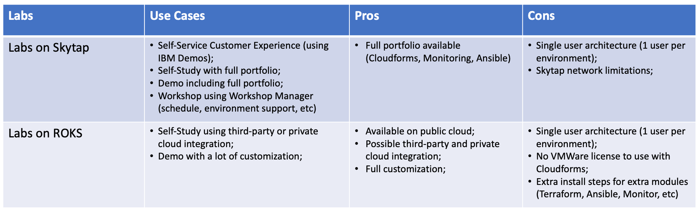

## Cloud Pak for Multicloud Management Labs Environments

As described in the previous page, DTE provides two options of labs environment (ROKS and Skytap). Here you will learn the use cases, pros and cons for each approach.

Now that you have more information to select the right environment for you, go ahead and explore the labs pages below:

- [Labs on Skytap](../../skytap/overview/)
- [Labs on ROKS](../../roks/overview/)
