<FeatureCard
  title="Monitoring using SRE Golden Signals with IBM Cloud Pak for Multicloud Management"
  color="dark"
  >


</FeatureCard>


<AnchorLinks>
  <AnchorLink>Lab Overview</AnchorLink>
  <AnchorLink>Prerequisite</AnchorLink>
  <AnchorLink>Business Context</AnchorLink>
  <AnchorLink>Add Managed Clusters</AnchorLink>
  <AnchorLink>Deploy cloud native monitoring</AnchorLink>
  <AnchorLink>Deploy Bookinfo Application</AnchorLink>
  <AnchorLink>Deploy synthetics monitoring Point-of-Presence</AnchorLink>
  <AnchorLink>Explore SRE Golden Signals</AnchorLink>
  <AnchorLink>Summary</AnchorLink>
</AnchorLinks>

***

## Lab Overview

Monitoring module of IBM Cloud Pak for Multicloud Management is a modern management platform, providing application-aware infrastructure monitoring and analysis for improved time to value. As a cloud-native application management platform, Monitoring provides the correct set of easy to use tools that meet the needs of development, operations, and site reliability engineering (SRE) teams. Tools needed to quickly find the root cause of an issue across a broad range of technologies, hybrid-cloud, and complex microservices architectures in all sorts of industries. Monitoring delivers app-centric monitoring of microservices-based applications in addition to monitoring for traditional resources across enterprises.

Monitoring module includes IBM Cloud Event Management and gives site reliability engineers (SREs) a consistent monitoring method across the enterprise to any public or private cloud. Deploy in minutes, simplify your application management with increased flexibility, and deliver on different aspects of the application modernization journey.
With Monitoring, you can simplify monitoring and incident management, which helps decrease time to resolution no matter how complex the hybrid microservices-based environment.

In this tutorial, you will explore the following key capabilities:
-	`Understand Cloud Pak for Multicloud Management Monitoring module`
-	`Learn how to add cloud native monitoring to the managed cluster`
- `learn how to gather monitoring metrics from the managed cluster`
-	`Learn how to use SRE Golden Signals to monitor application running on the managed cluster`

***

## Prerequisite

- You need to provision your own copy of the CP4MCM 2.0 environment, start it and verify for correct startup (check [here](../../gettingstarted/)).

***

## Business Context

Companies are modernizing their applications, preparing to move them to the cloud. In this process, applications are refactored to use a microservice architecture and deployed in dynamic environments like Kubernetes. Cloud-native development is way more agile than traditional methodology, which enables changes to application structure at a rapid pace. This creates a challenge for Operation teams who must maintain those applications and provide high availability of the services. With a new version of application deployed daily or weekly, there is rarely time to create bespoke monitoring dashboards and practice the troubleshooting routines. Both people and tools have to adapt to new conditions.
IBM Cloud Pak for Multicloud Management can manage Kubernetes clusters that are deployed on any target infrastructure - either in your own data center or in a public cloud. IBM Cloud Pak for Multicloud Management includes IBM Cloud App Management to simplify monitoring your applications across any cloud environment.
IBM Cloud Pak for Multicloud Management helps companies make the transition from traditional monitoring systems to cloud-based ones more easily. It effectively monitors all kinds of IT resources in a hybrid environment. It helps Operation teams manage hybrid environments without hiring new personnel to support each new technology that is being used by developers.
In this tutorial, you learn how to use IBM Cloud Pak for Multicloud Management to monitor and manage the application availability with a "Golden Signal" approach to monitoring your applications. This approach focuses on Latency, Errors, Traffic, and Saturation (for a quick introduction, see Simplify Application Monitoring with SRE Golden Signals).

In this tutorial, you use a Red Hat OpenShift cluster with Cloud Pak for MCM as a **Management Hub** and a second single-node cluster running MicroK8s as a **managed cluster**
-	Hub cluster includes management console, federated monitoring, and all the controllers. 
-	Managed cluster includes klusterlet components that communicate status back to the Hub cluster. 

The relationship between hub and managed clusters is shown in the diagram below:


In this tutorial, you will log in to the Hub cluster and configure the Monitoring module.

You will complete the following tasks:
-	Add a managed cluster (if not done already)
-	Deploy cloud native monitoring to the managed cluster
-	Visualize monitored resources in a managed cluster
- Install the Synthetic Monitoring Point-of-Presence
-	Deploy an monitored application to managed cluster
-	Define the synthetic monitoring of the application and define a Service Level Objective for it
- Explore application service topology and SRE Golden Signals provided by data collectors embeded in the application runtimes

***

## Add Managed Clusters

In this section, you will add a managed cluster in your Control Panel. If you have done this before as a part of [Cluster Management lab](../clustermgmt/index.mdx) you may skip to the [Next step](#deploy-cloud-native-monitoring-to-the-managed-cluster)

0. **IMPORTANT:** MicroK8s instance that you will use in this exercises as a managed cluster gets automatically updated on startup. Beginning with version 1.19, the default configuration of MicroK8S prevents running containers in privileged mode, which breaks some of labs. Before you continue, go to the desktop and open the terminal window to MicroK8s cluster clicking the **MicroK8s Terminal** link. Then, in a yellow window, run the following commands:

```sh
sudo echo "--allow-privileged=true" >> /var/snap/microk8s/current/args/kube-apiserver
sudo systemctl restart snap.microk8s.daemon-apiserver.service
```

When prompted for a ibmuser password, enter **engageibm**

1. To start the lab, you should be in your Cloud Pak for Multicloud Management Web Console. If you are not, check [here](../gettingstarted/) how to open your console page.

  

2. Now, let's explore the Cluster view. Click the hamburger **Menu** (1) and select **Automated Infrastructure -> Clusters** (2).

  

3. You can add a cluster by Importing an existing cluster or provisioning a new cluster using a Service Library. We use the first option. Select **Import an Existing cluster** (1) and click **Import** (2).

  

4.  Enter **microk8s** for cluster name (1) and **microk8s** for namespace (2). Click **Generate command** to continue (3).

  

5. A curl command is generated that you will use to add the new cluster. Click **Copy command** button (1) and click **View cluster** (2) to see the new iks-cluster details page. Copy the generated command in a note, you will use it later.

  

6. Go back to the desktop and open the terminal window to MicroK8s cluster clicking the **MicroK8s Terminal** link. 


7. MicroK8s terminal has a yellow background. To verify the cluster status run the following command in the **MicroK8s** window

  ```
  kubectl get nodes
  ```

  

  Great, you are accessing the managed cluster. Now you are ready to execute the generated command.

8. **Paste** the generated command that you previously copied in the clipboard. When you run the command, several Kubernetes objects are created in the multicluster-endpoint namespace.

  

  If you see the error as before - just run the command again.

9. You can view the progress by entering the command:

  ```
  kubectl get pods -n multicluster-endpoint
  ```

  Make sure all the pods are in the running state.

  

10. Back to the browser window, click **View cluster** and make sure that the cluster status is **Ready** now (if necessary, refresh the details page).

  

  

11. On the page navigation breadcrumb, click on **Clusters** link

  

12. Now you can see your managed cluster in a clusters list. You need to add labels to identify your new cluster. Labels are then used by the PlacementRules and PlacementPolicies to select clusters where different applications and policies should be deployed.

In the [Cluster Management lab](../clustermgmt/index.mdx) you could learn how to add labels using a web console. Below you will use alternative methods of modifying labels using a CLI.

First, you need to install a multicluster plugin to the `cloudctl` command. Open the green terminal to the **Management Hub** and run the following commands

```sh
curl -kLo cloudctl-mc-plugin https://cp-console.apps.demo.ibmdte.net/rcm/plugins/mc-linux-amd64
cloudctl login -a https://cp-console.apps.demo.ibmdte.net -u bob -p Passw0rd -n default
cloudctl plugin install -f cloudctl-mc-plugin
```

Now, you can manage your remote clusters with the cli. To list the labels for **microk8s** cluster, in a green **Management Hub** terminal run:

```sh
cloudctl mc describe cluster microk8s -n microk8s -c hub0
```

To add a new label **environment=QA** run the following command in a green **Management Hub** terminal

```sh
cloudctl mc label cluster microk8s environment=QA -n microk8s
```

The remote Kubernetes cluster is now registered as a managed cluster. In the next step, you will deploy the cloud native monitoring to that mamnaged cluster.
***

## Deploy cloud native monitoring

When the Cloud Pak for Multicloud Management is installed with the Monitoring module, you can automatically deploy the Kubernetes data collector to the remote managed clusters. This data collector is capable of gathering and sending to the Management Hub information about performance of all nodes, pods and other resources running in a managed cluster.

To deploy Kuberenetes data collector (also known as cloud native monitoring) complete the steps below.

1. First, you need to label target cluster with **ibm.com/cloud-native-monitoring=enabled**. You can do this in web console, or run the following command in a green terminal titled **Management Hub**

```sh
cloudctl mc label cluster microk8s ibm.com/cloud-native-monitoring=enabled -n microk8s
```


2. Second, you need to add the target cluster namespace as a managed resource to your team. Again, you can do this in web console (Menu -> Administer -> Identity and access -> Teams tab, select the team 'operations', edit the Resources), or run the following command in a green terminal titled **Management Hub**

```sh
cloudctl iam resource-add operations -r crn:v1:icp:private:k8:mycluster:n/microk8s:::
```

This command adds a namespace **microk8s** (this namespace was automatically created during cluster import and contains the cluster CRD) as a managed resource to the team **operations**. This operations triggers the deployment process of cloud-native-monitoring operator to the target cluster.

You can check that the operator was deployed running the following commands in a yellow terminal connected to **MicroK8s** cluster

```sh
kubectl get pods -n cp4mcm-cloud-native-monitoring
```

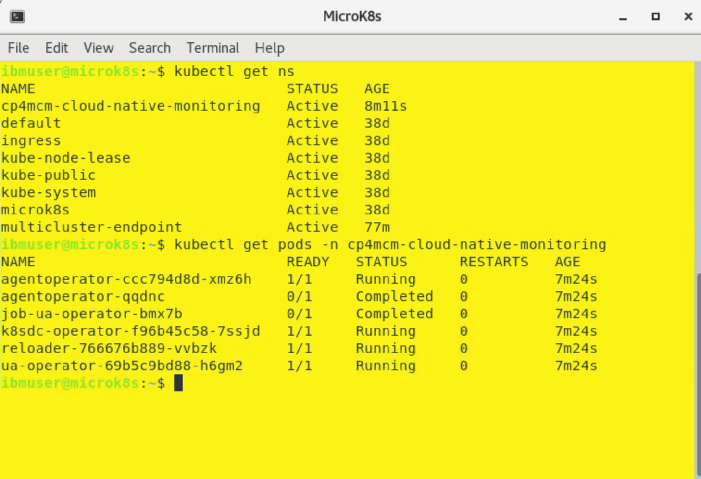

3. Finally, you need to open the Monitoring module console as a user belonging to the operations team - user **bob** in our case. Select "hamburger" menu in the top-left corner and then **Monitor health** (2) and **Infrastructure monitoring**. 


If you are redirected to login page, login again as user **bob** with password **Passw0rd**. Eventually, you should see the **Resources** tab shown below:


The page probably won't show any resources yet, because the process to install Kubernetes data collector was just started. You can check if it was successfully deployed running the previous command again (in yellow terminal).

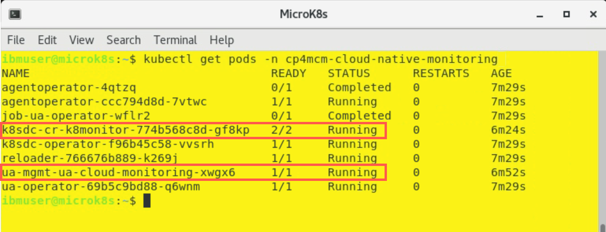

When it is deployed, after 1-2 minutes you can refresh the browser, and you should see the view showing now all the resources from the managed cluster.


Click the **Kubernetes cluster**.


Then click **microk8s**.


The next view, let you explore the metrics and events releated to the selected resource. On top, you can see the Event timeline (1) for wihich you can change the time window (from 30 minutes to 1 week). Deployment topology widget (2) shows how the specific resource is located within the cluster. 

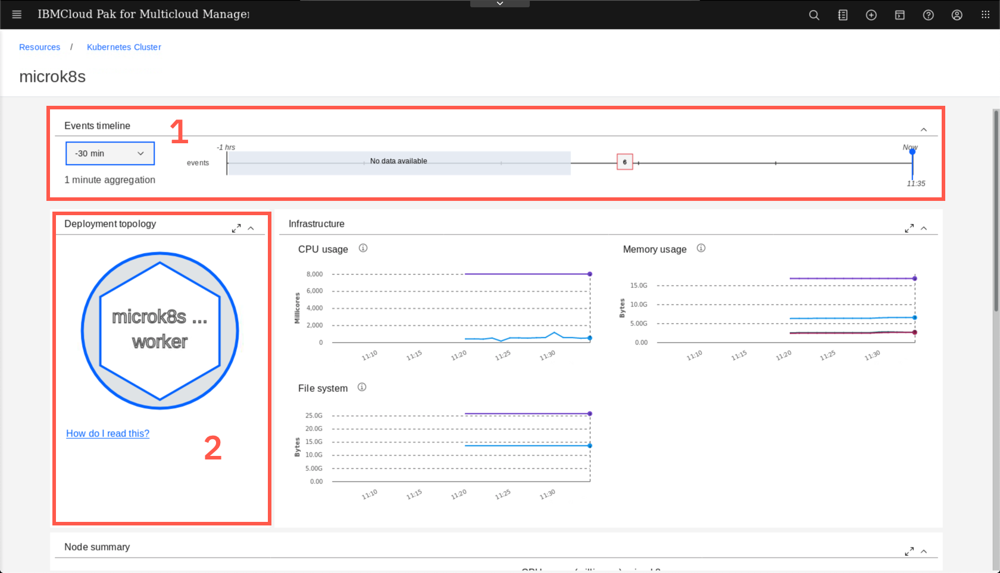

If you hover over the numbers on the Timeline (1) you can see the details of the events. You can also click the 'How do I read this' link (2) on the Deployment topology to learn hot to use that widget.


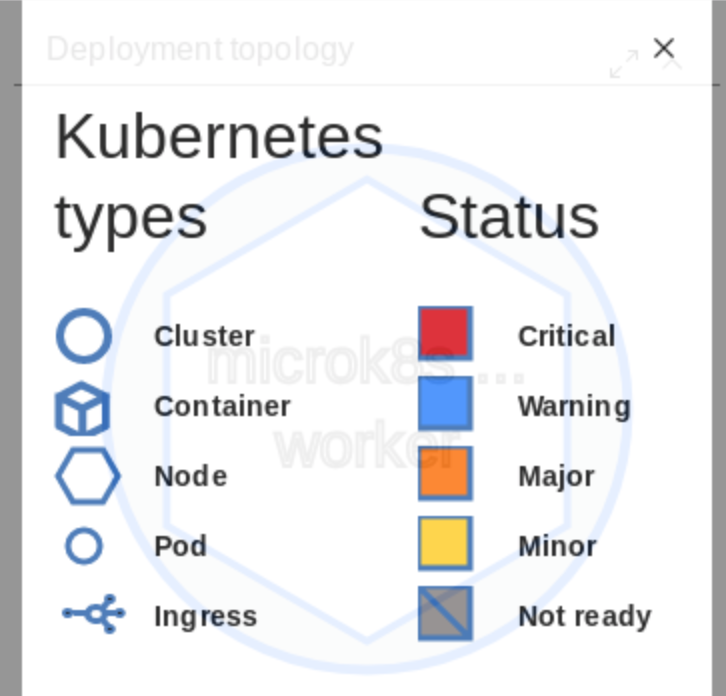

Feel free to explore other resources and their metrics. For example you can click the worker node icon on the Deployment topology widget.


***

## Deploy Bookinfo Application

On top of monitoring Linux worker nodes and basic Kubernetes objects Operations teams want are responsible for monitoring business applications. So let's deploy sample application, called Bookinfo

1. To start, clone the git repository containing the yaml files needed to deploy the application. Using the green terminal window, run the following commands on the **Management Hub**

```sh
git clone https://github.com/dymaczew/charts
cd charts
```

2. Apply the application resources running the following commands:

```sh
/home/ibmuser/oclogin.sh
oc apply -f bookinfo-multiclister-2020.2.0
oc apply -f kubernetes-1.19-ingress-deployable.yaml
```

The last command updates the ingress deployable for Kubernetes 1.19 version that is running on the your managed cluster (Ingress definition was changed in 1.19 and extended with new mandatory fields)

The output looks like the following:


Don't worry about the error in the last line - it just means that ImagePolicy admission controller is not used in the environment.

3. Now, let's edit the placement rule for the application to get it deployed on the managed cluster (we tagged in with label "environment=QA"). Navigate to application view, selecting the "hamburger" menu in the top-left corner, then **Observe environments** and **Overview**


On the overview page, scroll down to the Applications section and select **bookinfo-app** link. We recommend this way, becasue for some reason (probably a bug?) the application is not listed directly on the Hybrid Applications list

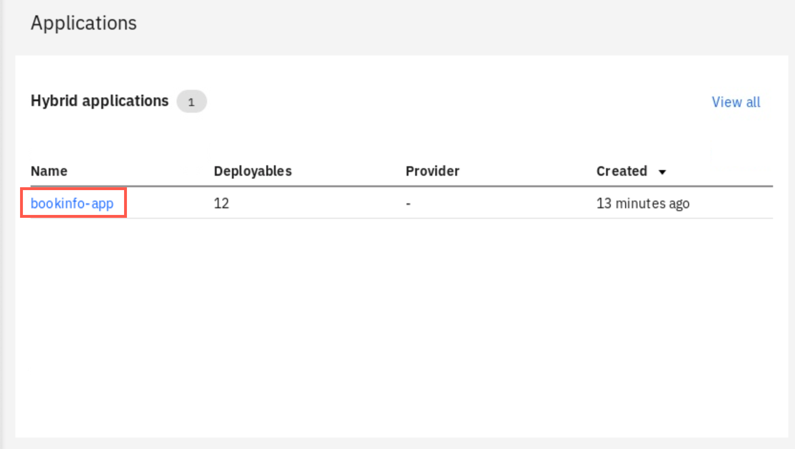

4. When the Application view opens, click on the **bookinfo-rule** icon

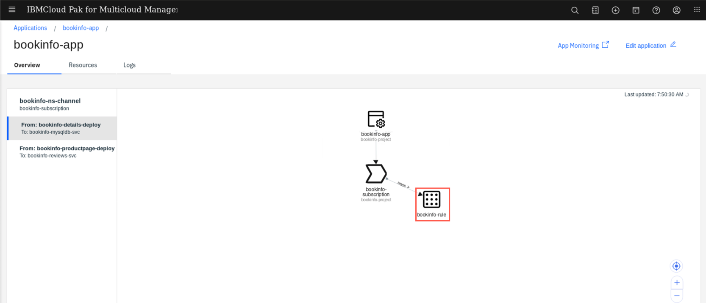

5. Edit the placement rule in the editor on the right, changing the value of the label from **Dev** to **QA** (1) and then apply you changes with the button on top of the editor(2)


6. After a few seconds, you should notice that the application is now being placed on the **microk8s** cluster. The deployment takes usually 1-2 minutes needed to pull images and start containers.

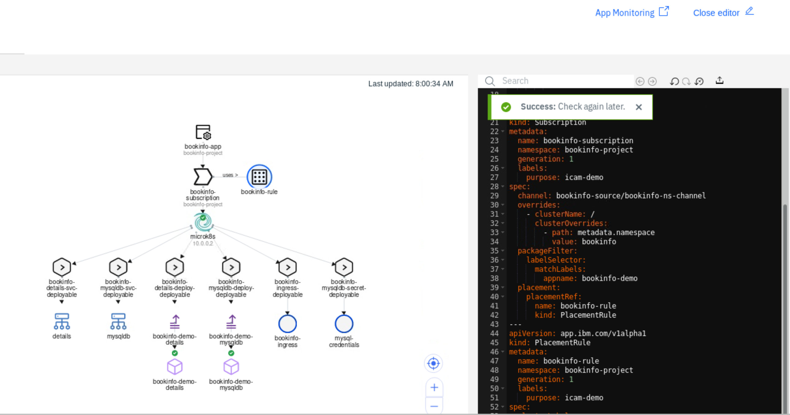

7. You can verify if the application was successfuly deployed and is accessible by opening a new browser tab and entering the URL: `bookinfo.10.0.0.2.nip.io`. You should reach the page that looks like below:

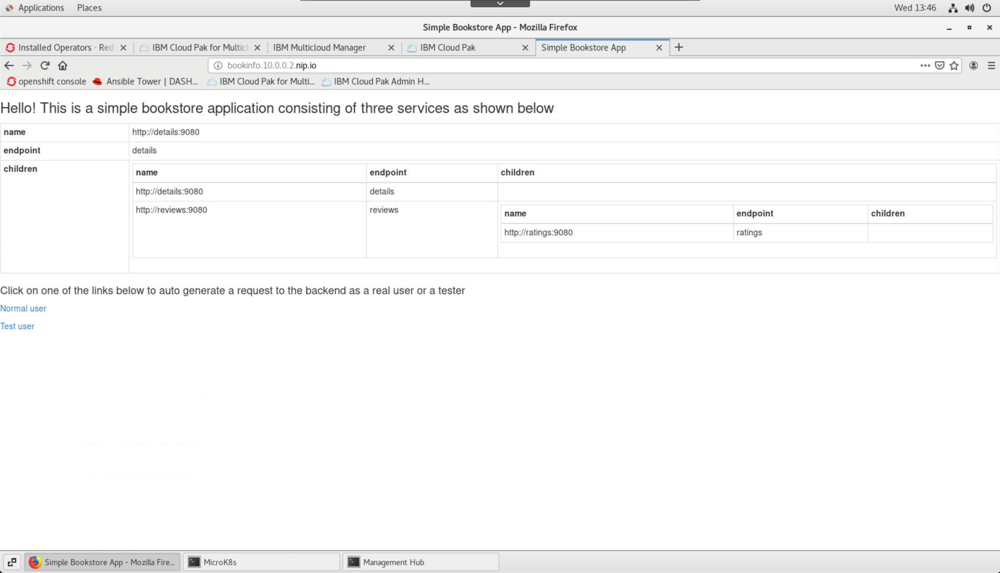
   
***

## Exploring synthetics monitoring

Cloud Pak for Multicloud Management is capable of monitoring the application availability using a synthetic transaction monitoring. There is a default agent installed on the Hub cluster that automatically starts monitoring any ingress object that is deployed as a part of Hybrid application. Let's check how it looks like.

1. Open the Monitoring module interface (Select "hamburger" menu, then **Monitor Health**, then **Infrastructure monitoring**). Then select the **Synthetic results** tab

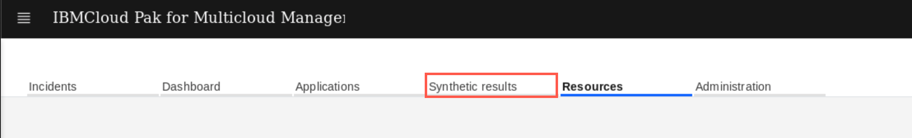

2. On the page Synthetic results page, you should see the automatically configured monitor for ingress deployed as a part of Bookinfo application. Click on the monitor name to explore details


3. You can adjust the scope of the timeline, reducing the windows to last 30 minutes (1). You can also select to see a Response time graph or a response time Breakdown (2). This helps to diagnose issues related to name resolution on establishing the SSL session.

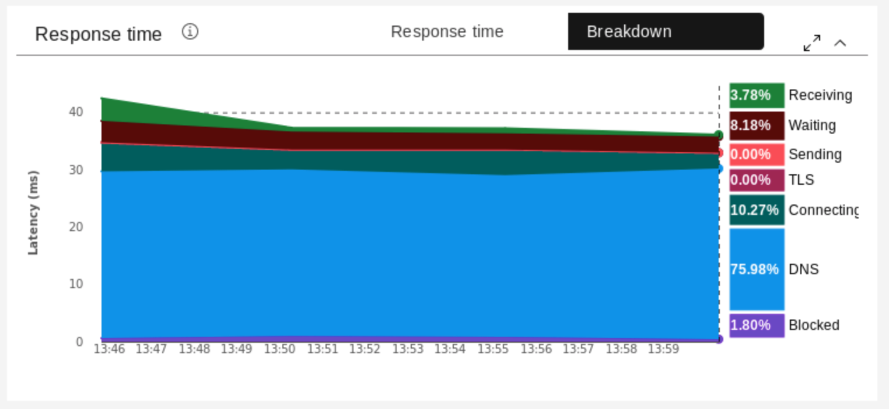

4. When you scroll down you can see the results of actual tests. Select any dot on the graph to see detailed breakdown of the response.

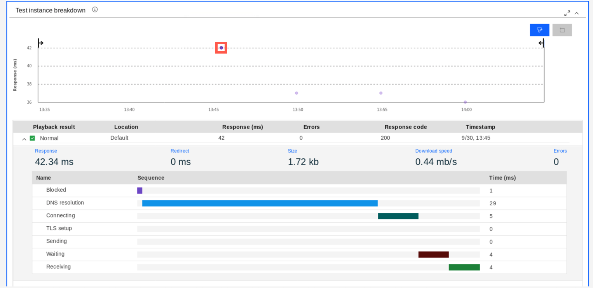

You can deploy more agents in different locations to have your applications tested for availability and response time from a customer perspective.

***

## Explore SRE Golden Signals

tbc

***

## Summary

You completed the Cloud Pak for Multicloud Management tutorial: Monitoring and using SRE Golden Signals. Throughout the tutorial, you explored the key takeaways:
-	`Understand Cloud Pak for Multicloud Management Monitoring module`
-	`Learn how to add cloud native monitoring to the managed cluster`
- `learn how to gather monitoring metrics from the managed cluster`
-	`Learn how to use SRE Golden Signals to monitor application running on the managed cluster`

If you would like to learn more about Cloud Pak for Multicloud Management, please refer to:
-	<a href="https://www.ibm.com/cloud/cloud-pak-for-management" target="blank">Cloud Pak for Multicloud Management home page</a>
- <a href="https://www.ibm.com/demos/collection/Cloud-Pak-for-Multicloud-Management" target="blank">Cloud Pak for Multicloud Management Demos </a>
