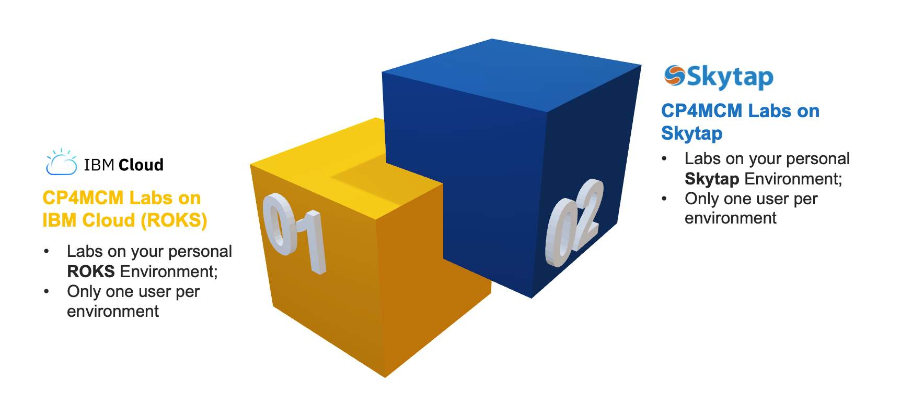

## Cloud Pak for Multicloud Management Labs Environments

The DTE Team provides the ability to provision learning environment with the Cloud Pak for Multicloud Management 2.x installed running on Red Hat OpenShift.

There are two different options, as described in the picture below:

The options are different in capabilities, features and use cases. Next page, you will understand the pros, cons and use case of each option, to help you to select the best option for your demand.

Both environments are dedicated/personal environments with no extra cost for you.

In this tutorial, you have all the documentation to request and prepare both options. Each environment has a collection of pre-created labs to be used in a self-study scenario or in a hands-on event. The labs are not the same, because the environments have different capabilities. Check each environment page, to see the list of labs available.

After you follow this documentation, you will have a Cloud Pak for Multicloud Management 2.x environment. During the reservation process, you are able to define the expiration date of your environment, max of 14 days (with some options to extend it).

If you have any issues or feedback, please share it with the tutorial authors. Enjoy it!!
