<FeatureCard
  title="Continuous Integration & Continuous Delivery with IBM Cloud Pak for Multicloud Management"
  color="dark"
  >


</FeatureCard>


<AnchorLinks>
  <AnchorLink>Lab Overview</AnchorLink>
  <AnchorLink>Prerequisite</AnchorLink>
  <AnchorLink>Business Context</AnchorLink>
  <AnchorLink>Installing Tekton</AnchorLink>
  <AnchorLink>Preparing your Tekton Environment</AnchorLink>
  <AnchorLink>Creating Service Account & Pipeline Resources</AnchorLink>
  <AnchorLink>Creating and Testing Tasks</AnchorLink>
  <AnchorLink>Editing your Deployables YAMLs</AnchorLink>
  <AnchorLink>Creating your Application Model YAMLs</AnchorLink>
  <AnchorLink>Creating and Running your Pipeline</AnchorLink>
  <AnchorLink>Check the Application Deployment</AnchorLink>
  <AnchorLink>Summary</AnchorLink>
</AnchorLinks>

Note: 'This lab is to be used for CP4MCM 2.1.X on ROKS.'


***

## Lab Overview

BM Cloud Pak for Multicloud Management provides consistent visibility, automation, and governance across a range of multicloud management capabilities such as cost and asset management, infrastructure management, application management, multi-cluster management, edge management, and integration with existing tools and processes. Customers can leverage Cloud Pak for Multicloud Management to simplify their IT and application ops management, while increasing flexibility and cost savings with intelligent data analysis driven by predictive signals.

IBM Cloud Pak for Multicloud Management can manage Kubernetes clusters that are deployed on any target infrastructure - either in your own data center or in a public cloud.

In this tutorial, you explore how to deploy a node.js application (Stock Trader) using Continuous Integration and Continuous Delivery pipeline together with IBM Cloud Pak for Multicloud Management. The CI/CD pipeline creates the docker image from the source code and generate the deployables to Cloud Pak for Multicloud Management (CP4MCM). The Management Pak will be the responsible to deploy the application in different managed cluster based on Placement rules.

Here, you use Tekton as your CI/CD Pipeline tool. Tekton is an open source project to configure and run CI/CD pipelines within a Kubernetes cluster.

In this lab, you explore the following key capabilities:
- `Learn how to register a managed cluster`
-	`Learn to create a CI/CD pipeline in Tekton`
-	`Learn to deploy an application using Pipeline and Cloud Pak for Multicloud Management`
-	`Learn to use Github webhook to start the pipeline`

***

## Prerequisite

- You need to have your personal CP4MCM on ROKS environment (check [here](../../environment/overview/) how to request it).
- You need to pre-install all necessaries CLI tools (check [here](../installcli/) how to install them).
- If you didn't complete the Lab 1 - Multicluster Management, you need, at least, to complete the steps of [Add Managed Clusters](https://pages.github.ibm.com/demohub/cloudpak-mcm/labs/clustermgmt/#add-managed-clusters) to have your clusters ready on CP4MCM to be able to follow this lab.
-	You need to have a [Docker Hub](https://hub.docker.com) account.
-	You need to have a [Github](https://github.com) account.
- You need to have the Tekton CLI. Follow the installation steps described in this [Tekton site](https://openshift.github.io/pipelines-docs/docs/0.10.5/proc_installing-cli.html), based in your operational system.

***

## Business Context

You are an Operator member of a DevOps team in your company. Your development team has created a NodeJS application and saved the application code in GitHub, now it is your responsibility to deploy the application to a Kubernetes cluster - IBM Kubernetes Cluster (IKS). You deploy a Tekton Pipeline along with Pipeline Resources, and two Task objects. The pipeline pulls the application source code from GitHub and builds the Docker image. When the image is built, the image is pushed to Docker Hub Image repository. But, instead to deploy directly your application to a Kubernetes cluster, you decide to explore how IBM Cloud Pak for Multicloud Management, provides consistent visibility, governance and automation in a Multicloud environment. Because of that, your pipeline runs the task that deploys this containerized application to your IBM Cloud Pak for Multicloud Management Hub cluster.  And your hub cluster will use Placement Rules to define where to deploy your application (that could be any Kubernete cluster in multiple cloud providers).

At the end of the lab, you configure Github webhook to automatically trigger a new PipelineRun on Tekton when you change your application.

In this tutorial, you use two Kubernetes clusters:

-	**Hub cluster** includes management console, federated monitoring, and all the controllers. In this tutorial, you identify Hub cluster as hub-cluster. Here is the OpenShift cluster.
-	**Managed cluster** includes klusterlet components that communicate status back to the Hub cluster. In this tutorial, your managed cluster is an IBM Kubernetes Services (IKS) cluster. This cluster will be identified as labX-cluster (where X is your labuser number).

The relationship between hub and managed clusters is shown in the diagram below:

  

In this tutorial, you will log in to the Hub cluster to do cluster management. After that you will use the Command Line Interface to create your Tekton Pipeline.


***

## Installing Tekton

Tekton is an open source project to configure and run CI/CD pipelines within a Kubernetes cluster. In this lab, you will create a Tekton pipeline to build and deploy a Node.JS application, to be managed by Cloud Pak for Multicloud Management.

In this section, you install Tekton in your Hub cluster. Let's do it!

1.Open the Terminal window. Let’s use the Hub Cluster context:

```
kubectl config use-context roks-hub-cluster
```

2.Let’s test the new context configuration. Run the command below to get the cluster nodes.
```
oc get nodes
```

  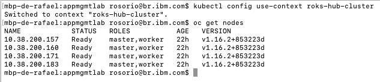

3.To simplify the lab steps, you will clone a pre-created YAML files to help the installation. To copy pre-created YAML files, let’s use the Git CLI. Run the command below:
```
git clone https://github.com/rafosorio/cp4mcm-cicd.git
```

4.Open the **cp4mcm-cicd** folder.
```
cd cp4mcm-cicd
```

5.Run the command below to install the OpenShift Pipelines Operator.
```
oc apply -f openshift-pipelines-sub.yaml
```

  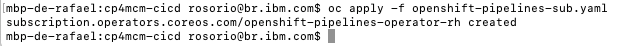

6.Now, let's create a project for Tekton Pipelines.
```
oc new-project tekton-pipelines
```

7.Now, you are ready to install Tekton Dashboard. Run the command below:
```
kubectl apply --filename https://github.com/tektoncd/dashboard/releases/download/v0.6.1.4/openshift-tekton-dashboard-release.yaml --validate=false
```

8.Now, you need to install the Tekton Webhooks extension, to use the webhooks feature.
```
kubectl apply --filename openshift-tekton-webhooks-extension-release.yaml
```

9.`Optional:` If you want to access the Tekton Dashboard UI. Execute the command below to check the Tekton Dashboard URL.
```
kubectl get route tekton-dashboard -n openshift-pipelines
```

  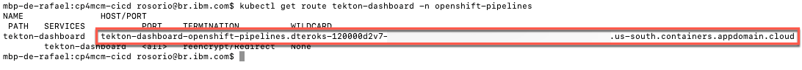

  Now you just need to enter this URL in a browser tab (Note: allow any permission request). That is it!

  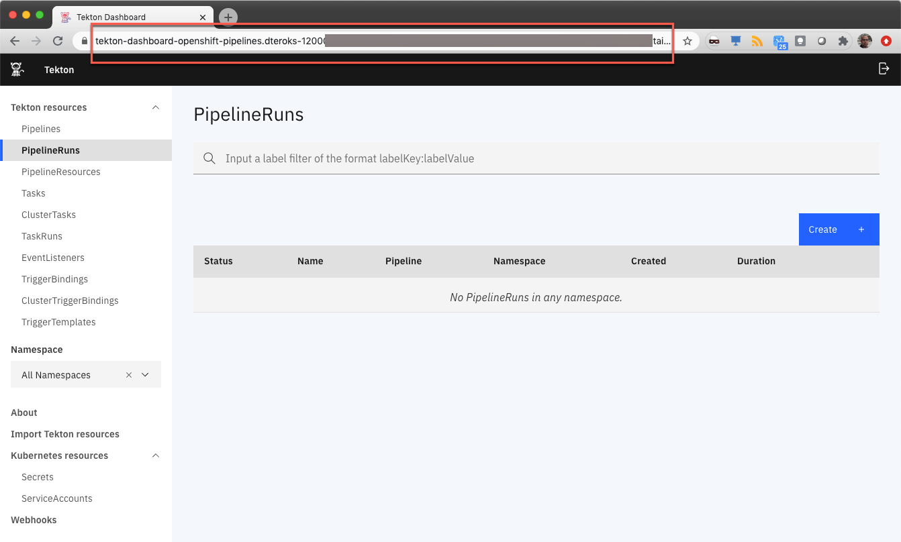

  However, in this lab, you will use Command Line interface to create Tekton Objects. However, you are welcome to explore the UI to see the objects that you will create.

***

## Preparing your Tekton Environment

In this section, you prepare your Tekton environment, by configuring your docker hub account secret and cloning the github repositories that you will use to create the pipeline. Let's do it!

1.First, let's create your labX-tekton project.
```
oc new-project labX-tekton
```

2.Now, let's create a secret for you Docker Hub account. Execute the command below, and replace **YOUR_DOCKER_USER**, **YOUR_DOCKER_PASSWORD** and **YOUR_DOCKER_EMAIL**.
```
oc create secret docker-registry regcred --docker-server=https://index.docker.io/v1/ --docker-username=<YOUR_DOCKER_USER> --docker-password=<YOUR_DOCKER_PASSWORD> --docker-email=<YOUR_DOCKER_EMAIL>
```

3.Now that you have the secret, let's create the YAML files. To simplify the lab steps, you will clone a pre-created YAML files. Don’t worry, because we will understand them. To copy pre-created YAML files, let’s use the Git CLI. Back to your terminal window, run the command below:
```
cd ..
git clone https://github.com/rafosorio/cp4mcm-tekton.git
```

  Next section, you start to create your Pipeline. Now, let's fork the github repository of the node.js application.

4.Back to your browser, open a new tab, and access the url **https://github.com/rafosorio/motherload**. On the GitHub page, click to **Fork** this repo to your Github account.

  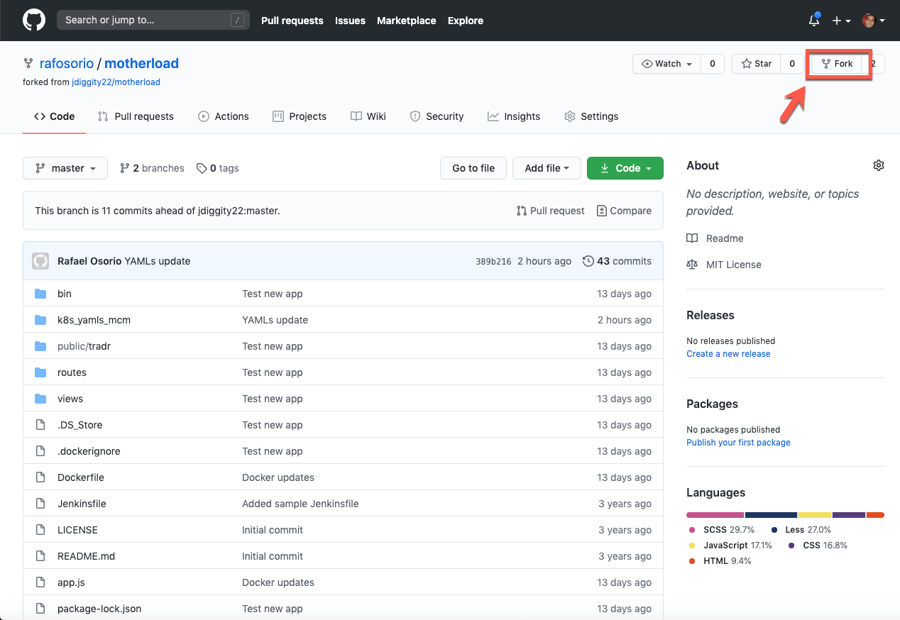

  Continue the necessary steps to fork this repository.

5.On your new Repo page, click **Code** (1) and copy the Clone HTTPS url (2) of your repo.

  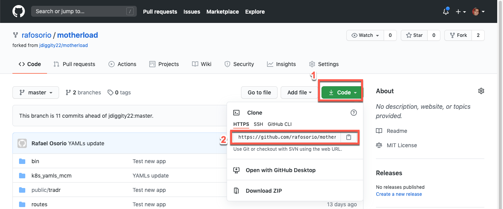

6.Back to your Terminal command line window, clone your new repository using the command below (replace the repository URL, with the URL copied in the previous step).
```
git clone https://github.com/YOUR_GIT_ACCOUNT/motherload
```

  Great now, you have two folders. In the `cp4mcm-tekton` folder, you have all the YAMLs to create the Tekton pipeline and to deploy the application in Cloud Pak for Multicloud Management. In the motherload folder, you have the node.js application source code, that you will deploy.

  Next sections, you will see how to use both repositories.

***

## Creating Service Account & Pipeline Resources

Tekton provides a set of extensions to Kubernetes, in the form of Custom Resources, for defining pipelines. The following diagram shows the resources used in this tutorial. The arrows depict references from one resource to another resource.


The resources are used as follows:
  - A **PipelineRun** defines an execution of a pipeline. It references the Pipeline to run.
  - A **Pipeline** defines the set of Tasks that compose a pipeline.
  - A **Task** defines a set of build steps such as compiling code, running tests, and building and deploying images.

We will go into more detail about each resource during the walkthrough of the example.

Let's create a simple pipeline that
  - builds a Docker image from source files and pushes it to your Docker Hub registry
  - deploys the image to your Cloud Pak for Multicloud Management

In this section, let's start with the basic:
  - You create a Service account to execute the Tekton Pipeline using your previous created Secret
  - You create the Pipeline Resources to access the Github source code repository and Docker Image Registry

Let's do it!

1.Back to your Terminal command line window, execute the command below to open the **cp4mcm-tekton** folder.
  ```
  cd cp4mcm-tekton
  ```

2.In this folder, you have two folders, one with the Cloud Pak for MCM YAMLS (MCM_yamls) and other with Tekton YAMLs (Tekton_yamls).

  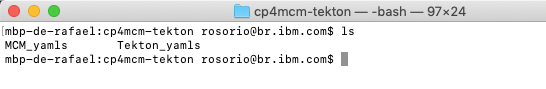

3.Open the **Tekton_yamls** folder.
```
cd Tekton_yamls
```

4.The first YAML file (01_serviceaccount.yaml) is to create the Service account. You are welcome to view and explore this file. Because this lab is focused on the CI/CD integration with CP4MCM, it will not explain the details of the Service Account.  Execute the command below to create the service account and bind with the previous created secret.
```
oc apply -f 01_serviceaccount.yaml
```

  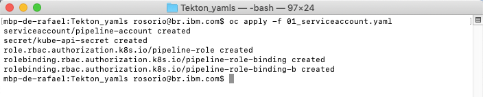

5.Now, you need to create the Pipeline Resources. Use any editor to open the file **02_pipelineresources.yaml**. Here you should see two PipelineResources one that inform the URL to store the Docker Image on Docker Hub (docker-image-tradr) (1) and the second is the URL of GitHub Source Code repository (git-source-tradr) (2).

  Edit your file to include `your_docker_hub_user` and `your_github_user`.

  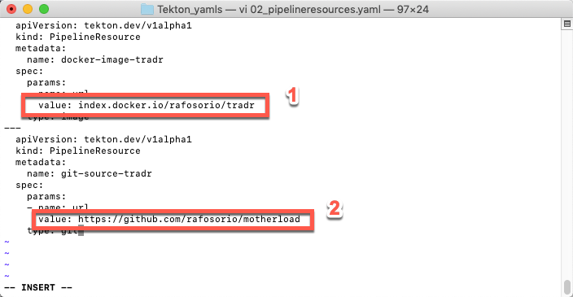

  **Save** the file.

6.Execute the command below to create your Pipeline Resources.
```
oc apply -f 02_pipelineresources.yaml
```

  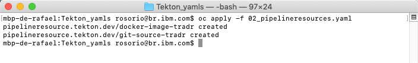

7.Now you have your two pipelineresources. You can execute the command below to confirm it.
```
oc get pipelineresources
```

  

  Great, next section, you will create the Tasks that use these Pipeline Resources as input.

***

##  Creating and Testing Tasks

In this section you create all the tasks necessaries for your pipeline. As described earlier, a Task defines a set of build steps such as compiling code, running tests, and building and deploying images. In your case, you have two tasks:

- **tradr-build-task:** builds a Docker image from source files and pushes it to your Docker Hub registry
- **tradr-deploy-task:** deploys the image to your Cloud Pak for Multicloud Management

Let's explore them!

1.On the terminal window, in the **Tekton_yamls** folder, use any editor to view the **03_task.yaml**.

  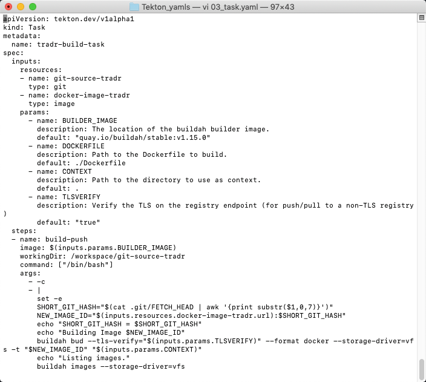

2.This YAML file creates our two tasks. Each task includes multiples steps. The first task (`tradr-build-task`) uses buildah commands to build and push your docker image to your Docker Hub Image Registry from the GitHub Node.js source coude that you forked previously.

  The second task is the key part about the integration with Cloud Pak for Multicloud Management. Instead to deploy the application directly to a Kubernetes cluster, this task will deploy just the deployables YAML file in your CP4MCM Hub Cluster. And the hub cluster will be the responsible to deploy the application based on Placement Rules definitions (we will talk more later about Cloud Pak for Multicloud Management Application Lifecycle model).
  For example, the deploy-deployable step (3) of tradr-deploy-task (1) execute kubectl apply command (3) to deploy the deployables in your Hub Cluster. These tasks uses the pipeline resources (2) that we created in the previous section. You are welcome to explore the YAML file to see the different steps of the different tasks.

  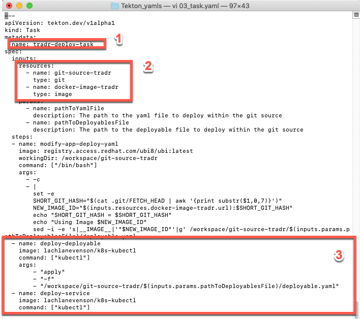

3.**Close** the YAML file. No change is necessary.

4.Now, let's create the Tasks on Tekton. Execute the command below:
```
oc apply -f 03_task.yaml
```

  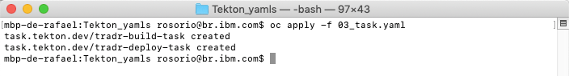

5.You can execute the command below to validate the tasks.
```
oc get tasks
```

  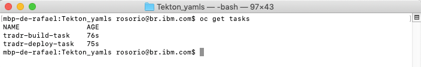

6.The tasks were created, but they were not executed yet. They will be used as part of a Pipeline that you will create in next sections. However, you can test one specific task by creating a TaskRun object. Let's do it!

  There is a YAML file (04_taskrun.yaml) that creates a TaskRun object to execute only the tradr-build-task. You are welcome to explore the YAML file if you want. Let's apply it!

```
oc apply -f 04_taskrun.yaml
```

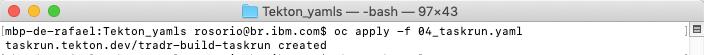

7.Now, let's use the Tekton CLI to see the TaskRun. Execute the commands below to list the TaskRun and to display TaskRun logs.
```
tkn taskrun list
tkn taskrun logs -f tradr-build-taskrun
```

  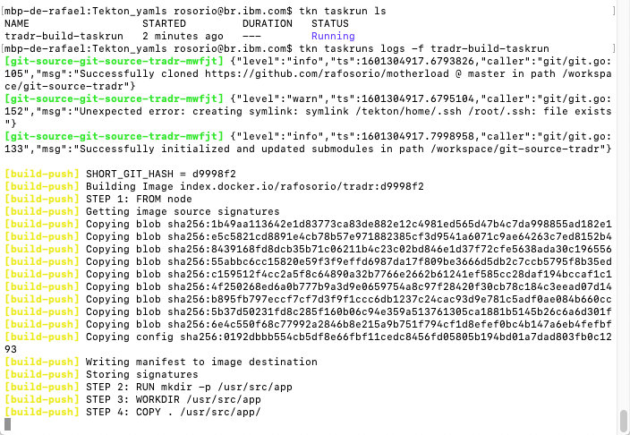

10.As soon as the taskrun finish (you need to wait a few minutes), you should see the information about the image repository in your Docker Hub.

  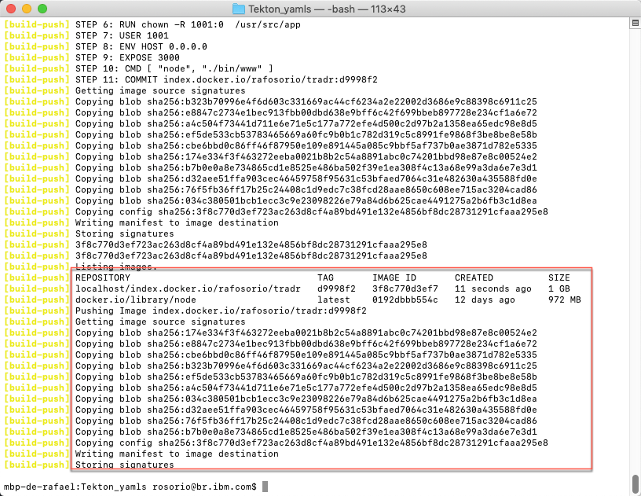

Let's check the image on Docker Hub site.

11.Open the [Docker Hub site](https://hub.docker.com/) (**https://hub.docker.com/**) and log in with your account. On the home page, you should see your new tradr docker image.

  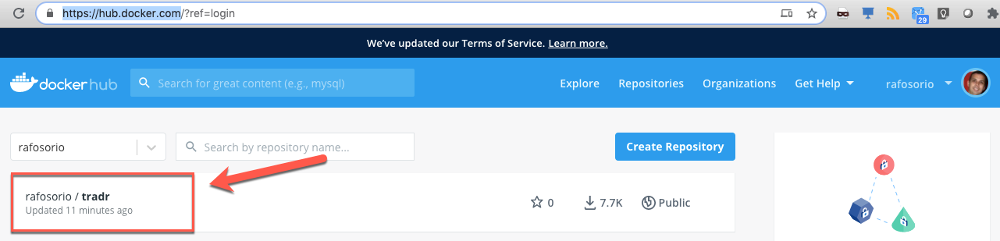

  Great! Your image was created and this prove that your task was executed successfully. Now let's create the pipeline to execute both tasks together.

***

## Creating your Cloud Pak for Multicloud Management Application Model YAMLs

Before we create and execute the pipeline, let's create our Channel, Subscription, Application and Placement Rules.

IBM Cloud Pak for Multicloud Management provides enhanced application management capabilities through an improved application model and new deployment options. The new model and deployment options are designed to unify and simplify the deployment experience for creating and managing your applications across clusters.

The new application management capabilities use Channels and Subscriptions to gain improved continuous and automated delivery of deployables to target managed clusters.

The concept is similar to subscription model of TV channels. In this model, all the applications, which are packaged as helm charts, will be hosted in one or more repositories. The repositories, which contain the application packages, are defined as channels that broadcast across the clusters. If you want to deploy an application, then define a subscription to the channel with the name of the application (one or more) you want to deploy.

Channels (Channel.app.ibm.com) define a namespace within the hub cluster and point to a physical place where resources are stored for deployment; such as an object store, Kubernetes namespace, or Helm repository.

Let's see our Cloud Pak for Multicloud Management YAML files.

1.Back to the cp4mcm-tekton terminal window, execute the command below to access the MCM_yamls folder
```
cd ../MCM_yamls
```

2.In this folder, you have the Channel, Placement Rule, Subscription and Application YAML files. The only YAML not available here is the deployable. As you saw before, the deployable will be generated by the Tekton pipeline, based on the Docker Image created on CI/CD process.

  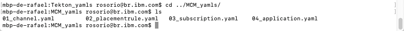


  In this lab, you will not explore in details the CP4MCM YAMLs file. There is [another lab](https://www.ibm.com/cloud/garage/dte/tutorial/multi-cluster-application-management) that explain the details about CP4MCM Application Management capability.

  But, let's highlight some important point of these YAMLs:

- The Channel is of type namespace, meaning that the yaml you create will be deployed and stored in OpenShift namespace (labX-tekton).
- The Placement Rule will create one cluster replica in cluster that match labels environment:Dev. That is exactly your Hub cluster that you registered in the Lab 1.

3.Now, edit the **02_placementrule.yaml**. The original YAML was deploying the application in cluster that match label environment:Dev and targetX:labX. In your case, you don't need the criteria of targetX:labx. So delete this expression.

  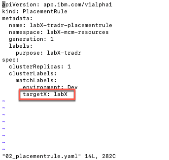

4.Your new file should looks like the picture below.

  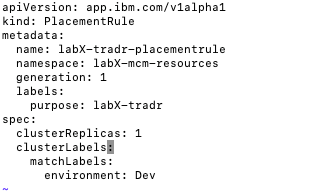

  **Save** and **close** the file.

5.Before apply the YAML files, you need to change the OpenShift project.
```
oc project labX-mcm-resources
```

  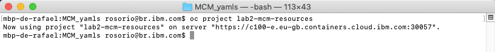

8.Now, let's apply all the YAML files. Run the command below.
```
oc apply -f .
```

  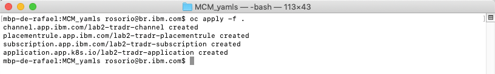

  Great, your Cloud Pak for Multicloud Management is ready. Now, you need to create the Pipeline.

***

## Creating and Running your Pipeline

In this section you create a simple pipeline (build-and-deploy-pipeline-tradr) that executes the two previous created tasks in sequence.

1.On terminal window, execute the command below to access the Tekton_yamls folder
```
cd ../Tekton_yamls
```

2.Because you changed the project in the previous step. Run the command below to open the labX-tekton project again.
```
oc project labX-tekton
```

  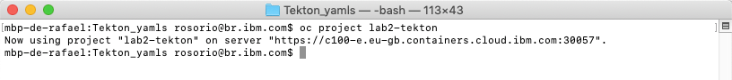

3.Use your editor to explore the **05_pipeline.yaml** file.

  The pipeline has two tasks: build-task and deploy-task.

  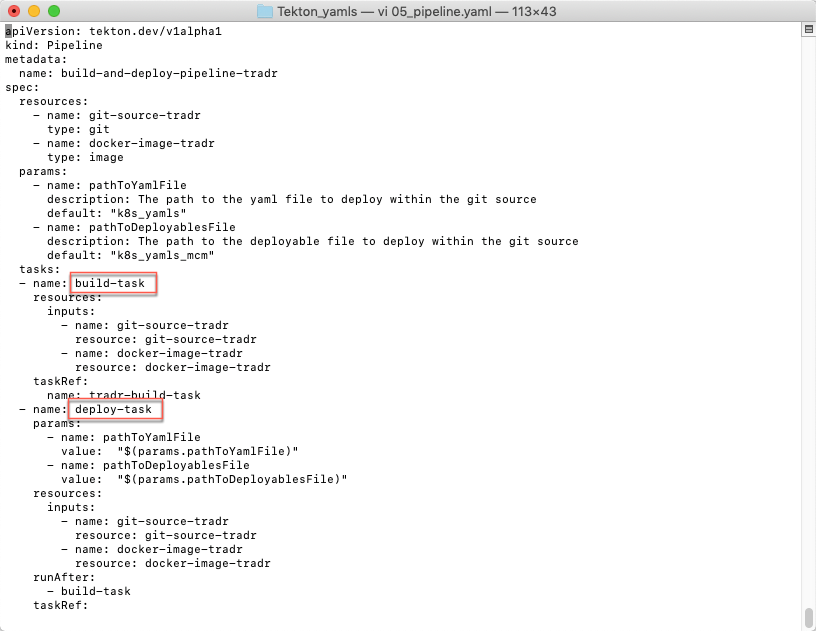

  No change is necessary. **Close** your file.

3.Now, let's create the pipeline. Run the command below, to apply the YAML file.
```
oc apply -f 05_pipeline.yaml
```

  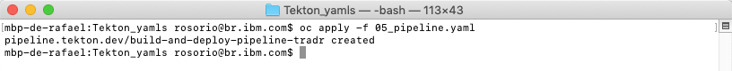

3.You can check the new Pipeline, running the command below.
```
oc get pipelines
```
  Or using the Tekton CLI command below:
```
tkn pipeline ls
```
  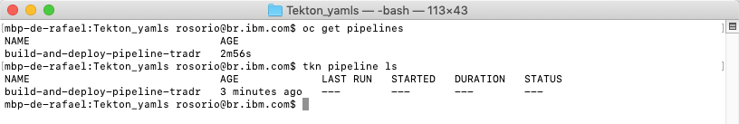

  Great! Your Pipeline was created. However you didn't run the Pipeline yet. Later you will create a webhook to configure Github to invoke this pipeline when a new code is available. However, let's start the pipeline manually. To do it, we need to create another object: PipelineRun.

4.Similar of TaskRun, you use a PipelineRun YAML (06_pipelinerun.yaml) to create this object. It is a really simple YAML that inform the resources and the pipeline. You are welcome to explore the YAML file. To create the PipelineRun, run the command below.
```
oc apply -f 06_pipelinerun.yaml
```

  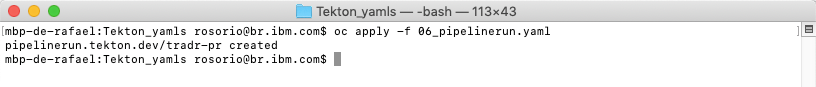

5.Execute the command below to check the pipelinerun log.
```
tkn pipelinerun logs -f tradr-pr
```
  When the pipelinerun terminates, you will see a message that the deployable, service and configmap were created.

  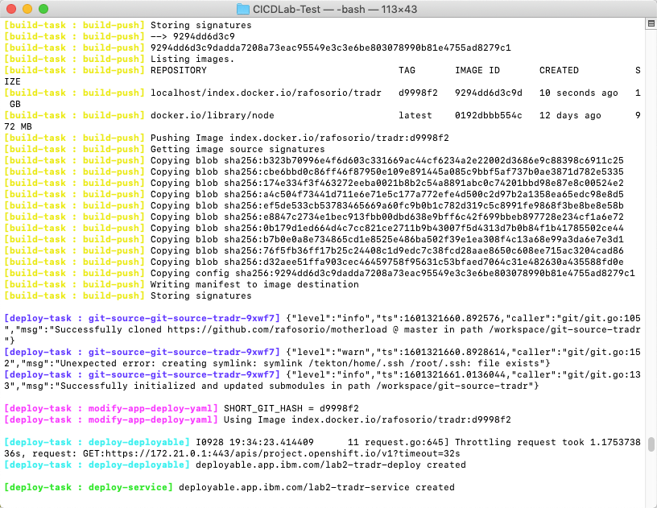

  Great, now let's check the Application deployment.

***

## Check the Application Deployment

In this section, you check the application deployment in Cloud Pak for Multicloud Management Web Console and in your IKS cluster.

1.Back to the browser, you should be in your Cloud Pak for Multicloud Management Web Console. If you are not, check [here](../beforestart/) how to open your console page.

  

2.On the top left of the page, open the **Menu** (1) and select **Manage Applications** (2) and click **Hybrid applications** (3).

  

2.Click on the **labX-tradr-application** link to get to the application Overview page.

  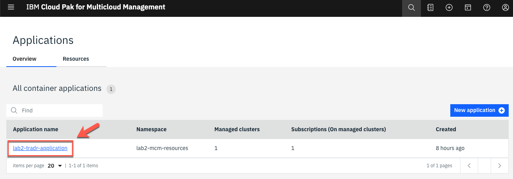

3.Scroll down to view the application diagram.

  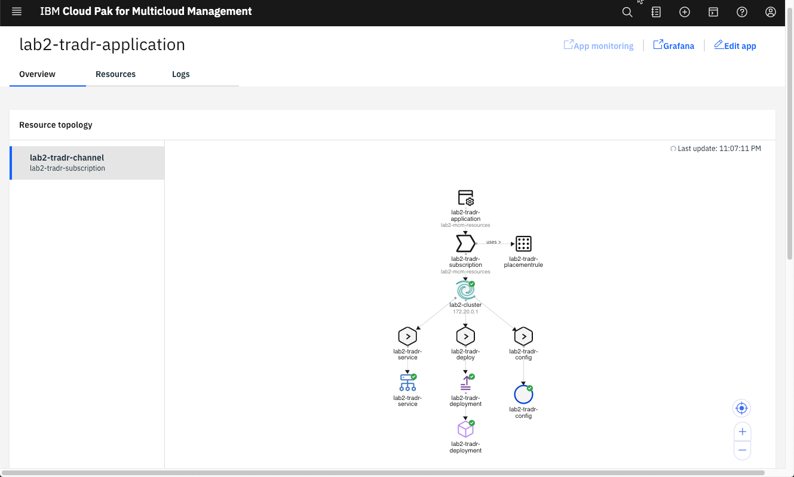

  *Note: It may take a couple of minutes for the application to deploy to the cluster.*

  When the application is successfully deployed via the subscription, the pod in the application topology view will have a green icon as illustrated above.

4.Let's change the project to point to your labX-tradr-mcm namespace.
```
oc project labX-tradr-mcm
```

5.Let’s check the application pod is in running state.
```
oc get pods
```
  You should see the labX-tradr-deployment-* pod running.

  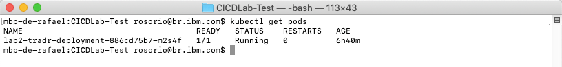

6.Now let's check the services available.
```
oc get services
```

7.Now, let's  expose this service. Replace [your_service_name] with the service displayed in the previous step.
```
oc expose service [your_service_name]
```

8.View your new route:
```
oc get route
```

  Copy the route of your application.

9.Back to your browser window, open a new tab and enter the url below, where [exposed-route] is the route copied in the previous step.

```
http://[exposed-route]/tradr
```

  

  Congratulations! You deployed your application using Tekton Pipeline and Cloud Pak for Multicloud Management.

***


## Summary

You completed the CI-CD and Cloud Pak for Multicloud Management lab. Throughout the tutorial, you explored the key takeaways:
- `Learn how to register a managed cluster`
-	`Learn to create a CI/CD pipeline in Tekton`
-	`Learn to deploy an application using Pipeline and Cloud Pak for Multicloud Management`
-	`Learn to use Github webhook to start the pipeline`

If you would like to learn more about Cloud Pak for Multicloud Management, please refer to:
-	<a href="https://www.ibm.com/cloud/cloud-pak-for-management" target="blank">Cloud Pak for Multicloud Management home page</a>
- <a href="https://www.ibm.com/demos/collection/Cloud-Pak-for-Multicloud-Management" target="blank">Cloud Pak for Multicloud Management Demos </a>
