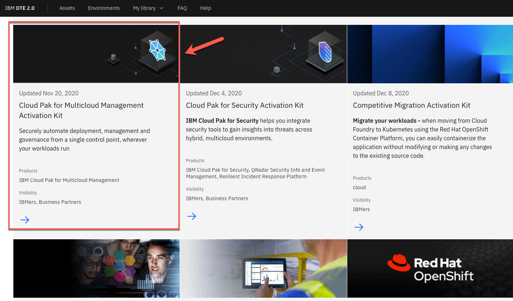
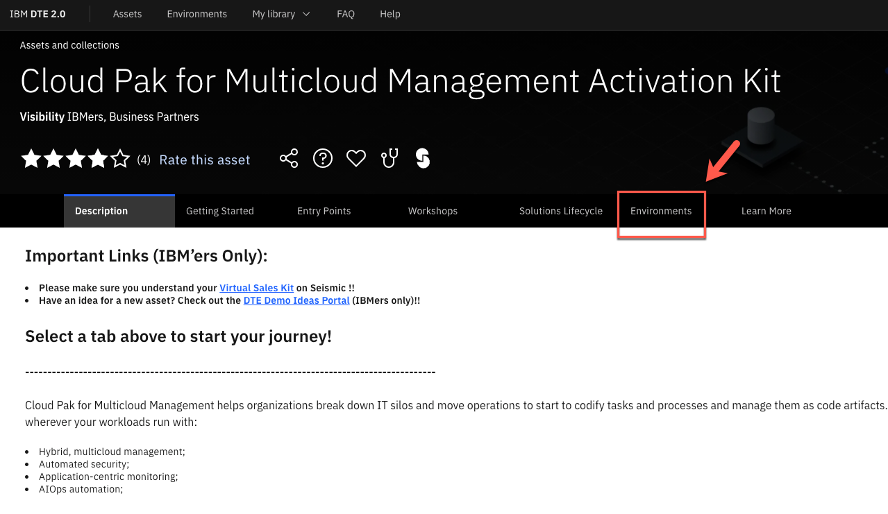
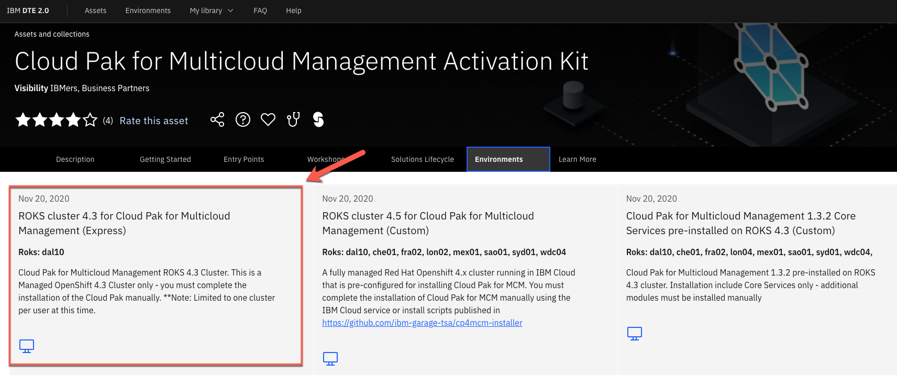
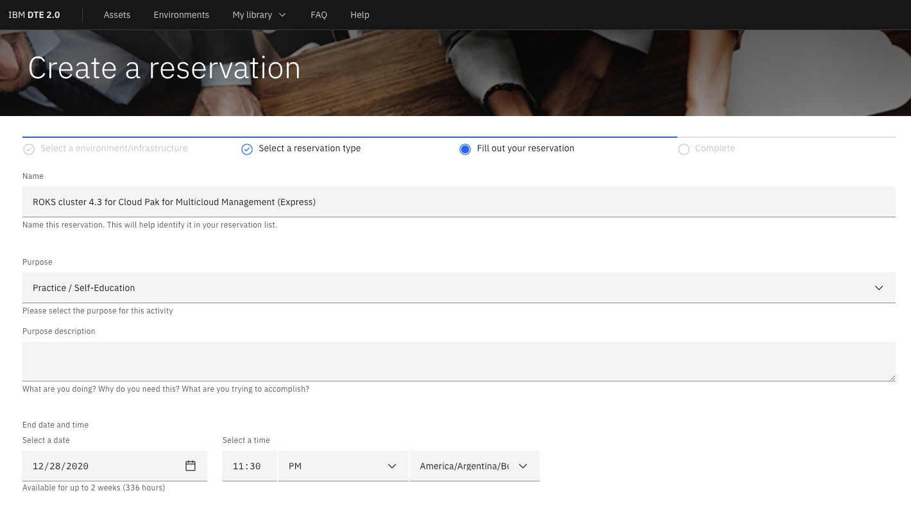

Follow the steps below to request your CP4MCM ROKS environment.

## Requesting a ROKS Cluster

1.Access the [DTE 2.0 site](https://dte2.us1a.cirrus.ibm.com/) and log in using your IBM credentials.

2.On the home page, scroll down and open the **Cloud Pak for Multicloud Management Activation Kit**.

  

3.Open the **Environments** tab.

  

4.Select the ROKS cluster that you want (the simplest way is to select the latest version of the Express instalation).

  

5.Follow the **Create a reservation** form to define the details of your ROKS Reservation.

  

  After few minutes, your ROKS environment is ready. Now you are ready to move to the next step and install Cloud Pak for Multicloud Management!
