<FeatureCard
  title="Application Management with IBM Cloud Pak for Multicloud Management"
  color="dark"
  >


</FeatureCard>


<AnchorLinks>
  <AnchorLink>Lab Overview</AnchorLink>
  <AnchorLink>Prerequisite</AnchorLink>
  <AnchorLink>Business Context</AnchorLink>
  <AnchorLink>Define Application Channel</AnchorLink>
  <AnchorLink>Create a Subscription</AnchorLink>
  <AnchorLink>Deploy the Application</AnchorLink>
  <AnchorLink>Validate the Application</AnchorLink>
  <AnchorLink>Move the Application</AnchorLink>
  <AnchorLink>Summary</AnchorLink>
</AnchorLinks>

***

## Lab Overview

IBM Cloud Pak for Multicloud Management provides consistent visibility, automation, and governance across a range of multicloud management capabilities such as cost and asset management, infrastructure management, application management, multi-cluster management, edge management, and integration with existing tools and processes. Customers can leverage Cloud Pak for Multicloud Management to simplify their IT and application ops management, while increasing flexibility and cost savings with intelligent data analysis driven by predictive signals.

Customers can leverage IBM Cloud Pak for Multicloud Management to simplify their IT and application ops management, while increasing flexibility and cost savings with intelligent data analysis driven by predictive signals.

In this tutorial, you will explore the following key capabilities:
-	`Understand Cloud Pak for Multicloud Management`
-	`Deploy an application using Channels and Subscriptions`
-	`Move the application between clusters using Placement Policies`
-	`Visualize the application health using Grafana dashboards`

***

## Prerequisite

- You need to provision your own copy of the CP4MCM 2.0 environment, start it and verify for correct startup (check [here](../preparing/)).

***

## Business Context

As a member of the Cloud Operation team, you are having problems to manage your multicloud hybrid world. Operate your cloud-based services and data across multiple providers is overwhelming your team.
Your company is deploying multiple Kubernetes clusters to address their specific needs. Some Dev teams are deploying clusters across public and private clouds, and some are deploying clusters across regions, and some are deploying clusters to support the development and test needs.

As different teams deploy more clusters, new challenges are introduced:
-	Where are my services running?
-	How can I monitor applications across clusters and clouds?
-	How can I manage clusters as if they were one environment?
-	How do I monitor usage across clouds?
-	Where are the failed components?
-	How do I deploy applications across these environments?
-	How do I move workloads across environments?
-	How do I set consistent security policies across environments?
-	Which clusters are compliant?
-	How can I place workloads based on capacity, policy?

Because of that, you want to explore how IBM Cloud Pak for Multicloud Management, provides consistent visibility, governance and automation of your complex environment.

IBM Cloud Pak for Multicloud Management provides enhanced application management capabilities through an improved application model and deployment options. The concept helps simplify and streamline application life cycle management across clusters.

In this tutorial, you will be using a sample Modresort application to demonstrate how to deploy an application in multiple clusters using channels and subscriptions. The Modresort is a WebSphere Liberty Java application available in Dockerhub.


In this tutorial, you use two Red Hat OpenShift clusters.
-	Hub-cluster is the Hub cluster that includes management console, federated monitoring, and all the controllers. In this Lab, you identify the hub-cluster with the label Dev for environment.
-	Managed-cluster is an Openshift cluster managed by the Hub cluster. In this Lab, you identify the managed cluster with the label QA for environment

You will complete the following tasks:
-	`Deploy Modresort application using Channels and Subscriptions`
-	`Move the application between clusters using Placement Policies`
-	`Visualize application health by using Grafana dashboard`

***

## Add Managed Clusters

In this section, you will add two new managed clusters in your Control Panel. As explained before, you will add your OpenShift Hub cluster and your Microk8s managed cluster.

1. To start the lab, you should be in your Cloud Pak for Multicloud Management Web Console. If you are not, check [here](../preparing/) how to open your console page.

  

2. Now, let's explore the Cluster view. Click the hamburger **Menu** (1) and select **Automate Infrastructure -> Clusters** (2).

  

3. Initially, you shouldn't have any cluster registered here. Let's add our first cluster. Click **Add cluster**.

  

4. You can add a cluster by Importing an existing cluster or provisioning a new cluster using a Service Library. We use the first option. Select **Import an Existing cluster** (1) and click **Import** (2).

  

5. Enter **ocp311** for cluster name (1) and **ocp311** for namespace (2). You can view the yaml file and change the settings as needed (3). To import an OpenShift cluster no further changes are needed. Click **Generate command** to continue (4).

  

6. A curl command is generated that you will use to add the new cluster. Click **Copy command** button (1) and click **View cluster** (2) to see the new hub-cluster details page.

  

7. Open the terminal window clicking the **OCP 3.11 Terminal** link on the desktop. The **OCP 311** windows has a blue background.

  

8. Let's test the new context configuration. Run the command below to get the cluster nodes.

  ```
  oc get nodes
  ```

  

  Great, you are accessing the OCP 3.11 cluster. Now you are ready to execute the generated command.

9. **Paste** the generated command that you previously copied in the clipboard.  When you run the command, several Kubernetes objects are created in the multicluster-endpoint namespace.

  

  In case you will see the error like shown below, run the command again.

  

  This error is a result of performance limitations of the Skytap environment - the final result should look like below:

  

10. You can view the progress by entering the command:

  ```
  watch oc get pods -n multicluster-endpoint
  ```

  Make sure all the pods are in the running state.

  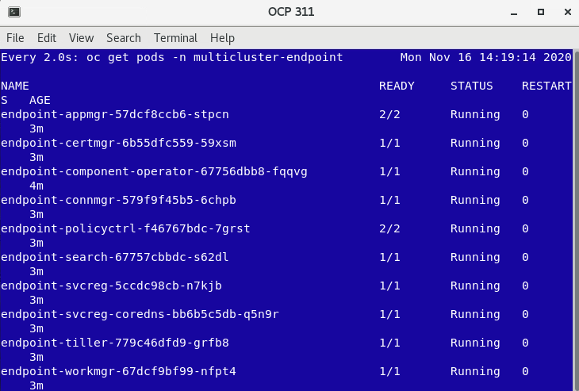

11. The cluster endpoint (klusterlet) is ready when all the Pods are in Running state (press CTRL+C to cancel the watch command). Back to the browser window, click **View cluster** and make sure that the cluster status is **Ready** now (if necessary, refresh the details page). On the page navigation breadcrumb, click on **Clusters** link.

  

12. Now you can see your ocp311 cluster on the clusters list. You can add labels to identify your new cluster. On the hub-cluster row, click on the three dots icon (1) and select **Edit labels** (2).

  

13. Add a new label, **environment** (1), and give a value **Dev** (2). Click **+** (3) and **save** (4) the changes.

  

  Great, your first cluster is ready! Now let's add your MicroK8s managed cluster.

14. Click **Add cluster** again.

  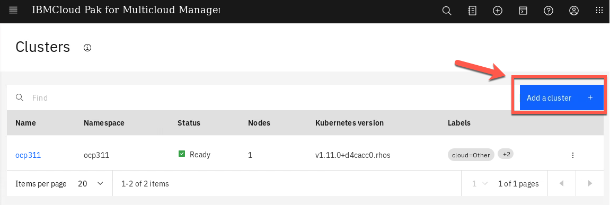

15. Select again **Import an Existing cluster** (1) and click **Import** (2).

  

16. Enter **microk8s** for cluster name (1) and **microk8s** for namespace (2). Click **Generate command** to continue (3).

  

17. A curl command is generated that you will use to add the new cluster. Click **Copy command** button (1).

  

18. Go back to the desktop and open the terminal window to MicroK8s cluster clicking the **MicroK8s Terminal** link.


19. MicroK8s terminal has a yellow background. To verify the cluster status run the following command in the **MicroK8s** window

  ```
  kubectl get nodes
  ```

  

  Great, you are accessing the managed cluster. Now you are ready to execute the generated command.

20. **Paste** the generated command that you previously copied in the clipboard. When you run the command, several Kubernetes objects are created in the multicluster-endpoint namespace.

  

  If you see the error as before - just run the command again.

21. You can view the progress by entering the command:

  ```
  watch kubectl get pods -n multicluster-endpoint
  ```

  Make sure all the pods are in the running state (press CTRL+C to terminate the watch command).

  

22. Back to the browser window, click **View cluster** and make sure that the cluster status is **Ready** now (if necessary, refresh the details page).

  

  

23. On the page navigation breadcrumb, click on **Clusters** link

  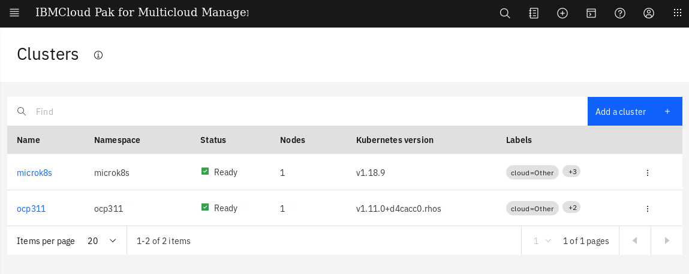

24. Now you can see your both clusters in a clusters list. You should add labels to identify your new cluster. Follow the same procedure as in steps 12-13 above to add a label **environment** = **QA** to the microK8s cluster

  Great, your both clusters are ready and managed by IBM Cloud Pak for Multicloud Management. Using this Pak, you are able to manage both cluster from a single pane of glass. Let's check it in the next section.

***

## Define Application Channel

IBM Cloud Pak for Multicloud Management provides enhanced application management capabilities through an improved application model and new deployment options. The new model and deployment options are designed to unify and simplify the deployment experience for creating and managing your applications across clusters.

The new application management capabilities use Channels and Subscriptions to gain improved continuous and automated delivery of deployables to target managed clusters.

The concept is similar to subscription model of TV channels. In this model, all the applications, which are packaged as helm charts, will be hosted in one or more repositories. The repositories, which contain the application packages, are defined as channels that broadcast across the clusters. If you want to deploy an application, then define a subscription to the channel with the name of the application (one or more) you want to deploy


Channels (Channel.app.ibm.com) define a namespace within the hub cluster and point to a physical place where resources are stored for deployment; such as an object store, Kubernetes namespace, or Helm repository.


In this section, you define Application and Channel resources to deploy the Modresort application. The resources will be created using YAML files. The modresort application is a simple application with only one component.

1.Back to the Desktop, open the Management Hub terminal window (green terminal).

  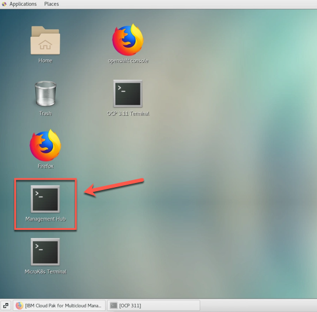

  To set the the context to use your Hub cluster (login to the cluster), run the command below:

```
./oclogin.sh
```

  

2.Let's create our YAML files to define Channel, Application, Subscription, etc. To simplify the lab steps, you will clone a pre-created YAML. Don't worry, because we will understand them. To copy pre-created YAML files, let's use the Git CLI (if you don't have Git CLI, check [here](https://pages.github.ibm.com/demohub/cloudpak-mcm/labs/installcli/) how to install it). Run the command below:

```
git clone https://github.com/rafosorio/appmgmtlab.git
```

```
cd appmgmtlab
```

  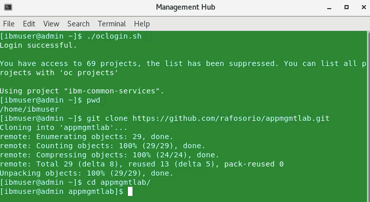

3.Now you have two folders (modresortchan and modresortapp). Let's start exploring the **modresortchan** and use any editor to see the content of the **channel.yaml** file.

```
cd modresortchan
```
```
vi channel.yaml
```

4.Our channel.yaml has the content below.

```
apiVersion: app.ibm.com/v1alpha1
kind: Channel
metadata:
  name: modresort-devchan
  namespace: modresort-entitlement
  labels:
    app: modresortchan
spec:
  type: Namespace
  pathname: modresort-entitlement
```

  It is a really simple file. The spec collection defines the type of the channel. In this lab, the channel is of type namespace, meaning that the yaml you create will be deployed and stored in OpenShift namespaces rather than in a Helm chart or Object store. This file is ready, and you don't need to edit it, go ahead and **close** the channel.yaml file.

5.The modresort application component consists of a **deployment resource definition** and a **service resource definition**.

  To enable these components to be used by the channel subscription, each of the resources need to be wrapped by a new custom resource definition (CRD) called Deployable.

  Use your editor again and check now the **deployable.yaml** file.

```
vi deployable.yaml
```

```
apiVersion: app.ibm.com/v1alpha1
kind: Deployable
metadata:
  name: devchan-modresortchan-deployment
  namespace: modresort-entitlement
  annotations:
    app.ibm.com/is-local-deployable: "false"
  labels:
    app: modresortchan
    component: main
    package: modresort
spec:
  template:
    kind: Deployment
    apiVersion: apps/v1
    metadata:
      name: devchan-modresortchan-deployment
      labels:
        app: modresortchan
    spec:
      selector:
        matchLabels:
          app: modresortchan
          release: modresort-devchan
          tier: frontend
      replicas: 1
      template:
        metadata:
          labels:
            app: modresortchan
            release: modresort-devchan
            tier: frontend
        spec:
          containers:
            - name: frontend
              image: "kpostreich/modresort:1.0"
              imagePullPolicy: Always
              ports:
                - containerPort: 9080
              env:
              - name: GET_HOSTS_FROM
                value: dns
              - name: WLP_LOGGING_CONSOLE_FORMAT
                value: json
              - name: WLP_LOGGING_CONSOLE_LOGLEVEL
                value: info
              - name: WLP_LOGGING_CONSOLE_SOURCE
                value: message,trace,accessLog,ffdc
---
apiVersion: app.ibm.com/v1alpha1
kind: Deployable
metadata:
  name: devchan-modresortchan-service
  namespace: modresort-entitlement
  annotations:
    app.ibm.com/is-local-deployable: "false"
  labels:
    app: modresortchan
    component: main
    package: modresort
spec:
  template:
    kind: Service
    apiVersion: v1
    metadata:
      name: devchan-modresortchan-service
      labels:
        app: modresortchan
    spec:
      type: NodePort
      ports:
        - port: 9080
      selector:
        app: modresortchan
        release: modresort-devchan
        tier: frontend
---
apiVersion: app.ibm.com/v1alpha1
kind: Deployable
metadata:
  name: devchan-modresortchan-route
  namespace: modresort-entitlement
  annotations:
    app.ibm.com/is-local-deployable: "false"
  labels:
    app: modresortchan
    component: main
    package: modresort
spec:
  template:
    apiVersion: route.openshift.io/v1
    kind: Route
    metadata:
      labels:
        app: devchan-modresortchan-route
      name: modresorts
    spec:
      host: modresorts-default.10.0.0.15.nip.io
      port:
        targetPort: 9080
      subdomain: ""
      to:
        kind: Service
        name: devchan-modresortchan-service
        weight: 100
      wildcardPolicy: None
```

  There are three Deployables defined in the yaml file that wrap the modresort Kubernetes resources
  - One for the modresort deployment, refers to the location of the Docker image;
  - One for the modresort service, refers to the service port and defines a NodePort;
  - One for the modresort routes, refers to domain name and exposes to the external network;

  Refer to the [online documentation](https://www.ibm.com/support/knowledgecenter/en/SSFC4F_1.2.0/mcm/applications/managing_deployables.html) for details on the construct of the Deployable definition.

  Next section, you learn how to create a subscription.

***

## Create a Subscription

The subscription to a channel package contains
  -	Application Definition
  - Placement Rules Definition
  - Subscription Definition

**Applications** (Application.app.k8s.io) in IBM Multicloud Manager are used for grouping application components.

**Placement rules** (PlacementRule.app.ibm.com) define the target clusters where deployables can be deployed. You can use placement rules to help you facilitate the multi-cluster deployment of your deployables. Placement rules can be referenced by deployables and subscriptions.

**Subscriptions** (Subscription.app.ibm.com) are sets of definitions that identify deployables within channels by using annotations, labels, and versions.

The subscription controller can monitor the channel for new or updated deployables, such as an updated Helm release or a new Kubernetes deployable object. Then, the controller can download the Kubernetes deployable object or Helm release directly from the source location (Helm repository, object store, or namespace) to the target managed clusters.

1.Back to the Management Hub terminal window, let's explore the YAML files on modresortapp folder.

```
cd ../modresortapp
```

2.Now, using your editor again, open the **application.yaml**. Below is the content of the file:

```
apiVersion: app.k8s.io/v1beta1
kind: Application
metadata:
  name: modresort101-modresortapp
  namespace: modresort-project
  labels:
    app: modresortapp
spec:
  selector:
    matchExpressions:
    - key: release
      operator: In
      values:
      - modresort101
  componentKinds:
  - group: app.ibm.com
    kind: Subscription
```

  Here we have the definition of our modresort application. Refer to the [online documentation](https://www.ibm.com/support/knowledgecenter/en/SSFC4F_1.2.0/mcm/applications/app_lifecycle.html) for details on configuring the Application resource.

3.**Close** the application.yaml file.

4.Use your editor again, to explore the **placementrules.yaml** file. Below is the file's content:

```
apiVersion: app.ibm.com/v1alpha1
kind: PlacementRule
metadata:
  name: modresortapp101-modresortapp
  namespace: modresort-project
  labels:
    app: modresortapp
    release: modresort101
spec:
  clusterReplicas: 1
  clusterLabels:
    matchLabels:
      environment: Dev
```

  Placement Rules defines where and how Helm charts and deployables are deployed. Use placement rules to help you facilitate multi-cluster deployments of your deployables. Refer to the [online documentation](https://www.ibm.com/support/knowledgecenter/en/SSFC4F_1.2.0/mcm/applications/managing_placement_rules.html) for details on configuring the Placement Rules resource.

  In your case, the placementrules.yaml is defining to deploy the modresortapp in Dev environment only.

5.**Close** the placementrules.yaml file.

6.Now, let’s explore the **subscription.yaml** file.

```
apiVersion: app.ibm.com/v1alpha1
kind: Subscription
metadata:
  name: modresort101-modresortapp
  namespace: modresort-project
  labels:
    app: modresortapp
    release: modresort101
spec:
  channel: modresort-entitlement/modresort-devchan
  name: ""
  packageFilter:
    version: ">=1.x"
    labelSelector:
      matchLabels:
        package: modresort
        component: main
  placement:
    placementRef:
      name: modresortapp101-modresortapp
      kind: PlacementRule
      group: app.ibm.com
  overrides:
  - clusterName: "/"
    clusterOverrides:
    - path: "metadata.namespace"
      value: default
```

  This contains the details of relating the placement rule definition with the application specification. Refer to the [online documentation](https://www.ibm.com/support/knowledgecenter/en/SSFC4F_1.2.0/mcm/applications/managing_subscriptions.html) for details on configuring the Subscription resource.

7.**Close** the subscription.yaml file. All your files are ready to deploy the application.

  This completes enabling an existing application with policies so that they can be deployed to any Kubernetes managed cluster. Next section, you deploy the application using the channel and subscription created here.

***

## Deploy the Application

In this section, you will deploy the application components to their respective Kubernetes namespaces, using the yaml files that you created in the previous task.

1.Back to the Management Hub terminal window, execute the command bellow to create two new Openshift projects.

```
oc new-project modresort-project
```

```
oc new-project modresort-entitlement
```

  

2.Now, let’s deploy the modresortchan. Execute the commands below:

```
cd ..
```

```
oc apply -f modresortchan
```

  The output of the above command will be similar to the illustration below. The output shows that Channel and Deployables are deployed.

  

3.The subscription is deployed to a different namespace than the channel. Never deploy the subscription to the same namespace as the channel. Hence, deploy the subscription to the other namespace, modresort-project.

```
oc project modresort-project
```

```
oc apply -f modresortapp
```

  

  Next section of the lab will walk you through validating the application deployment.

***

## Validate the Application

The Application view in Cloud Pak for Multicloud Management console provides graphical view into the applications, channels and subscriptions deployed in the clusters. Let’s validate if the modresort application is deployed correctly.

1.Back to the Firefox browser, you should be in your Cloud Pak for Multicloud Management Web Console.

  

2.On the top left of the page, open the **Menu** (1) and select **Manage Applications** (2) and click on **Hybrid applications** (3).

  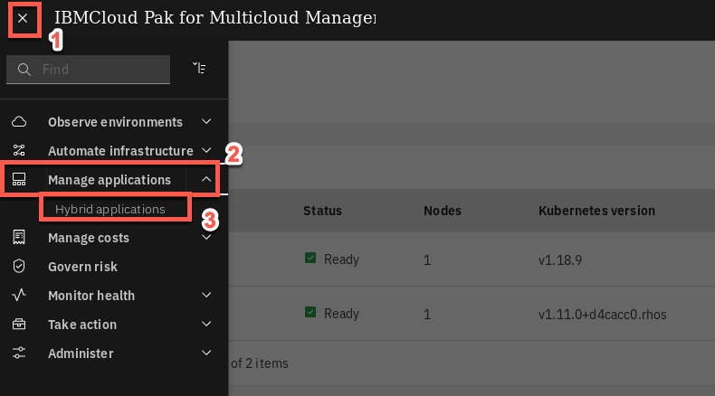

3.Click on the **modresort101-modresortapp** application link to get to the application Overview page.

  

4.Scroll down to view the application diagram.

  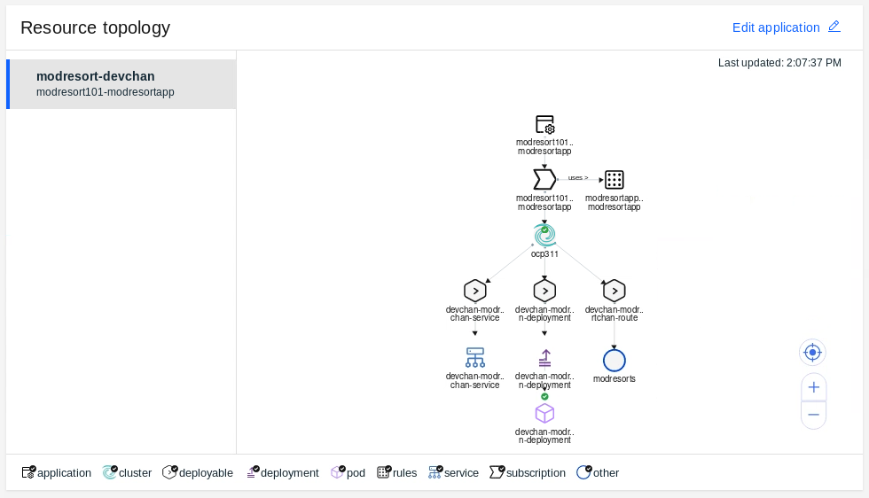

  *Note: It may take a couple of minutes for the application to deploy to the cluster.*

  When the application is successfully deployed via the subscription, the pod in the application topology view will have a green icon as illustrated below.

  

  `Note (Only if you have issues): After a couple of minutes, if your pod has a yellow icon next to the pod, indicating it is in an unknown state, you will need to troubleshoot your yaml files for correctness and redeploy the resources.   Verify that your subscriptions are propagated correctly by running the command.`

```
oc get subscription.app.ibm.com --all-namespaces
```

  The subscription from the **modresort** should be in the **Propagated** state.

5.Back to OCP311 terminal window (blue window), let’s check the pods are in running state.

```
oc get pods -n default
```

  You should see the devchan-modresort-deployment pod running in the default namespace

  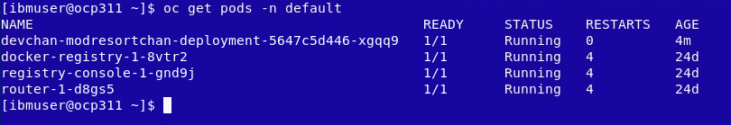

6.Use the command line to get the devchan-modresortchan-service NodePort.

```
oc get services -n default
```

  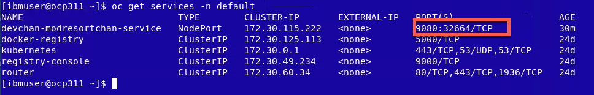

  Take note of the devchan-modresortchan-service nodePort (on the picture above is 30606), you will use it to access your application.

7.Back to the browser, open a new tab and navigate to:

```
http://ocp311:<NodePort>/resorts
```
  For example, http://ocp311:32664/resorts

  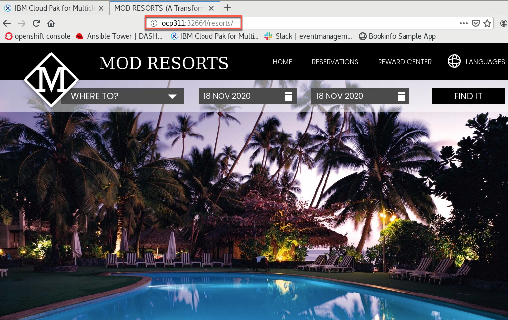

  Congratulations! You have successfully deployed the modresorts application to the OpenShift 3.11 Cluster.

***

## Move the Application

Applications deployed using the Subscription model are deployed to clusters based on PlacementRules. The placement rules for deployables can be defined as a stand-alone resource and referenced by the deployable. The placement rules use cluster labels to determine where to place the applications.

In the following steps, you will move the application from the Dev cluster to the QA cluster by changing the placement policy. You also learn how to use cluster replicas.

1.Currently, the application deployed as running on Dev cluster because of the placement values specified in application, as you verified earlier.

  You can modify the placement policies from application view by selecting the placement policy and modifying the corresponding values in the yaml file. Let’s do it!

  Back to the Multicloud Management page, on the Resource topology chart, click on the **modresortapp101 placement policy** icon.

  

2.On the Editor, modify the environment setting from Dev to QA.

  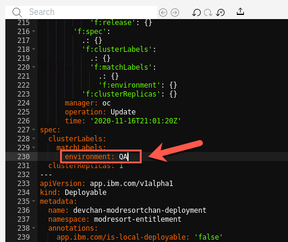

3.Apply changes by clicking on **update** icon as shown below.

  

4.Within a few minutes, the cluster value changes from ocp311 to microk8s, and the application is now running on microk8s cluster.

  

5.Let’s verify that the application is actually running on MicroK8s cluster. Go back to the yellow MicroK8s terminal windows and execute the following commands:

```
kubectl get pods -n default
kubectl get service -n default
```

  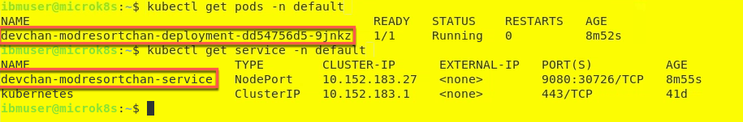

6.Notice the **Node port** used by the service. In the example screenshot it is `30726`.

  

7.Go back to your browser window, open a new tab and provide the following URL:
  `http://microk8s:[port-number-from-previous-step]/resorts`

  

  Great, you moved the application from one cluster to the other.

8.What if you want to run the application on both the clusters? This is possible by changing clusterReplicas and matchingLabel. Let’s do it!

  Back to the Multicluster Management page, on the Editor, change **clusterReplicas** to **2**.

  

9.On the spec **matchLabels** setting, **remove** the **environment label**, and add **cloud** label with value **Other**.

  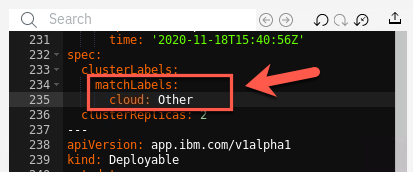

  The label, cloud, exists on both the clusters and the value matches Other.

12.Apply the changes by clicking update icon.

  

13.Within a few minutes, the resource overview refreshes, indicating that the application is running on both clusters. You can validate by checking the status of pods on both the clusters

  

  Great, now you have your application on both clusters. Next section, you explore Grafana dashboard to visualize the application health across clusters.

  Congratulations! You have successfully completed the lab “Application Management with IBM Cloud Pak for Multicloud Management”.

***

## Summary

You completed the Cloud Pak for Multicloud Management tutorial: Multi-cluster Management. Throughout the tutorial, you explored the key takeaways:
- `Understand Cloud Pak for Multicloud Management`
-	`Define an application with Channels and Subscriptions`
-	`Deploy the application chart from the catalog`
-	`Modify Placement Policies to move application resources across clusters`
-	`Check the application health by using Federated Prometheus Dashboard`


If you would like to learn more about Cloud Pak for Multicloud Management, please refer to:
-	<a href="https://www.ibm.com/cloud/cloud-pak-for-management" target="blank">Cloud Pak for Multicloud Management home page</a>
- <a href="https://www.ibm.com/demos/collection/Cloud-Pak-for-Multicloud-Management" target="blank">Cloud Pak for Multicloud Management Demos </a>
