<FeatureCard
  title="Infrastructure Management with IBM Cloud Pak for Multicloud Management"
  color="dark"
  >

</FeatureCard>

<AnchorLinks>
  <AnchorLink>Lab Overview</AnchorLink>
  <AnchorLink>Prerequisite</AnchorLink>
  <AnchorLink>Business Context</AnchorLink>
  <AnchorLink>Explore the Infrastructure management interface</AnchorLink>
  <AnchorLink>Define a new dialog</AnchorLink>
  <AnchorLink>Define a Self-service catalog and new Catalog Item</AnchorLink>
  <AnchorLink>Request a new service</AnchorLink>
  <AnchorLink>Define a connection to Vmware vSphere environment</AnchorLink>
  <AnchorLink>Define a shared parameter instance</AnchorLink>
  <AnchorLink>Define new Service Plan</AnchorLink>
  <AnchorLink>Summary</AnchorLink>
</AnchorLinks>

***

## Lab Overview

  IBM Cloud Pak® for Multicloud Management – Infrastructure Management delivers the insight, control, and automation enterprises need to address the challenges of managing virtual environments, which are far more complex than physical ones. This technology enables enterprises with existing virtual infrastructures to improve visibility and control, and those just starting virtualization deployments to build and operate a well-managed virtual infrastructure.

  IBM Cloud Pak® for Multicloud Management – Infrastructure Management was previously called IBM Red Hat CloudForms. For more information, see the previous versions of CloudForms® Red Hat CloudForms product documentation Opens in a new tab.

  IBM Cloud Pak® for Multicloud Management – Infrastructure Management includes the following feature sets:
  - Insight: discovery, monitoring, utilization, performance, reporting, analytics, chargeback, and trending.
  - Control: security, compliance, alerting, policy-based resource and configuration management.
  - Automate: IT process, task and event, provisioning, workload management and orchestration.
  - Integrate: systems management, tools and processes, event consoles, CMDB, RBA, and web services.

In this tutorial, you will explore the following key capabilities:
-	`Understand Cloud Pak for Multicloud Management Infrastructure Management capabilities`
-	`Learn how to define a new service for VM provisioning`
- `Learn how to provision new VM service`
-	`Learn how to apply configuration and control policies to the managed VMs`

***

## Prerequisite

- You need to provision your own copy of the CP4MCM 2.x environment, start it and verify for correct startup (check [here](../preparing/)).

***

## Business Context

In the hybrid environments there is often need to provision services that are a mix of systems and services running in multiple target environments. While new cloud-native applications may be fully containerized and run on the Kubernetes clusters, in case of modernized legacy applications usually some parts are still running on a Virtual Machines. IBM Cloud Pak for Multicloud Management allows you to automate provisioning of virtual machines as a part of hybrid applications. It also provides you the means to manage virtual machine lifecycle and compliance, as well as report the usage of shared resources in a form of chargback reports.

Cloud Pak for Multicloud Management provide 2 main ways to provision new infrastructure. First, leverages the provioning capabilities of ManagedIQ project and built-in providers. Second, uses the Terraform infrastructure-as-Code approach. You can any of these 2 methods or both - depending on the use case.

For the ManagedIQ/CloudForms provisionig part you will complete the following tasks:
- Define a new dialog
- Define a Self-service catalog and new catalog item
- Request a new service
-	Defina and apply compliance policy for a new VM service
-	Define a chargeback report for VMs

For the Terraform provisionig part you will complete the following tasks:
-	Define a connection to Vmware vSphere environment
-	Define a shared parameter data object
-	Define a new service for VM provisioning
- Test new service provisioning
- Define a new service plan
- Publish a service to the catalog

***

## Explore the Infrastructure management interface

1. To start the lab, you should be in your Cloud Pak for Multicloud Management Web Console. If you are not, check [here](../preparing/) how to open your console page.

  

2. Now, let's explore the Infrastructure Management view. Click the hamburger **Menu** (1) and select **Automate Infrastructure -> Infrastructure Management** (2).

  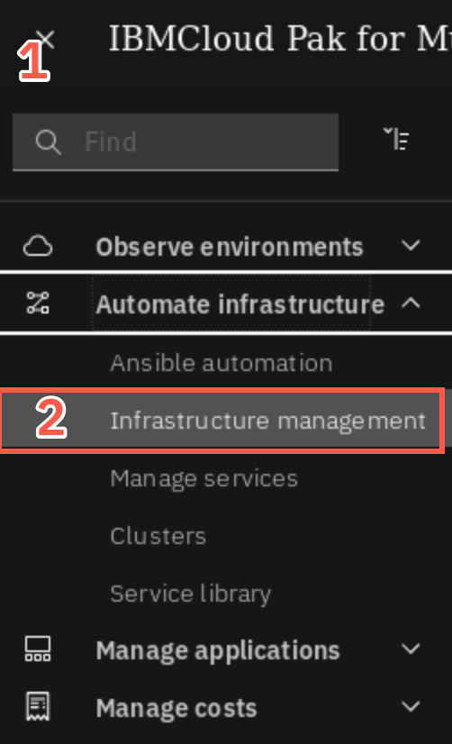

3. The new browser tab opens, and because there is a Single-Sign-On configured between the Cloud Pak Core and Infrastructure management module, you should get automatically logged in.

  

   The dashboard shows summary of the information regarding the connected providers. In this environment, there is only 1 provider used - Vmware vSphere, but you could connect many other target environments - including Openstack, Microsoft SC VMM or public clouds, like AWS, Azure, GKE, etc. This user interface was inherited from the former Red Hat CloudForms and is a commercial, supported version of the open source project ManagedIQ. This modules uses Ansible to discover the VMs in the managed providers and apply configuration and control policies. It also collects the usage data needed for chargeback reports, allowing you to divide costs of shared infrastructure among different consumers - application owners, business units or departaments.

4. The provider for the VMware vSphere was already defined in the environment - to explore details select **Compute -> Infrastructure -> Providers**.

   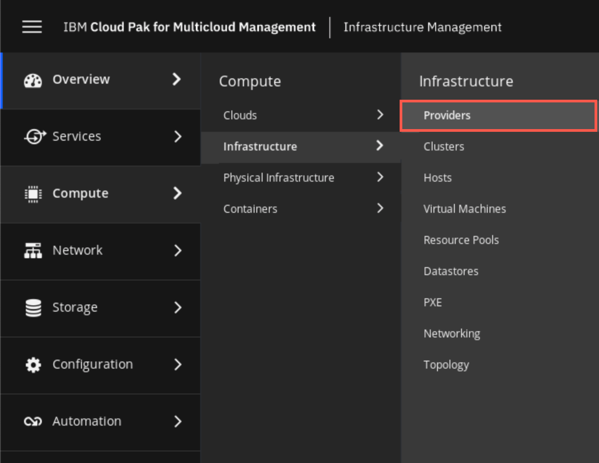

   Click on a `vcenter` provider.

   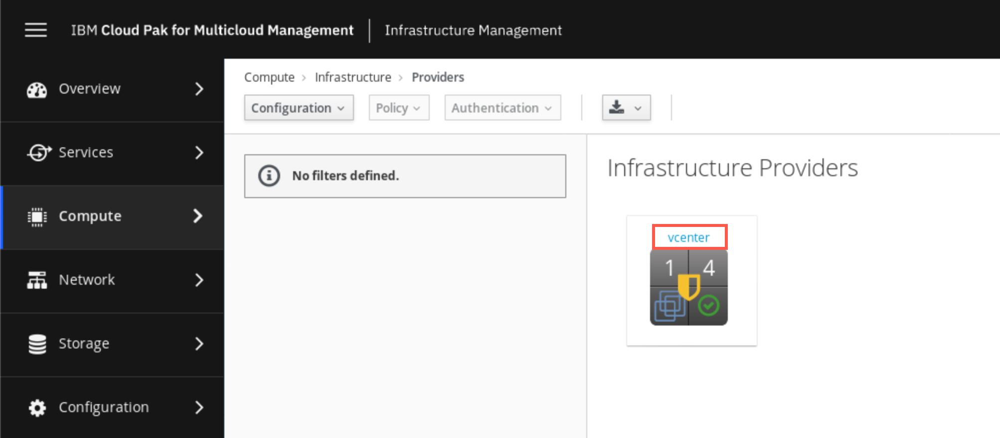

   On the details page, you can notice that the authentication status for the provider is OK (1), and that there is one host in the target cluster (2) and four virtual machines (3).

   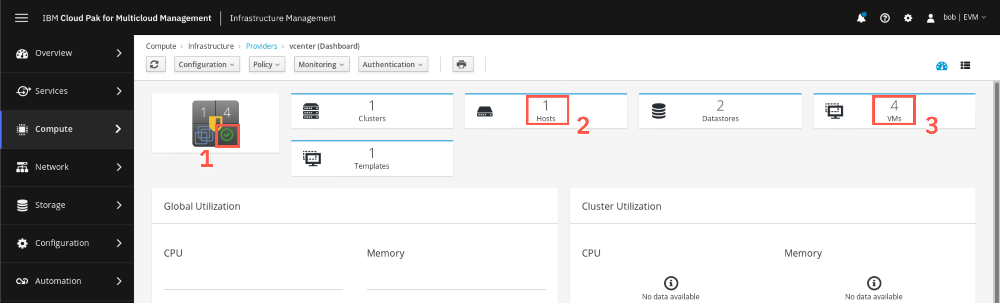

   You can click on the **4 VMs** icon (3) to go to the details of virtual machines.

   

   Here you can explore the details of each individual Virtual Machine, as well as take lifecycle management actions. You can for example provision a new VM, clone or retire any of the existing ones. Since you are in an administrator role you have access to all functions. However, normal users won't have that level of access, so let's create for them an offering in a self-service catalog so they will be able to provision a new VM when needed.

***

## Define a new dialog

To expose any offering in a catalog, you have to first define a user interface for that offering. In our case, it will be the dialog window allowing end-user to specify a service name and a virtual machine name.

1. In the left-side menu select **Automation -> Automate -> Customization**.

   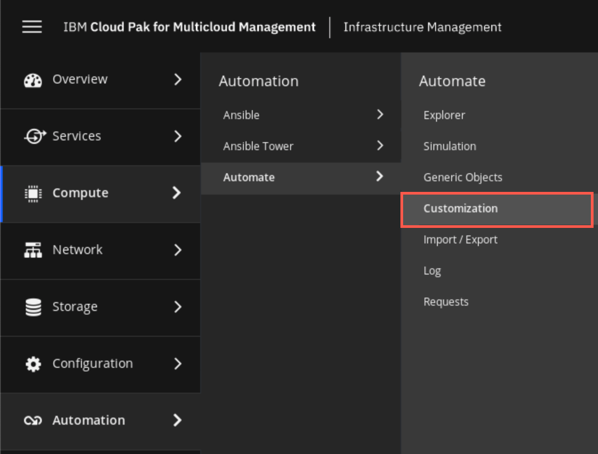

2. Here you can see and customize all the dialogs defined in the systems, modifying the fields, providing additional validation or default values. In our case, let's define a new service dialog. Open the **Service Dialogs** section. Then select the **Configuration** and **Add a new Dialog** option.

   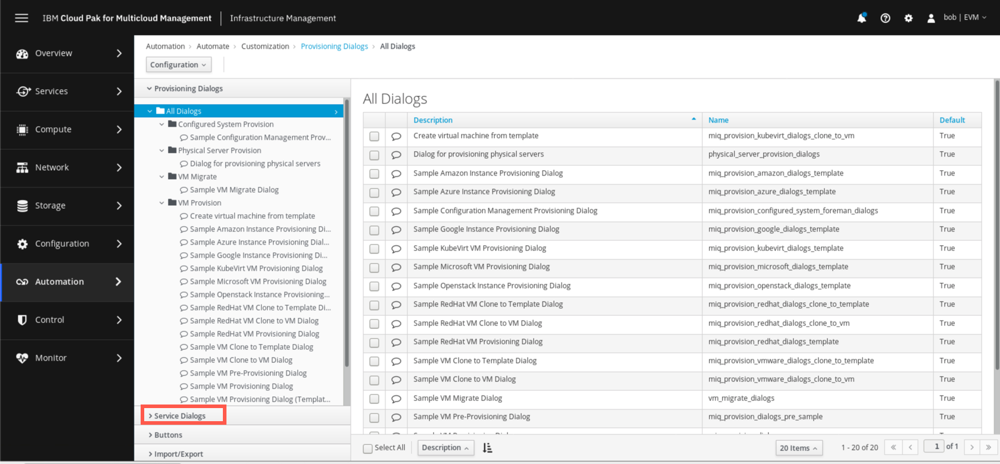

   

3. Hover cursor over the **New tab** and select the pencil icon that shows up.

   

   Change the label of the tab to **General**. Then in a similar way change the label of the **New section** to **Settings**. Then, drag the new **Text box** from the palette to the section details field.

   

   Change the field label to **Service Name** and name to **service_name**. On the **Options** tab select the **Value type** to be **String**. Then click **Save**. Repeat the operation for a second text box, this time providing **VM name** as a label and **vm_name** as a name.

   Finally, provide the **Provision VM** as a dialog's name (1) and click **Save** (2).

   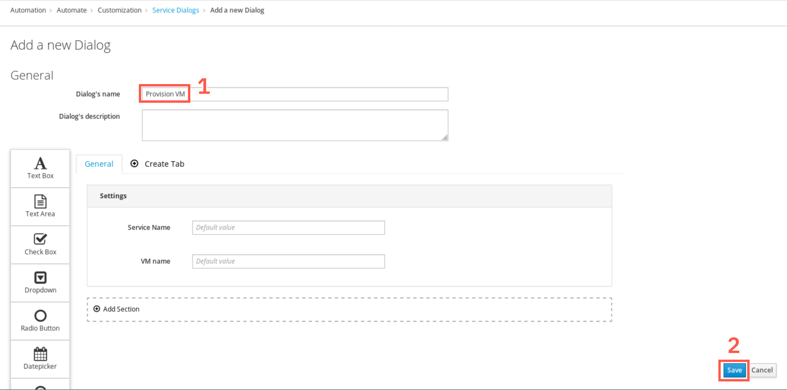

   You have just created a very simple dialog, that allows end-user to customize a service name and a virtual machine name. You have seen that the palette of options is much richer. Using this functionality, you can create a sophisticated, multi-tab dialogs with validation for more complex offerings.

   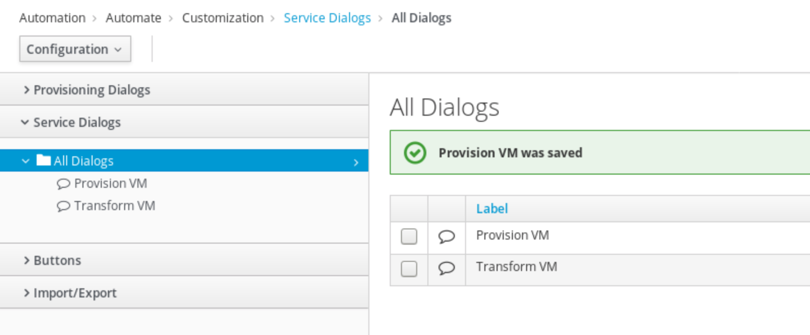

***

## Define a Self-service catalog and new Catalog Item

   In this step you will define a new catalog and catalog item in to be shown in the Self-service catalog of the users in your organization.

1. Start selecting the **Services -> Catalogs** from the left-side menu.

   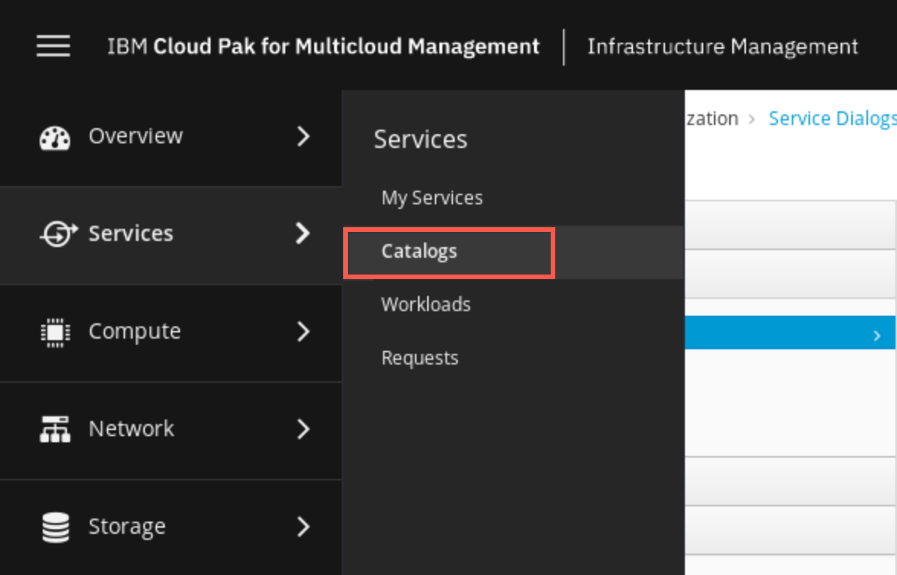

2. Open the **Catalogs** section, and click **Configuration -> Add a New Catalog** option. Provide **Virtual Machines** as a name and click **Add**.

   

3. Now, open the **Catalog Items** section, and again click **Configuration -> Add a New Catalog Item**. Then, select the **Vmware** as Catalog Item Type.

   

4. Next, you can provide the details of the offering. Provide the following data:

   - Name: `Provision New Ubuntu VM`
   - Choose `Display in Catalog` checkbox
   - Choose `My company/Virtual Machines` catalog
   - Choose `Provsion VM` dialog (this is the dialog that you created in a previous exercise)
   - Choose `Default Zone`

   Optionally, you can provide the monthly cost of the service if you want. This is only informational, to be displayed for the end-user next to the item in the catalog.

   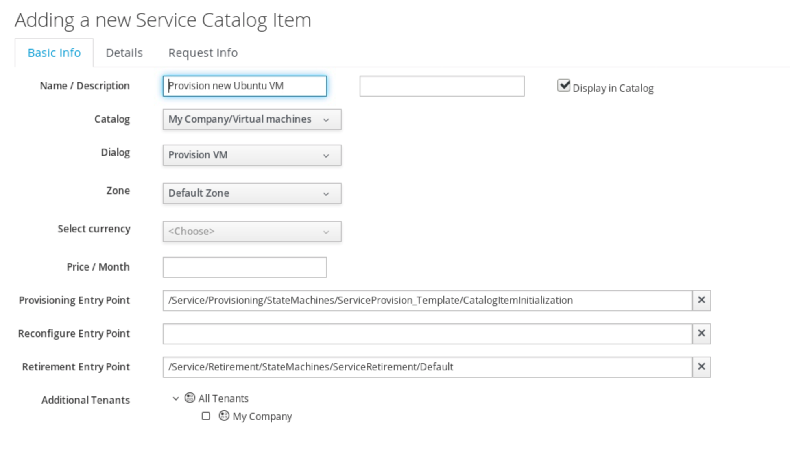

5. Now, move to the `Request Info` tab to provide details about a virtual machine that will be provisioned. Select **ubuntu** as a template, and provide **changeme** as a VM name.

   

6. On the **Environment** tab, select **Choose automatically**. On the **Customize** tab, select **Specification** in the Customize dropdown, and provide the `demo.ibmdte.net` as a Domain name. Finally click **Add** to create a new catalog item.

   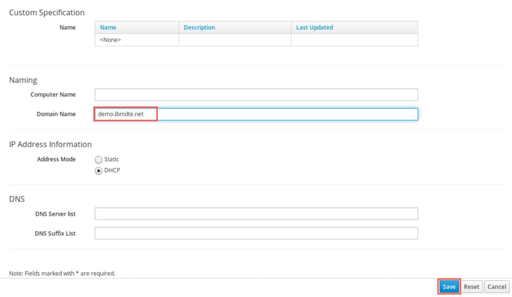

   Great, you have just added a new item to the self-service catalog. Let's go to the next exercise to test if it is working as designed.

***

## Request a new service

1. In this exercise you will test the offering created in a previous step. Open a new browser tab (1), a click **Self-service Catalog** (2) bookmark on the browser toolbar.

   

2. You should get automatically logged in into the Self-service portal. Here normal users can request published services. Click the **Service catalog** on the left.

   

3. The view shows recently added catalog item to provision a new Ubuntu VM. Click the offering tile and provide service name and vm name. Finally, click **Add to Shopping cart** button.

   

4. Item is added to a shopping cart. Click the cart icon in the top-right corner to proceed to checkout.

   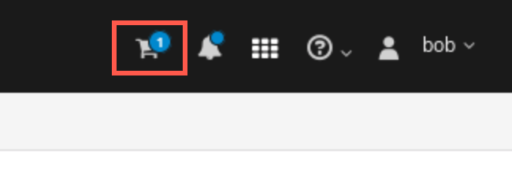

5. On the dialog windows listing all requested items (in your case it is just a single VM) click **Order**.

   

6. The order is auto-approved and the provisioning is started in the background. It takes about 5 minutes to spawn a new VM. In the meanwhile you can explore other options available in the Self-service interface. For examples, users can review status of their orders, view the services they own and take lifecycle actions agains them.

   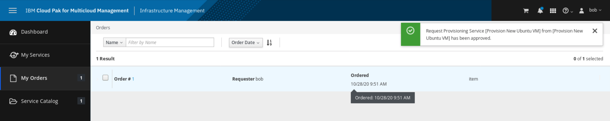

7. After few minutes, you should see the pop-up that the new VM has been provisioned.

   

8.  To verify that the VM was actually provisioned, go back to the other **CP4MCM:IM** browser tab and select **Compute -> Infrastructure -> Virtual Machines** from the left-side menu. You should see test1vm among other VMs. When you click this VM, the details view opens, showing the virtual machine details.

   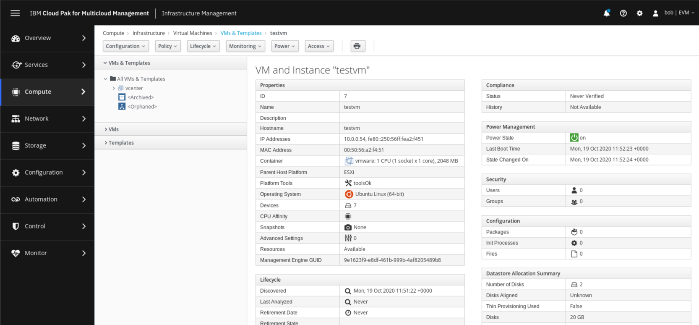

9. Finally, let's look at the Infrastructure Overview dashbord in the main Cloud Pak user interface. Select the browser tab with the main Cloud Pak UI, then go to menu and select **Observe environments -> Overview**.

   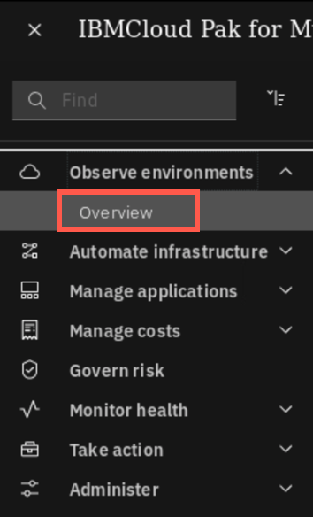

   You can notice, that now the newly provisioned service is visible in *Virtual machine services* section

   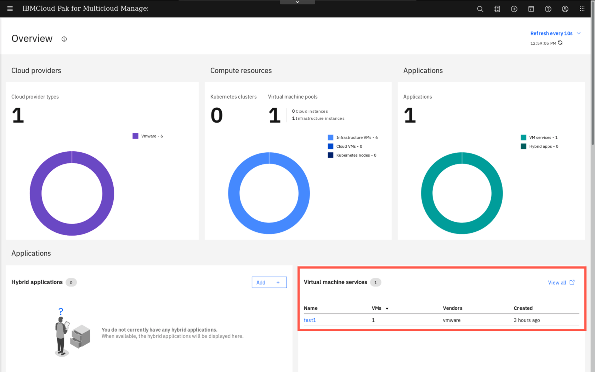

   Congratulations! You have successfuly configured the Infrastructure management module for new virtual machine services provisioning!

***

# VM provisioning using Terraform

In the following section you will explore the second method of infrastructure provisioning, using the Infrastructure-as-Code approach. Cloud Pak for Multicloud Management includes the Terraform provisioning engine that has this capability.

## Define a connection to Vmware vSphere environment

In this section, you will define a connection to the Vmware vSphere environment to be used by Terraform engine. The demo environment contains a single node vSphere cluster managed by the Vmware vCenter which you will leverage in that excercise.

1. To leverage Infrastructure-as-Code for service provisionig Cloud Pak for Multicloud Management uses Terraform. To open the Terraform management UI (former Cloud Automation Manager) go back to the browser tab with the main Cloud Pak UI, click the hamburger **Menu** (1) and select **Automate Infrastructure -> Manage Services** (2).

  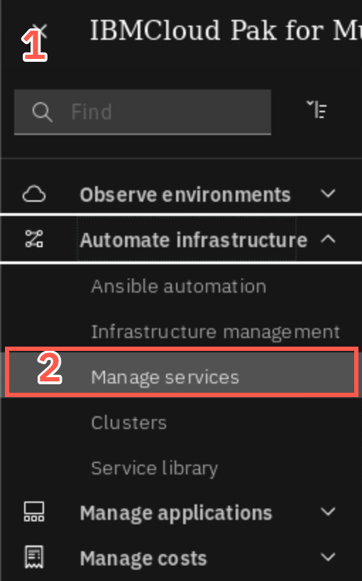

  This opens a service management UI - where you can define and manage Terraform templates and services. Service comprises of one or more templates connected into a provisioning workflow with pre-defined parameters and service plans.

  

2. Before you will be able to exercise any of the templates that are pre-loaded in the service library, you have to define a connection to the target environment. In this demo scenario it is Vmware vCenter. Click hamburger menu in the top-left corner (1) and select **Manage -> Cloud connections**

   

3. Click **Create connection** button to add a new connection.

   

   Provide the following details:

   - cloud provider: `VMware vSphere`
   - Connection name: `vcenter`
   - vCenter user: `administrator@vsphere.local`
   - vCenter password: `P@ssw0rd`
   - vCenter host: `10.0.0.100`

   When ready click **Create** at the bottom.

   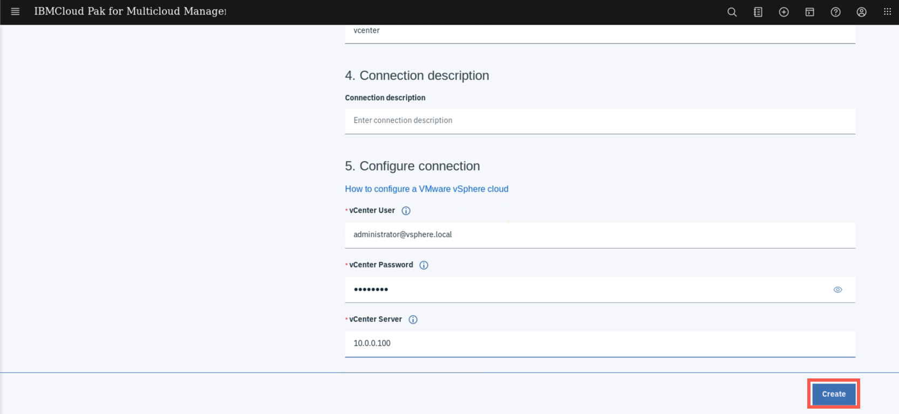

   If the details are entered correctly, you should see the **Success** message shown below. Click **Save**.

   

   Great, you connected Infrastructure management to your target environment. Let's move to the next section.

   

***

## Define a shared parameter instance

   To provision new VMs using a terraform usually user has to provide multiple parameters that are required by VMware vSphere environment. Cloud Pak for Multicloud Management let you pre-define those parameters so users won't be required to specify them every time they request a service. This is done by defining a shared parameter data object.

1. Open the hamburger menu and select **Manage -> Shared parameters**.

   

2. On the top of the screen you will see a definition of shared parameters data types. These type defines what attributes the shared parameter object contains - usually they are defined to match the parameters required by terraform providers. Scroll down to the **Data objects** section which holds the defined instances of shared parameters, and click the **Create data object button**.

   

3. On the naxt page, provide the following details:

   - Data Type: `vsphere_managed_inventory_definition`
   - Data Object Name: `ubuntu`
   - Datacenter Name: `Datacenter`
   - Resource Pool Name: `dte-demo`
   - Virtual Machine Folder Name: `DTE`
   - Virtual Machine Image Template Name: `ubuntu`
   - Virtual Machine Domain Name: `demo.ibmdte.net`
   - Virtual Machine Template User Name: `ibmuser`
   - Virtual Machine Template User Password: `passw0rd`
   - Datastore Name: `datastore2`
   - Network Name: `VM Network`
   - DNS Servers: `10.0.0.201`
   - DNS Suffixes: `demo.ibmdte.net`
   - IPv4 Gateway: `10.0.0.254`
   - IPv4 Netmask (CIDR): `24`

   When finished click **Create** at the bottom.

   

   As you have seen, then number of different parameters required can be overwhelming. Using a shared parameter object, administrator can wrap them in the single object that can be easily reused by end-users, pointing them to the right values (as desired by the administrator).

4. Now, let's test what you have just defined. Open the menu and select **Library -> Services**

   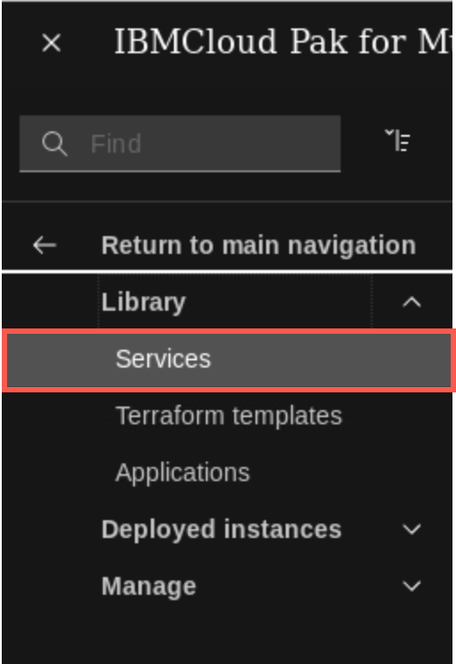

5. Cloud Pak for MCM includes multiple sample services, that can be easily reused and enhanced. Click **Virtual Machine on VMware** to explore details.

   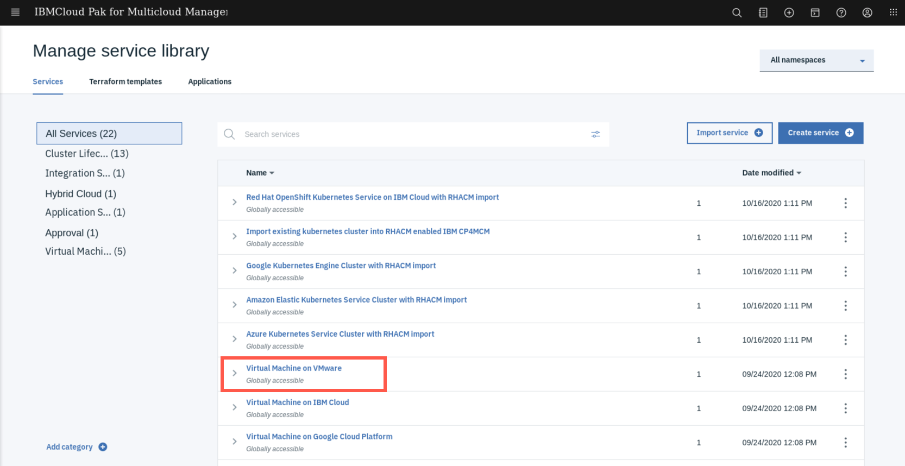

6. You can notice, that the service is in a *Draft* state (1) and it has just one *Standard* plan available (2). To test the service provisioning click **Next** (3).

   

7. Provide the service details as following (for non specified fields leave the default values):

   - Namespace: `default` (this is used for access control & this is where the CRD representing the service will be placed)
   - Service instance name: `test2`
   - Conection: `vcenter (Global)`
   - Virtual Machine IP Address: `10.0.0.40`
   - Vsphere Managed Inventory Definition: `ubuntu (Global)`
   - Disk size (GB): `20`

   When finished, click **Deploy** at the bottom.

   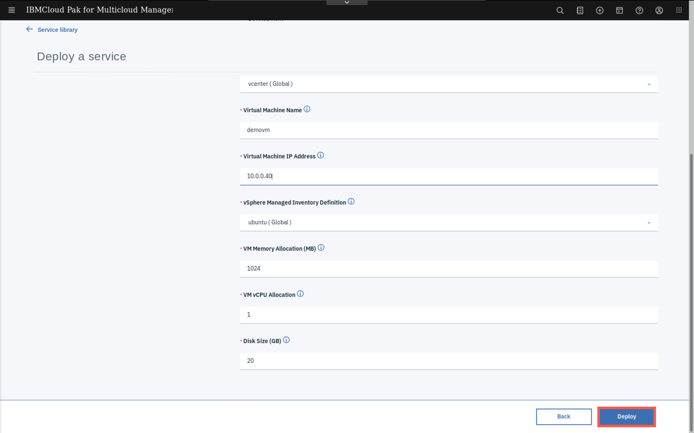

8. Order confirmation dialog is displayed. To monitor the deployment process, click **Go to instances**. Then click the service name **test2**

   

   

9. On the service details page, you can see information about the service, like Service details (1), parameters (2) or you can check the provisioning status. Click the **Log file** link (3)

   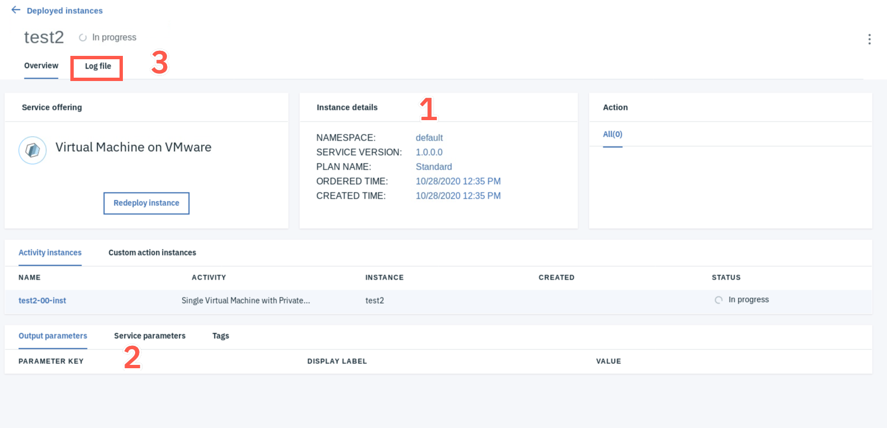

10. Here, you can trace the provisioning log and if you provided correct values, after a few minutes you should see that the provisioning was successfully completed and that the service is now active.

    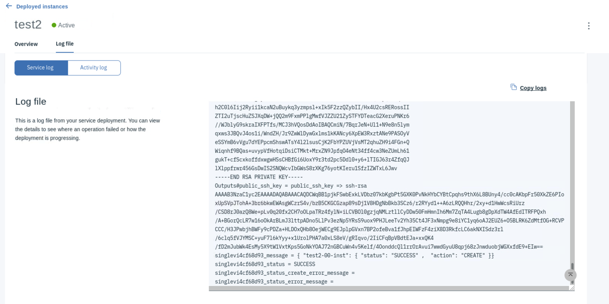

11. Service was successfully tested so let's deprovision the instance to save resources. Go back to the deployed services list and select **Terminate** from the context menu in the **test2** service item.

    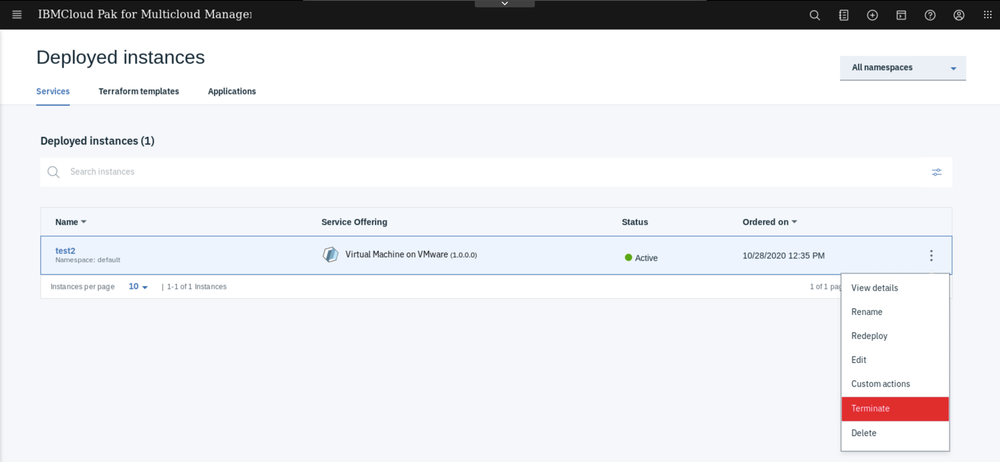

    There are 2 seperate items to deprovision the service. *Terminate* means that the resources will be deleted from the target cloud, but the definition will be left in place. *Delete* does the oposite - remove the service definition but leaves the resources running in the target environment.

12. After a while, virtual machine is terminated so you can delete the service instance. Select **Delete** from the context menu.

    

    Service is ready to be published, but before you do this, let's define a new detailed service plans.

***

## Define new Service Plan

1. To modify the default service you need to create a new version. Go back to the **Manage service library** view (**menu -> Library -> Services**). In the **Virtual Machine on VMware** row select **Add Version** from the context menu.

   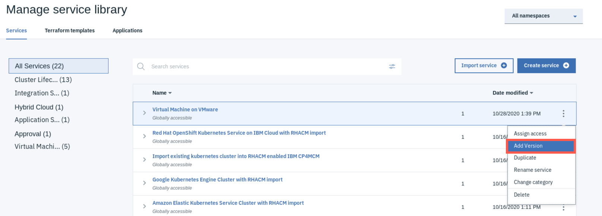

2. Version number must adhere to the four digit syntax. Provide for example `1.1.0.0` and click **Add**.

   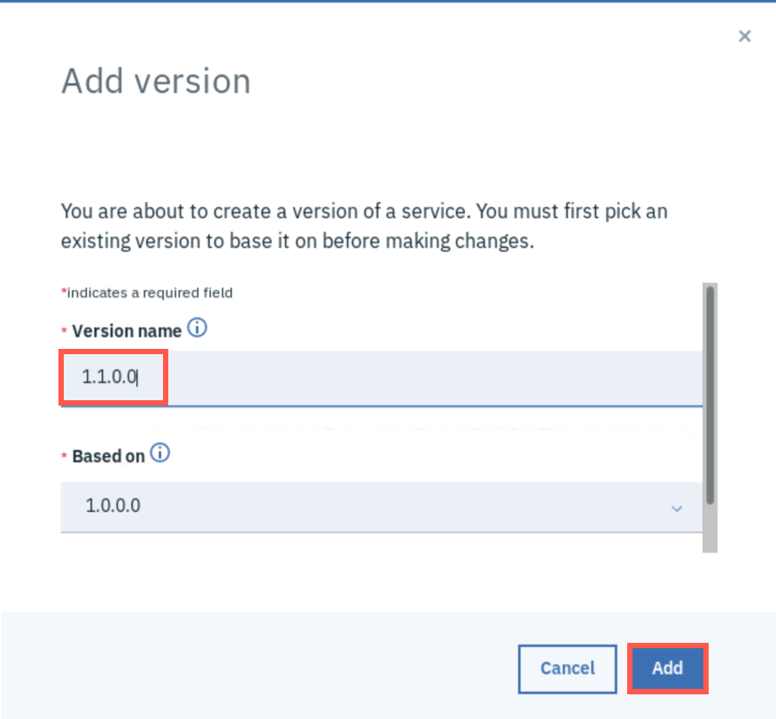

3. When the new version is added, you can change multiple properties of the service. Feel free to explore **Composition** or **Parameters** tabs, later click **Plans and form** tab.

   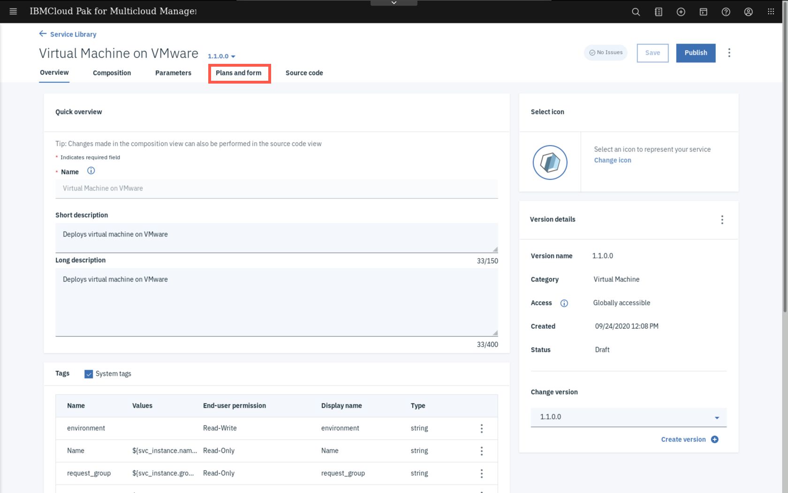

4. To add a new plan click **Add plan** button. Then provide `Development Ubuntu` as Plan name and plan description.

   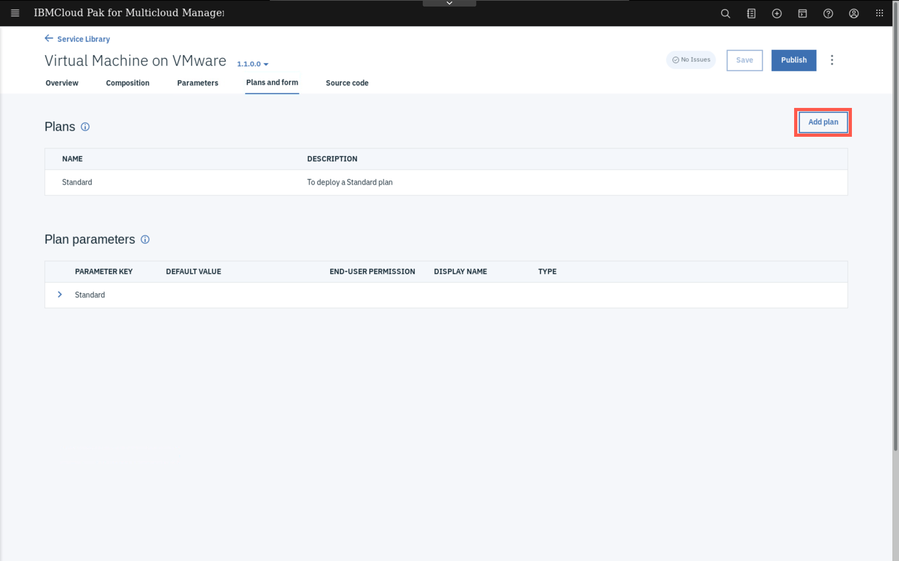

   

5. Change the default values of parameters for the new plan. To edit the value, select the parameter item in `Development Ubuntu` plan and select **Edit** from the context menu

   

6. Provide the following default values:

   - Conection: `vcenter (Global)`
   - Virtual Machine IP Address: `10.0.0.40`
   - Vsphere Managed Inventory Definition: `ubuntu (Global)`
   - Disk size (GB): `20`
   - vm_memory: `512`

   When changing the value of parameter, administrator can make it read only or even hide the value from the user.

   

7. When finished, click the **Save** and **Publish** buttons to preserve the changes and make a Service generally available.

  Congratulations! You have successfully completed the lab “Infrastructure Management with IBM Cloud Pak for Multicloud Management”.

***

## Summary

You completed the Cloud Pak for Multicloud Management tutorial: Multi-cluster Management. Throughout the tutorial, you explored the key takeaways:
-	`Understand Cloud Pak for Multicloud Management Infrastructure Management capabilities`;
-	`Learn how to define a new service for VM provisioning`;
- `Learn how to provision new VM service`;
-	`Learn how to apply configuration and control policies to the managed VMs`;

If you would like to learn more about Cloud Pak for Multicloud Management, please refer to:
-	<a href="https://www.ibm.com/cloud/cloud-pak-for-management" target="blank">Cloud Pak for Multicloud Management home page</a>
- <a href="https://www.ibm.com/demos/collection/Cloud-Pak-for-Multicloud-Management" target="blank">Cloud Pak for Multicloud Management Demos </a>
