<FeatureCard
  title="Security & Compliance Management with IBM Cloud Pak for Multicloud Management"
  color="dark"
  >


</FeatureCard>


<AnchorLinks>
  <AnchorLink>Lab Overview</AnchorLink>
  <AnchorLink>Prerequisite</AnchorLink>
  <AnchorLink>Business Context</AnchorLink>
  <AnchorLink>Namespace Policy</AnchorLink>
  <AnchorLink>Network Policy</AnchorLink>
  <AnchorLink>Summary</AnchorLink>
</AnchorLinks>

***

## Lab Overview

IBM Cloud Pak for Multicloud Management provides consistent visibility, automation, and governance across a range of multicloud management capabilities such as cost and asset management, infrastructure management, application management, multi-cluster management, edge management, and integration with existing tools and processes. Customers can leverage Cloud Pak for Multicloud Management to simplify their IT and application ops management, while increasing flexibility and cost savings with intelligent data analysis driven by predictive signals.

IBM Cloud Pak for Multicloud Management helps companies make the transition from traditional monitoring systems to cloud-based ones more easily. It effectively monitors all kinds of IT resources in a hybrid environment. It helps Operation teams manage hybrid environments without hiring new personnel to support each new technology that is being used by developers.

This Tutorial explores how to use governance and compliance features to manage your multicloud environments with a consistent set of configuration and security policies across all applications and clusters.You explore the following key capabilities:
-	`Understand Cloud Pak Policy and Governance`
-	`Learn to create and customize policies with the out of the box policy templates`
-	`Learn to use namespace policies`
-	`Learn to use network policies`

***

## Prerequisite

- You need to provision your own copy of the CP4MCM 2.0 environment, start it and verify for correct startup (check [here](../../gettingstarted/)).

***

## Business Context

As a member of the Security Operation (SecOps) team, you are having problems to minimize risks and identify policies violations in your multicloud hybrid world. Manage a Security Policy for all your cloud-based services and data across multiple providers is overwhelming your team.
Your company is deploying multiple Kubernetes clusters to address their specific needs. Some Dev teams are deploying clusters across public and private clouds, and some are deploying clusters across regions, and some are deploying clusters to support the development and test needs.

As different teams deploy more clusters, new challenges are introduced:
-	How do I set consistent security policies across environments?
-	Which clusters are compliant?

Because of that, you want to explore how IBM Cloud Pak for Multicloud Management, provides consistent visibility, governance and automation of your complex environment.

IBM Cloud Pak for Multicloud Management Governance and risk dashboard allows you to view and manage the number of security risks and policy violations in your clusters and applications. Policy templates are used to create one or more policies for third party or external security controls. For example, you can create a mutation policy with the mutation policy controller. Each policy document can have at least one or multiple templates.

By using policy-based role and compliance management, you are able to:
-	Set and enforce polices for security, applications, and infrastructure or auto enforcement at the cluster level.
-	Check compliance against deployment parameters, configuration, and policies.
-	Automatically remediate violations.

In this tutorial, you create and enforce the following governance policies:
-	`Namespace policy`
-	`Network policy`

***

## Add Managed Clusters

In this section, you will add two new managed clusters in your Control Panel. As explained before, you will add your OpenShift Hub cluster and your Microk8s managed cluster.

1. To start the lab, you should be in your Cloud Pak for Multicloud Management Web Console. If you are not, check [here](../gettingstarted/) how to open your console page.

  

2. Now, let's explore the Cluster view. Click the hamburger **Menu** (1) and select **Automate Infrastructure -> Clusters** (2).

  

3. Initially, you shouldn't have any cluster registered here. Let's add our first cluster. Click **Add cluster**.

  

4. You can add a cluster by Importing an existing cluster or provisioning a new cluster using a Service Library. We use the first option. Select **Import an Existing cluster** (1) and click **Import** (2).

  

5. Enter **ocp311** for cluster name (1) and **ocp311** for namespace (2). You can view the yaml file and change the settings as needed (3). To import an OpenShift cluster no further changes are needed. Click **Generate command** to continue (4).

  

6. A curl command is generated that you will use to add the new cluster. Click **Copy command** button (1) and click **View cluster** (2) to see the new hub-cluster details page.

  

7. Open the terminal window clicking the **OCP 3.11 Terminal** link on the desktop. The **OCP 311** windows has a blue background.

  

8. Let's test the new context configuration. Run the command below to get the cluster nodes.

  ```
  oc get nodes
  ```

  

  Great, you are accessing the OCP 3.11 cluster. Now you are ready to execute the generated command.

9. **Paste** the generated command that you previously copied in the clipboard.  When you run the command, several Kubernetes objects are created in the multicluster-endpoint namespace.

  

  In case you will see the error like shown below, run the command again.

  

  This error is a result of performance limitations of the Skytap environment - the final result should look like below:

  

10. You can view the progress by entering the command:

  ```
  watch oc get pods -n multicluster-endpoint
  ```

  Make sure all the pods are in the running state.

  

11. The cluster endpoint (klusterlet) is ready when all the Pods are in Running state (press CTRL+C to cancel the watch command). Back to the browser window, click **View cluster** and make sure that the cluster status is **Ready** now (if necessary, refresh the details page). On the page navigation breadcrumb, click on **Clusters** link.

  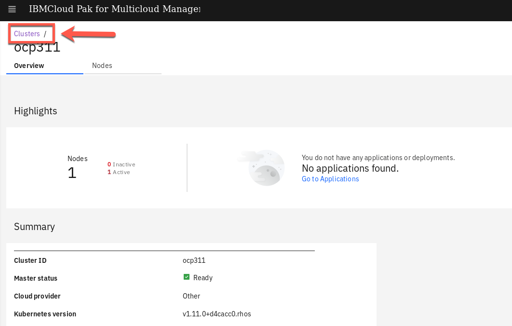

12. Now you can see your ocp311 cluster on the clusters list. You can add labels to identify your new cluster. On the hub-cluster row, click on the three dots icon (1) and select **Edit labels** (2).

  

13. Add a new label, **environment** (1), and give a value **Dev** (2). Click **+** (3) and **save** (4) the changes.

  

  Great, your first cluster is ready! Now let's add your MicroK8s managed cluster.

***

## Namespace Policy

Kubernetes namespaces help organize cluster resources between multiple users and split the resource quote. Cluster administrator might restrict the user to use specific namespaces for applications. The namespace policy allows you to catch cluster violations when namespaces are not defined as per the policies.

A sample namespace policy resemble the following:

  

In this section, you create a policy that ensures that a specified namespace is present in clusters that match the selection criteria.

1.Open the **OCP 311 Terminal** window (blue terminal).

  

2.Later you will create a Policy to inform/enforce a namespace in your cluster. Let’s verify that you don’t have this namespace by now. Run the command below:

```
oc get ns | grep k8demo
```

  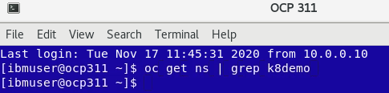

  So far, you don’t have the k8demo namespace. Great! Let’s create a Policy to inform when your cluster is not compliance with a namespace policy.

4.Back to the IBM Cloud Pak for Multicloud Management Web Console page on your browser.

  On the top-left of the page, open the **Menu** (1) and select **Govern risk** (2).

  

5.Here you see the Policy tab. This view displays the policies that have been created and the dashboard of policy compliance for each cluster. By now, you don’t have any Policy created. Let’s do it! Click **Create policy**.

  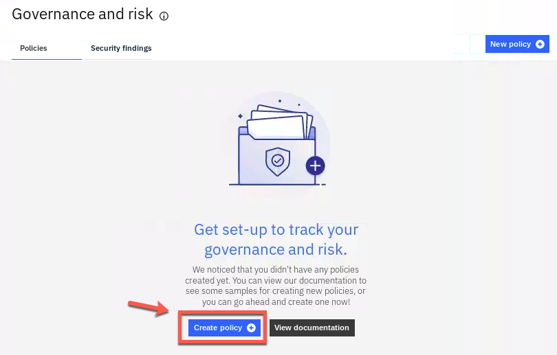

6.On the Name field type **policy-namespace** (1), on the Namespace field select **default** (2), on the Specifications field select **namespace** (3) and on Cluster binding select **environment: QA** (4).

  

7.Now, let’s change the namespace name value. In the YAML file section, on the right, change the name attribute from prod to k8demo. With that, you are creating a Policy to verify if you have a k8demo namespace/project in your cluster.

  

8.Notice that the policy is set to inform rather than enforce. With value inform, the policy only reports whether the cluster is compliant to the specified policies. With value enforce, the policy provides automatic remediation. Keep inform value by now.

  

9.Click the button **Create** to create your new policy.

  

10.In a few seconds, the policy controller will check if the namespace k8demo is present and provides information regarding the current compliance of the policies.
Remember, you did not enforce this policy. Instead we specified inform. As such, the Governance and risk view displays a policy violation in our cluster, as illustrated below (you need to scroll down the page).

  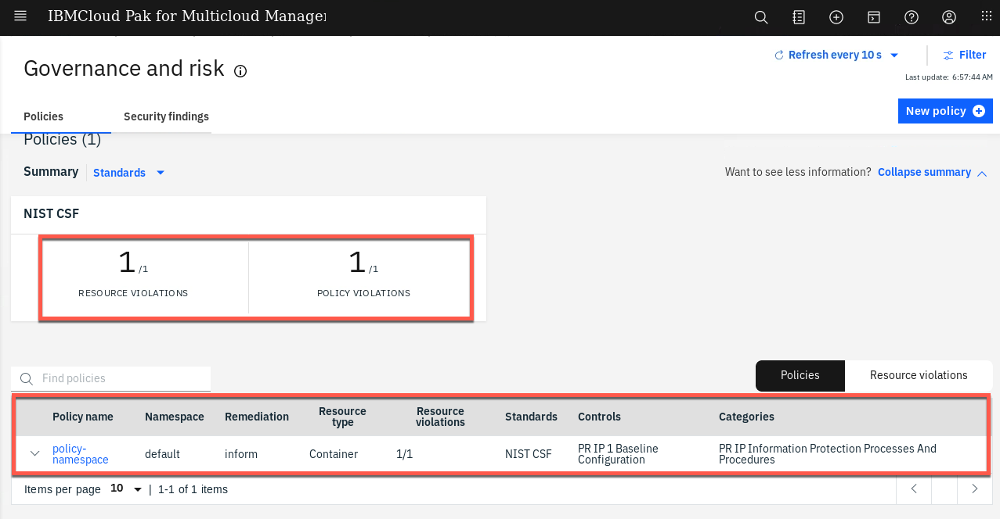

11.Click the **Resource violations** link to find which cluster is violating the policy.

    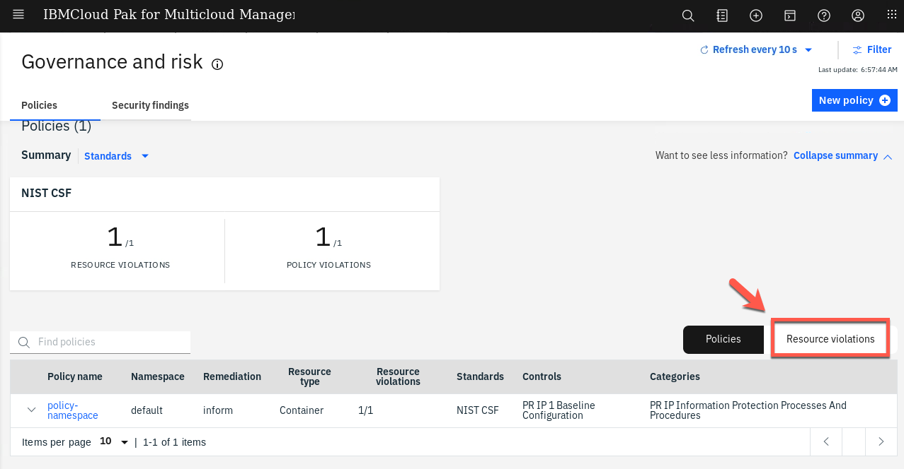

12.The ocp311 cluster is in violation of the policy which requires a namespace that is called “k8sdemo” to exist.

13.The ocp311 is the same cluster that you verified in the first step of this section that k8sdemo namespace does not exist. Hence it shows that there is no namespace k8demo in the cluster.

  

14.Now, let’s verify the k8demo namespace still does not exist. Back to the OCP311 terminal window (blue terminal), run the command below:

```
oc get ns
```

  

  There should not be a namespace named k8demo listed, which indicates that the policy did not enforce it to be created.

15.Back to the browser. Now, let’s change the policy to be enforced. In the policies view, click on **POLICY VIOLATIONS**.

  

16.Click the **policy-namespace** link.

  

17.Open the **YAML** tab.

  

18.Click the **Edit** button to go into edit mode to modify the YAML file.

  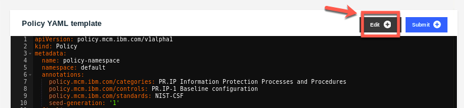

19.Change the value of remediationAction: inform to **remediationAction: enforce**.

  

20.Click the **Submit** button to save the change.

  

21.Open the **Details** tab.

  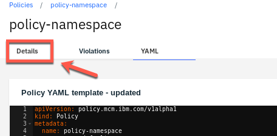

22.A few seconds later, the policy violation is automatically removed.

  

23.Open the **Violations** tab.

  

24.You also can validate the same from the Violations view: No Policy violations detected.

  

25.Now, let’s check how the policy on enforce mode, removed the violation. Back to the OCP311 terminal window (blue terminal), run the command below, to ensure that the k8demo namespace is created in the cluster.

```
oc get project | grep k8demo
```

  

  You have successfully implemented the Namespace Policy!

***

## Network Policy

A network policy is a specification of how groups of pods are allowed to communicate with each other and other network endpoints.NetworkPolicy resources use labels to select pods and define rules which specify what traffic is allowed to the selected pods.

Apply the network policy to define which network request to deny. For more information about network policies, refer to this [documentation](https://kubernetes.io/docs/tasks/administer-cluster/declare-network-policy/).

A sample network policy resembles the following:

  

IBM Cloud Pak for Multicloud Management enables your team to check and enforce network policy compliance against your multiple clusters in your hybrid environment.

In this section, you learn how to create a Network Policy in IBM Cloud Pak for Multicloud Management. This lab needs an application that has at least two pods with services where one pod needs to connect to other pod's associated service. You will use the application Quote of the Day that is already deployed on the cluster in the default project.

1.Back to the CP4MCM Console page tab on your browser, click **Policies** link on navigation breadcrumb.

  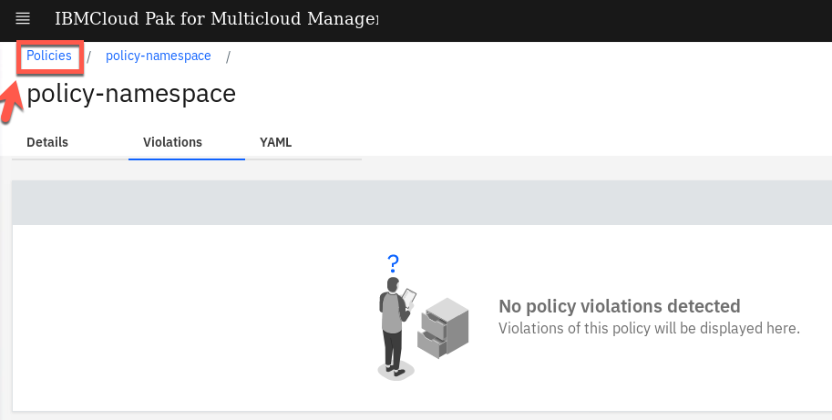

2.On the Policies view, click **New policy**.

  

3.Enter **policy-network** as name of the policy (1), select **default** as namespace (2), on specifications field choose **NetworkPolicy – deny network request** (3). On the cluster binding field select **name: ocp311** (4).

  

4.On the YAML file editor, change the objectDefinition > metadata > name from deny-from-other-namespaces to **deny-all-ingress-egress-traffic**.

  

5.The spec section is defined as follow:
```
spec:
	podSelector: {}
	policyTypes:
		- Ingress
		- Egress
```

  

6.Keep remediationAction as inform by now. Click **Create**.

  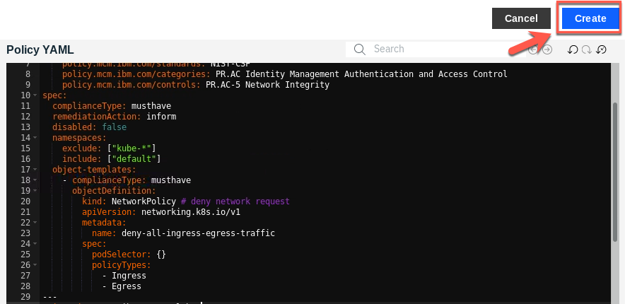

7.After few seconds, you should check that the policy violation was detected but not enforced.

  

  Because the policy is on inform mode, the policy is not forced.

8.Click on the new policy: **policy-network**.

  

9.You see that one decision is in violation.

  

10.Click the **Violations** tab.

  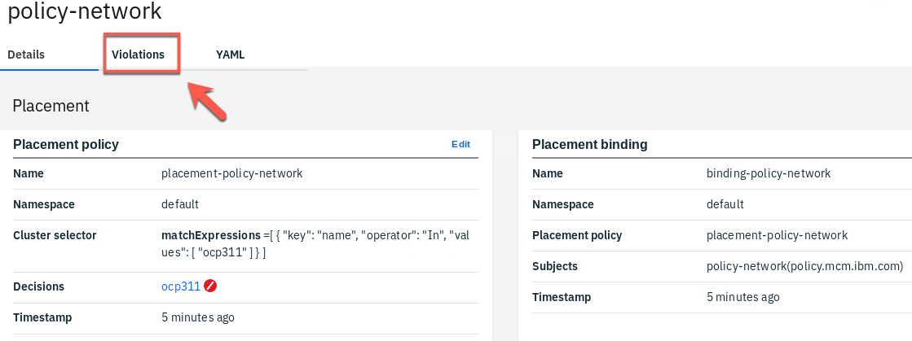

11.Here you see the violation about network isolation. Your ocp311 cluster is not compliance with this network policy. Let’s fix it!

  

12.Click on the OCP311 console link, to open the cluster Web Console.

  

13.You need to accept the risks. And log in with admin / passw0rd.

  

14.If necessary, change to Cluster Console view.

  

15.Use the side bar menu and select **Networking > Network Policies**.

  

16.Click the **Create Network Policy** button.

  

17.To the right of the view are a list of policy samples. Fortunately for us, there is a Network Policy Sample that we can use.  Click the Try it link (1). Then, edit the YAML, insert the letters from to the metadata name and replace deny-other-namespaces with deny-all-ingress-egress-traffic (2). Click the Create button to create this policy (3).

  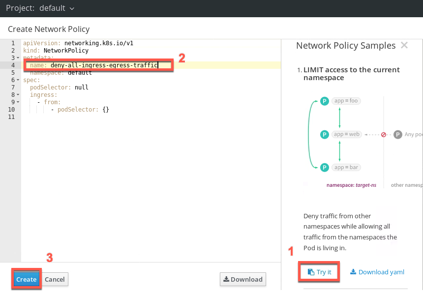

18.Great the policy is created now.

  

19.Go back to the CP4MCM browser tab.  You should notice that there are no violations now (wait 10 seconds if you have to).

  

20.Click on **Policies** link in breadcrumbs, to go back to the Policies page.

  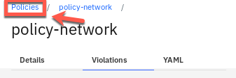

21.After waiting 10 seconds, you should see that all violations are gone.

  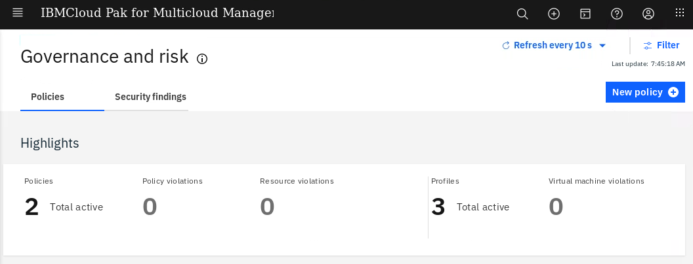

  Great! You have successfully implemented Network Policy!

***

## Summary

You completed the Cloud Pak for Multicloud Management tutorial: Security & Compliance Management. IBM Cloud Pak for Multicloud Management governance, risk and compliance framework helps create custom policy controllers. You learned in the Lab how to create and customize policies with the out of the box policy templates.

If you would like to learn more about Cloud Pak for Multicloud Management, please refer to:
-	<a href="https://www.ibm.com/cloud/cloud-pak-for-management" target="blank">Cloud Pak for Multicloud Management home page</a>
- <a href="https://www.ibm.com/demos/collection/Cloud-Pak-for-Multicloud-Management" target="blank">Cloud Pak for Multicloud Management Demos </a>
